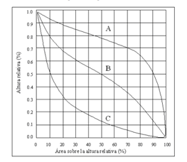
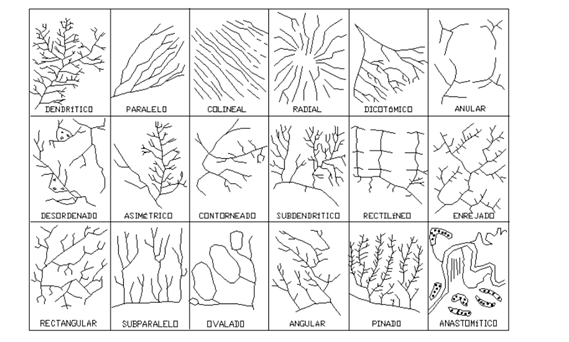
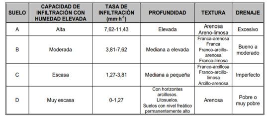

# Modelo Fisiográfico

El análisis fisiográfico es fundamental para caracterizar las propiedades físicas de una cuenca hidrográfica, incluyendo su topografía, red de drenaje, tipos de suelo y cobertura vegetal. Estos elementos determinan en gran medida el comportamiento hidrológico de la cuenca y su respuesta ante eventos de precipitación.

```{r setup, include=FALSE}
knitr::opts_chunk$set(echo = TRUE)
```

```{r, include=FALSE}
library(readxl)
library(tidyverse)
library(dplyr)
library(tidyr)
library(magrittr)
library(sf)
library(rgdal)
library(raster)
library(units)
library(jsonlite)
library(knitr)
library(kableExtra)
```

```{r, eval=FALSE, include=FALSE}
if (!require(remotes)) install.packages("remotes")

# on 64-bit Windows
remotes::install_github(c("ropensci/tabulapdf"), INSTALL_opts = "--no-multiarch")

# elsewhere
remotes::install_github(c("ropensci/tabulapdf"))

library("tabulapdf")
```

## Topografía documentada

```{r, include=FALSE}

cuenca_shp <- "cem_cuenca_geomcorreg.shp"
# Leer el shapefile
cuenca <- readOGR(dsn = cuenca_shp, layer = "cem_cuenca_geomcorreg", verbose = FALSE)
```

```{r, include=FALSE}
tabla_tamano_cuencas <- data.frame(
  Clasificacion = c("Muy pequeña", "Pequeña", "Intermedia pequeña", "Intermedia grande", "Grande", "Muy grande"),
  Rango_tamaño_km2 = c("< 25", "25 - 250", "250 - 500", "500 - 2,500", "2,500 - 5,000", "> 5,000"))
```

```{r include=FALSE}
#importar archivo con cadenamientos del cauce principal, obtenido con profile tool en qgis

cauce_principal <- read_excel("cauce_principal.xlsx")
```

```{r include=FALSE}
pendiente_uniforme_longitud_total <- cauce_principal$cadenamiento[nrow(cauce_principal)] - cauce_principal$cadenamiento[1]
pendiente_uniforme_deltay <- cauce_principal$elevacion[1] - cauce_principal$elevacion[nrow(cauce_principal)]
pendiente_uniforme <- pendiente_uniforme_deltay / pendiente_uniforme_longitud_total
```

```{r, include=FALSE}
# Crear una función para determinar la clasificación de la cuenca
determinar_clasificacion <- function(area_km2) {
  for (i in seq_along(tabla_tamano_cuencas$Rango_tamaño)) {
    rango_actual <- tabla_tamano_cuencas$Rango_tamaño[i]
    if (rango_actual == "< 25" && area_km2 < 25) {
      return(tabla_tamano_cuencas$Clasificacion[i])
    } else if (rango_actual == "> 5,000" && area_km2 > 5000) {
      return(tabla_tamano_cuencas$Clasificacion[i])
    } else {
      rango_min <- as.numeric(gsub(",", "", strsplit(rango_actual, "-")[[1]][1]))
      rango_max <- as.numeric(gsub(",", "", strsplit(rango_actual, "-")[[1]][2]))
      if (!is.na(rango_min) && !is.na(rango_max) && area_km2 >= rango_min && area_km2 < rango_max) {
        return(tabla_tamano_cuencas$Clasificacion[i])
      }
    }
  }
}

# Obtener la clasificación de la cuenca
clasificacion_cuenca <- determinar_clasificacion(cuenca$area_km2)
```

Para el presente estudio, se utilizó la información fue publicada en el geoportal **Continuo de Elevaciones Mexicano 3.0** [@CEM3.0] con una resolución de 15 x 15 metros y datum ITRF92 época 1988. Los datos fueron obtenidos en marzo de 2024 y procesados en el Sistema de Referencia de Coordenadas EPSG:32611 WGS 84 / UTM zona 11N, en unidades métricas.

## Delimitación del área de escurrimiento y red hidrográfica

La cuenca analizada, denominada "Subcuenca Río Guadalupe" (RH01Cc) según la nomenclatura INEGI, pertenece a la Región Hidrográfica Baja California Noroeste (Ensenada) y forma parte de la cuenca exorreica Río Tijuana - Arroyo de Maneadero. Presenta un **área de drenaje** de `r round(cuenca$area_km2, 2)` km^2^, delimitada por un **perímetro** de `r round(cuenca$perim_km, 2)` km y una **longitud** de `r round(cuenca$long_cu_km, 2)` km, clasificándose como una cuenca **`r clasificacion_cuenca`** conforme a la tabla \@ref(tab:tabla-tamanocuencas), de los *Apuntes de Hidrología Urbana* [@conde1995].

```{r, echo=FALSE, tabla-tamanocuencas}

knitr::kable(tabla_tamano_cuencas, 
               digits = 4, 
               booktabs = TRUE, 
               caption = "Clasificación de las cuencas según su tamaño", label = NA)%>%
  kable_classic_2(bootstrap_options = "basic", 
                  full_width = F, 
                  font_size = 12, 
                  position = "center") 

```

La **elevación media de la cuenca**, 891 msnm, y la **pendiente de la cuenca**, `r round(cuenca$pend_med_p, 2)` %, son valores que se obtienen
consultando las estadísticas de los rasters generados en QGIS.

El cauce principal, con una **longitud** de `r round(pendiente_uniforme_longitud_total/1000, 2)` km, nace cerca de la localidad Agua Amarga y descarga en la localidad de Playas La Misión, específicamente en el puente La Misión, sobre la carretera federal Tijuana - San Miguel, la cual pasa sobre la costa, por lo que podemos decir que el cauce desemboca en el mar.

Gracias a las cartas topográficas de la región hidrográfica RH01Cc se pueden ubicar elementos orográficos que pertenecen a la zona de estudio, como manantiales y lagos.

```{r, echo=FALSE, figura-cuencadelim, fig.cap="Delimitación de la subcuenca R. Gudalupe", fig.alt="cuenca delimitada con QGIS 3.36"}
knitr::include_graphics("subcuenca R. Gudalupe.png")
```

## Descripción del Relieve

El análisis del relieve es fundamental en hidrología, ya que las formas y características de la superficie terrestre influyen significativamente en los procesos hidrológicos, como el movimiento del agua, la escorrentía y la erosión. Comprender el relieve de una cuenca hidrográfica es esencial para el control de cauces, la restauración de arroyos, la prevención de riesgos de inundación y la gestión sostenible de los recursos hídricos.

```{r, include=FALSE}
cuenca_hipso <- read_excel("cem_elevreclas_dissolved.xlsx") %>%
  arrange(value)

# Crear vectores con los valores de elev_min y elev_max
elev_min <- c(5.00, 139.00, 273.00, 407.00, 541.00, 675.00, 809.00, 943.00, 1077.00, 1211.00, 1345.00, 1479.00, 1613.00, 1747.00)
elev_max <- c(139.00, 273.00, 407.00, 541.00, 675.00, 809.00, 943.00, 1077.00, 1211.00, 1345.00, 1479.00, 1613.00, 1747.00, 1879.00)

# Agregar las nuevas columnas a la tabla cuenca_hipso
cuenca_hipso <- cuenca_hipso %>%
  mutate(elev_min = elev_min,
         elev_max = elev_max,
         Hi = (elev_min + elev_max) / 2) %>%
  mutate(area_km2 = area_m2/1000000) %>%
   mutate(area_acumulada = cumsum(area_km2)) %>%
  mutate(areas_sobrealtitudes = sum(area_km2) - area_acumulada ) %>%
  mutate(proporcion_area = area_km2 / sum(area_km2)) %>%
  mutate(proporcion_altitud = areas_sobrealtitudes / sum(area_km2))
```

Para describir el relieve, se presenta la **relación de enlongación**, que caracteriza el relieve, cuya fórmula es $$R_e = 1.128 \frac{\sqrt{\ A}}{L_m}$$ y el **coeficiente de compacidad**, que indica la geometría de la cuenca, cuya fórmula es $$K_c = 0.282\frac{P}{\sqrt{A}}$$.

```{r,results='asis', comment = "", echo=FALSE}
Re <- round((1.1284 * (cuenca$area_km2**0.5)) / cuenca$long_cu_km, 1)
kc <- 0.28 * (cuenca$perim_km/sqrt(cuenca$area_km2))

cat("El valor de la relación de enlongación, R~e~ es", Re, "\n")

if (Re >= 0.9 & Re <= 1.0) {
  cat(", por lo que consideramos que la cuenca tiene un relieve bajo.\n")
} else if (Re >= 0.6 & Re < 0.9) {
  cat(", por lo que consideramos que la cuenca tiene un relieve fuerte.\n")
} else {
  cat(", por lo que consideramos que la cuenca tiene un relieve fuera de rango.\n")
}

cat("\nEl valor del coeficiente de compacidad, k~c~ es", kc, "\n")

if (kc <= 1) {
  cat(", por lo que consideramos que la cuenca tiene una forma circular.\n")
} else if (kc > 1 & kc <= 3) {
  cat(", por lo que consideramos que la cuenca tiene una forma alargada.\n")
} else {
  cat(", por lo que consideramos que la cuenca tiene una forma desconocida.\n")
}
```

El relieve influye en la velocidad del escurrimiento, la erosión del suelo y el transporte de sedimentos. Un relieve fuerte y una forma alargada implican una mayor concentración de los flujos de escorrentía en el cauce principal, lo que puede aumentar el riesgo de inundaciones repentinas. Estos factores deben considerarse cuidadosamente en el diseño de medidas de protección y en la gestión integral de la cuenca hidrográfica.

```{r, echo=FALSE, fig.align='center', figura-elevclas, fig.cap="Clasificación de las elevaciones de la cuenca"}
knitr::include_graphics("elevaciones clasificadas.png")
```

Los diferentes rangos de elevación dentro de la cuenca influyen en los patrones de precipitación y, por lo tanto, en la disponibilidad de agua en distintas zonas. La **curva hipsométrica**, que representa la distribución de áreas a diferentes altitudes, permite comprender el equilibrio dinámico de la cuenca y las etapas del ciclo erosivo [@conde1995].

-   La *curva A* representa una cuenca geológicamente joven, en una etapa de desequilibrio,     
-   la *curva B* representa una cuenca geológicamente madura, en una etapa de equilibrio (aunque algunos autores mencionan que refleja una actividad media erosiva),       
-   la *curva C* representa una cuenca erosionada, geológicamente vieja.

```{r, echo=FALSE, fig.align='center', figura-curvahipso, out.width=300, fig.cap="Clasificación de las curvas hipsométricas", fig.retina=2}

```

```{r, echo=FALSE, figura-curvahipsometrica, out.width=400, fig.align='center', fig.cap="Curva que determina la longevidad del cauce principal", warning=FALSE}
ggplot(cuenca_hipso, aes(x = proporcion_altitud, y = Hi)) +
  geom_line(size = 1, color = "steelblue") +
  labs(x = "Proporción de altitud (%)", 
       y = "Elevación (m)", 
       title = "Curva Hipsométrica del cauce principal") +
  scale_x_continuous(labels = scales::percent) +
  theme_minimal() +
  theme(plot.title = element_text(hjust = 0.5, size = 16, face = "bold"),
        axis.title = element_text(size = 12),
        axis.text = element_text(size = 10),
        panel.grid.major = element_line(color = "grey90"),
        panel.grid.minor = element_blank(),
        panel.border = element_rect(color = "black", fill = NA),
        plot.caption = element_text(hjust = 0, size = 10))
```

En el presente análisis, la curva hipsométrica obtenida se asemeja a la curva B, lo que sugiere que la cuenca se encuentra en una etapa geológicamente madura, con una actividad erosiva media. Esto implica que los procesos de erosión y sedimentación se encuentran en un estado relativamente equilibrado, aunque con incidencias probables de eventos erosivos significativos.

Además del análisis hipsométrico, es esencial considerar la pendiente del relieve, ya que influye directamente en la velocidad y el comportamiento de la escorrentía superficial. Pendientes bajas favorecen un movimiento más lento del agua, permitiendo una mayor infiltración y un mejor aprovechamiento de las escorrentías, mientras que pendientes escarpadas aceleran la velocidad del flujo, aumentando el riesgo de erosión del suelo.

```{r, echo=FALSE, figura-pendreclas , fig.cap="Clasificación de pendientes de la zona de estudio"}
knitr::include_graphics("pendiente reclasificada.png")
```

En el mapa de pendientes generado, se observa que el cauce principal atraviesa zonas llanas y suaves, las cuales podrían ser áreas clave para la implementación de soluciones basadas en la naturaleza (SbN) con el objetivo de controlar y aprovechar las escorrentías de manera sostenible. Estas medidas, como la creación de humedales artificiales o la reforestación de riberas, pueden contribuir a la regulación del ciclo hidrológico y la protección del ecosistema.

Es importante resaltar que un adecuado manejo de las pendientes y las elevaciones, en conjunto con los otros fisiográficos presentados, puede mejorar la resiliencia de la cuenca ante eventos extremos, como inundaciones o sequías, y promover la conservación de los recursos hídricos y la biodiversidad asociada.

## Red de drenaje

La red de drenaje de una cuenca hidrográfica desempeña un papel crucial en el movimiento y transporte del agua superficial, subsuperficial y subterránea, tanto de manera temporal como permanente [@campos1998]. Las características de esta red reflejan la eficiencia del sistema de drenaje de la cuenca y su capacidad para evacuar los excedentes de agua durante eventos de precipitación intensa.

Los patrones de drenaje pueden adoptar diferentes formas, como dendrítica, paralela, radial o rectangular, dependiendo de factores como la energía solar, la gravedad, el clima, la topografía, la cobertura vegetal, los tipos de suelo y los usos del territorio. Estos patrones revelan la interacción compleja entre los componentes bióticos y abióticos de la cuenca.

```{r, echo=FALSE, figura-modelosdrenaje, out.width=1000, fig.align='center', fig.cap="Modelos de drenaje" ,fig.retina=2}

```

El análisis del mapa \@ref(fig:figura-cuencadelim) indica que la red de drenaje presenta un patrón dendrítico, caracterizado por una distribución similar a las ramas de un árbol, típico de antiguas llanuras costeras.

La configuración de la red de drenaje tiene implicaciones importantes en la gestión de los recursos hídricos y la protección de los ecosistemas dentro de la cuenca. Un sistema de drenaje eficiente puede reducir el riesgo de inundaciones al evacuar rápidamente los excedentes de agua, pero también puede aumentar la erosión del suelo y el transporte de sedimentos y contaminantes hacia los cuerpos de agua receptores.

Por lo tanto, es fundamental considerar estrategias de manejo integrado de la cuenca que equilibren la necesidad de drenaje adecuado con la conservación de la calidad del agua y la biodiversidad.

```{r include=FALSE}
#sirve para determinar la cantidad de tramos a programar

print((cauce_principal$elevacion[1] - cauce_principal$elevacion[nrow(cauce_principal)])*0.04)
print((cauce_principal$cadenamiento[nrow(cauce_principal)] - cauce_principal$cadenamiento[1])*0.04)
```

### Análisis de pendiente del cauce principal de la cuenca

```{r, include=FALSE}
elev_inicial_cauce <- cauce_principal %>% 
  dplyr::select(elevacion) %>% 
  slice(1) %>% 
  pull()

elev_final_cauce <- cauce_principal %>% 
  dplyr::select(elevacion) %>% 
  slice(n()) %>% 
  pull()
```

El análisis del perfil longitudinal del cauce principal proporciona información sobre su pendiente, la cual influye en la velocidad del flujo y la capacidad de transporte de sedimentos. 

```{r, echo=FALSE, figura-cauceperfil, out.width=600, fig.align='center', fig.cap="Perfil del cauce principal"}
knitr::include_graphics("perfil del cauce.png")
```

La pendiente del cauce principal se ha calculado usando tres diferentes fórmulas, las cuales se encuentran referenciadas en el manual de alcantarillado y saneamiento pluvial [@conagua2019].

-   Pendiente uniforme  
-   Pendiente por elevaciones constantes de Taylor - Shwarz  
-   Pendiente por longitudes constantes de Taylor - Shwarz  

#### Pendiente uniforme

Esta pendiente se calcula a partir de la longitud total del cauce y la diferencia de elevación entre su punto inicial y final. La fórmula es
$$ S_c = \frac{\Delta H}{L_{tc}} \label{eq:pendieteuniforme} $$

```{r results='asis', echo=FALSE}
cat("La pendiente media del cauce principal calculada con la fórmula de pendiente uniforme es:", pendiente_uniforme, "m/m\n\n")
```

#### Pendiente Taylor Schwarz - Elevaciones constantes

Esta fórmula considera que el río está formado de canales con pendientes uniformes, por lo que se segmenta en tramos equivalentes para poder calcular la pendiente media.
$$S_{ec} = \left[\frac{l_t}{\sum_{i=1}^n\frac{l_i}{\sqrt{s_i}}} \right]^{2} \label{eq:pendietetaylorelev} $$

```{r include=FALSE}
pendiente_ts_ec <- function(dataframe, paso_elevacion = 10) {
  # Extraer el primer valor de elevación del dataframe
  elevacion_inicial <- dataframe$elevacion[1]

  # Calcular el número de elevaciones constantes descendentes necesarias
  num_elevaciones <- ceiling((elevacion_inicial - min(dataframe$elevacion)) / paso_elevacion) + 1

  # Generar el vector de elevaciones constantes descendentes
  elevaciones_constantes <- seq(elevacion_inicial, by = -paso_elevacion, length.out = num_elevaciones)


  # Crear una lista para almacenar los valores justo arriba y justo abajo de cada elevación constante
  valores_around <- vector("list", length(elevaciones_constantes))

  # Iterar sobre cada valor en elevaciones_constantes
  for (i in 1:length(elevaciones_constantes)) {
    # Encontrar el índice del valor justo arriba del valor actual en elevaciones_constantes
    index_above <- max(which(dataframe$elevacion >= elevaciones_constantes[i]))
    # Encontrar el índice del valor justo abajo del valor actual en elevaciones_constantes
    index_below <- min(which(dataframe$elevacion <= elevaciones_constantes[i]))

    # Almacenar los valores justo arriba y justo abajo en la lista
    valor_arriba <- dataframe$elevacion[index_above]
    valor_abajo <- ifelse(is.infinite(index_below), elevaciones_constantes[i], dataframe$elevacion[index_below])
    valores_around[[i]] <- c(valor_arriba, valor_abajo)
  }

  # Crear una lista para almacenar los cadenamientos asociados a cada valor de elevación
  cadenamientos_around <- vector("list", length(valores_around))

  # Iterar sobre cada elemento en valores_around
  for (i in 1:length(valores_around)) {
    # Extraer los valores de elevación justo arriba y justo abajo
    elev_arriba <- valores_around[[i]][1]
    elev_abajo <- valores_around[[i]][2]

    # Encontrar los índices de los valores justo arriba y justo abajo en el dataframe original
    index_arriba <- which(dataframe$elevacion == elev_arriba)
    index_abajo <- which(dataframe$elevacion == elev_abajo)

    # Extraer los cadenamientos asociados
    cadenamiento_arriba <- dataframe$cadenamiento[index_arriba]
    cadenamiento_abajo <- dataframe$cadenamiento[index_abajo]

    # Almacenar los cadenamientos asociados en la lista
    cadenamientos_around[[i]] <- c(cadenamiento_arriba, cadenamiento_abajo)
  }

  # Obtener el valor de arriba y el valor de abajo de la última fila de valores_around
  valor_arriba_ultima <- valores_around[[length(valores_around)]][1]
  valor_abajo_ultima <- valores_around[[length(valores_around)]][2]

  # Obtener el valor de cadenamiento de la última fila de cadenamientos_around
  cadenamiento_ultima <- cadenamientos_around[[length(cadenamientos_around)]]

  # Interpolar para obtener el valor de cadenamiento faltante
  cadenamiento_interp <- approx(
    x = c(valor_arriba_ultima, valor_abajo_ultima),
    y = c(cadenamiento_ultima, cadenamiento_ultima),
    xout = elevaciones_constantes[length(elevaciones_constantes)],
    method = "linear"
  )$y

  # Agregar el valor interpolado a la última fila de cadenamientos_around
  cadenamientos_around[[length(cadenamientos_around)]] <- c(cadenamientos_around[[length(cadenamientos_around)]], cadenamiento_interp)

  # Crear un dataframe para almacenar los resultados
  resultados <- data.frame(
    elevacion_constante = elevaciones_constantes,
    elev_arriba = numeric(length(elevaciones_constantes)),
    elev_abajo = numeric(length(elevaciones_constantes)),
    cadena_arriba = numeric(length(elevaciones_constantes)),
    cadena_abajo = numeric(length(elevaciones_constantes))
  )

  # Llenar el dataframe con los valores
  for (i in 1:length(valores_around)) {
    resultados[i, "elev_arriba"] <- valores_around[[i]][1]
    resultados[i, "elev_abajo"] <- valores_around[[i]][2]
    resultados[i, "cadena_arriba"] <- cadenamientos_around[[i]][1]
    resultados[i, "cadena_abajo"] <- cadenamientos_around[[i]][2]
  }

  # Calcular la interpolación constante para encontrar el cadenamiento asociado a cada elevación constante
  cadenamientos_interp <- approx(
    x = resultados$elev_abajo,  # Valores de elevación justo abajo
    y = resultados$cadena_abajo, # Cadenamientos asociados justo abajo
    xout = resultados$elevacion_constante, # Valores de elevación constantes
    method = "constant",  # Usar interpolación constante
    yleft = NA,  # No especificar valor para puntos por debajo del rango
    yright = NA,  # No especificar valor para puntos por encima del rango
    rule = 2  # Utilizar el valor más cercano para puntos fuera del rango
  )$y

  # Agregar los resultados de la interpolación al dataframe
  resultados$cadena_interp <- cadenamientos_interp

  # Obtener el último valor de cadenamiento del dataframe original
  ultimo_cadenamiento <- tail(dataframe$cadenamiento, 1)

  # Reemplazar NA en cadena_interp con el último valor de cadenamiento
  resultados$cadena_interp[is.na(resultados$cadena_interp)] <- ultimo_cadenamiento

  # Obtener el último valor de la columna elevacion del dataframe original
  ultimo_valor_elevacion <- tail(dataframe$elevacion, n = 1)

  # Asignar el último valor de elevacion del dataframe original a la última fila de elevacion_constante en resultados
  resultados$elevacion_constante[nrow(resultados)] <- ultimo_valor_elevacion

  # Calcular la diferencia entre los valores de cadenamiento consecutivos
  resultados$diferencia <- c(diff(resultados$cadena_interp), NA)

  # Calcular la diferencia de elevación entre filas consecutivas
  resultados$htramo <- c(-diff(resultados$elevacion_constante), NA)

  # Calcular la longitud_tramo / raíz cuadrada(htramo / longitud_tramo)
  resultados$relacion <- resultados$diferencia / sqrt(resultados$htramo / resultados$diferencia)

  # Calcular la sumatoria de longitud_tramo
  pendiente_taylor_ec_numerador <- sum(resultados$diferencia, na.rm = TRUE)

  # Calcular la sumatoria de relacion
  pendiente_taylor_ec_denominador <- sum(resultados$relacion, na.rm = TRUE)

  # Calcular (sum_longitud_tramo / sum_relacion)^2
  pendiente_taylor_elev <- (pendiente_taylor_ec_numerador / pendiente_taylor_ec_denominador)^2

  # Mostrar el resultado
  cat("La pendiente media del cauce principal calculada con la fórmula de Taylor Schwarz por elevaciones constantes es:", pendiente_taylor_elev, "m/m\n\n")
}

```

```{r results='asis', echo=FALSE, warning=FALSE}
pendiente_ts_ec(cauce_principal, paso_elevacion = 50)
```

#### Pendiente Taylor Schwarz - Longitudes constantes

Esta fórmula considera que el río está formado de canales con pendientes uniformes, por lo que se segmenta en tramos equivalentes para poder calcular la pendiente media.
$$S_{lc} = \left[  \frac{n}{\sum_{i=1}^n\frac{1}{\sqrt{s_i}}} \right]^{2} \label{eq:pendietetaylorlong} $$

```{r include=FALSE}
pendiente_ts_lc <- function(dataframe, paso_cadenamiento = 500) {
  # Extraer el primer valor de cadenamiento del dataframe
  cadenamiento_inicial <- dataframe$cadenamiento[1]

  # Calcular el número de cadenamientos constantes ascendentes necesarios
  num_cadenamientos <- ceiling((max(dataframe$cadenamiento) - cadenamiento_inicial) / paso_cadenamiento) + 1

  # Generar el vector de cadenamientos constantes ascendentes
  cadenamientos_constantes <- seq(cadenamiento_inicial, by = paso_cadenamiento, length.out = num_cadenamientos)

  # Crear una lista para almacenar los valores justo arriba y justo abajo de cada cadenamiento constante
  valores_around <- vector("list", length(cadenamientos_constantes))

  # Iterar sobre cada valor en cadenamientos_constantes
  for (i in 1:length(cadenamientos_constantes)) {
    # Encontrar el índice del valor justo arriba del valor actual en cadenamientos_constantes
    index_above <- min(which(dataframe$cadenamiento >= cadenamientos_constantes[i]))
    # Encontrar el índice del valor justo abajo del valor actual en cadenamientos_constantes
    index_below <- max(which(dataframe$cadenamiento <= cadenamientos_constantes[i]))

    # Almacenar los valores justo arriba y justo abajo en la lista
    valor_arriba <- ifelse(is.infinite(index_above), cadenamientos_constantes[i], dataframe$cadenamiento[index_above])
    valor_abajo <- dataframe$cadenamiento[index_below]
    valores_around[[i]] <- c(valor_arriba, valor_abajo)
  }

  # Crear una lista para almacenar las elevaciones asociadas a cada valor de cadenamiento
  elevaciones_around <- vector("list", length(valores_around))

  # Iterar sobre cada elemento en valores_around
  for (i in 1:length(valores_around)) {
    # Extraer los valores de cadenamiento justo arriba y justo abajo
    cad_arriba <- valores_around[[i]][1]
    cad_abajo <- valores_around[[i]][2]

    # Encontrar los índices de los valores justo arriba y justo abajo en el dataframe original
    index_arriba <- which(dataframe$cadenamiento == cad_arriba)
    index_abajo <- which(dataframe$cadenamiento == cad_abajo)

    # Extraer las elevaciones asociadas
    elevacion_arriba <- dataframe$elevacion[index_arriba]
    elevacion_abajo <- dataframe$elevacion[index_abajo]

    # Almacenar las elevaciones asociadas en la lista
    elevaciones_around[[i]] <- c(elevacion_arriba, elevacion_abajo)
  }

  # Obtener el valor de arriba y el valor de abajo de la última fila de valores_around
  valor_arriba_ultima <- valores_around[[length(valores_around)]][1]
  valor_abajo_ultima <- valores_around[[length(valores_around)]][2]

  # Obtener el valor de elevación de la última fila de elevaciones_around
  elevacion_ultima <- elevaciones_around[[length(elevaciones_around)]]

  # Interpolar para obtener el valor de elevación faltante
  elevacion_interp <- approx(
    x = c(valor_arriba_ultima, valor_abajo_ultima),
    y = c(elevacion_ultima, elevacion_ultima),
    xout = cadenamientos_constantes[length(cadenamientos_constantes)],
    method = "linear"
  )$y

  # Agregar el valor interpolado a la última fila de elevaciones_around
  elevaciones_around[[length(elevaciones_around)]] <- c(elevaciones_around[[length(elevaciones_around)]], elevacion_interp)

  
  # Crear un dataframe para almacenar los resultados
resultados2 <- data.frame(
  cadenamiento_constante = cadenamientos_constantes,
  cad_arriba = numeric(length(cadenamientos_constantes)),
  cad_abajo = numeric(length(cadenamientos_constantes)),
  elev_arriba = numeric(length(cadenamientos_constantes)),
  elev_abajo = numeric(length(cadenamientos_constantes))
)

# Llenar el dataframe con los valores
for (i in 1:length(valores_around)) {
  resultados2[i, "cad_arriba"] <- valores_around[[i]][1]
  resultados2[i, "cad_abajo"] <- valores_around[[i]][2]
  resultados2[i, "elev_arriba"] <- elevaciones_around[[i]][1]
  resultados2[i, "elev_abajo"] <- elevaciones_around[[i]][2]
}

  
# Calcular la interpolación para encontrar la elevación asociada a cada cadenamiento constante
elevaciones_interp <- splinefun(
  x = resultados2$cad_abajo,   # Valores de cadenamiento justo arriba
  y = resultados2$elev_abajo,  # Elevaciones asociadas justo arriba
  method = "natural"  # Utilizar el método spline natural
)(resultados2$cadenamiento_constante)  # Aplicar la interpolación al vector de cadenamientos constantes


# Agregar los resultados de la interpolación al dataframe
resultados2$elevacion_interp <- elevaciones_interp


# Obtener el último valor de elevación del dataframe original
ultima_elevacion <- tail(dataframe$elevacion, 1)

# Reemplazar NA en elevacion_interp con el último valor de elevación
resultados2$elevacion_interp[is.na(resultados2$elevacion_interp)] <- ultima_elevacion

# Obtener el último valor de la columna cadenamiento del dataframe original
ultimo_valor_cadenamiento <- tail(dataframe$cadenamiento, n = 1)

# Asignar el último valor de cadenamiento del dataframe original a la última fila de cadenamiento_constante en resultados
resultados2$cadenamiento_constante[nrow(resultados2)] <- ultimo_valor_cadenamiento


  # Calcular la diferencia entre los valores de cadenamiento consecutivos
resultados2$longitud_tramo <- c(diff(resultados2$cadenamiento_constante), NA)

# Calcular la diferencia de elevación entre filas consecutivas
resultados2$htramo <- c(-diff(resultados2$elevacion_interp), NA)

# Calcular la longitud_tramo / raíz cuadrada(htramo / longitud_tramo)
resultados2$relacion <- 1 / sqrt(resultados2$htramo / resultados2$longitud_tramo)

# Calcular la sumatoria de longitud_tramo
pendiente_taylor_lc_numerador <- nrow(resultados2)

# Calcular la sumatoria de relacion
pendiente_taylor_lc_denominador <- sum(resultados2$relacion, na.rm = TRUE)

# Calcular (sum_longitud_tramo / sum_relacion)^2
pendiente_taylor_long <- (pendiente_taylor_lc_numerador / pendiente_taylor_lc_denominador)^2

 # Mostrar el resultado
  cat("La pendiente media del cauce principal calculada con la fórmula de Taylor Schwarz por longitudes constantes es:", pendiente_taylor_long, "m/m\n\n")
  
}
```

```{r results='asis', echo=FALSE, warning=FALSE}
pendiente_ts_lc(cauce_principal, paso_cadenamiento = 5000)
```

Se hicieron corridas del modelo hidrológico con las pendientes de Taylor - Shwarz y uniforme, y se decidió usar la pendiente uniforme, debido a que genera resultados más conservadores. 

Las memorias de cálculo que generan las pendientes Taylor - Shwarz se encuentran en el Ápéndice.

Los parámetros fisiográficos y geomorfológicos calculados se muestran en la siguiente tabla.

```{r, echo=FALSE, tabla-resumenparametrosfisio}
# Crear un dataframe con los datos
resumen_paramatros_fisiogeom <- data.frame(
  Variable = c("Área de la cuenca (km^2)", "Perímetro de la cuenca (km)", "Longitud de la cuenca (km)",
               "Pendiente media de la cuenca (%)", "Elevación media de la cuenca (msnm)", "Relación de elongación",
               "Coeficiente de compacidad", "Elevación inicial del cauce (msnm)", "Elevación final del cauce (msnm)",
               "Longitud total del cauce (km)", "Pendiente uniforme del cauce (%)"),
  Valor = c(cuenca$area_km2, cuenca$perim_km, cuenca$long_cu_km, cuenca$pend_med_p, 891, Re, kc,
            elev_inicial_cauce, elev_final_cauce, pendiente_uniforme_longitud_total/1000, pendiente_uniforme*100)
)

# Mostrar la tabla
knitr::kable(resumen_paramatros_fisiogeom,
                      digits = 4,
                      booktabs = TRUE,
                      caption = "Características de la cuenca y el cauce principal",
                      label = NA) %>%
  kable_classic_2(bootstrap_options = "condensed",
                  full_width = F,
                  font_size = 12,
                  position = "center")
```


## Breve introducción a la estimación del coeficiente de escurrimiento

La estimación del coeficiente de escurrimiento es un aspecto fundamental en la modelación hidrológica, ya que determina la proporción de agua de precipitación que se convierte en escorrentía superficial. Las diferentes metodologías existentes para estimar este coeficiente resaltan la importancia de comprender la estructura y propiedades del suelo, así como la calidad de la cobertura vegetal.

En hidrología, es bien conocido que un suelo cubierto de vegetación tiene una mejor respuesta al ciclo hidrológico, lo que significa una mayor capacidad de infiltración y retención de agua. Por el contrario, las zonas descubiertas o con suelos compactados son propensas a generar mayores escurrimientos y erosión. Asimismo, las áreas urbanizadas, con superficies impermeables, tienen una capacidad limitada para retener e infiltrar el agua, a menos que se implementen soluciones basadas en la naturaleza, como jardines de lluvia, que permitan al suelo cumplir su función en el ciclo hidrológico.

En el presente estudio, se revisarán tres metodologías para el cálculo del coeficiente de escurrimiento.

Dadas las características de la cuenca en estudio, con un área de `r round(cuenca$area_km2, 2)` km^2^ y una naturaleza predominantemente rural, se descarta el uso del método racional, el cual es más adecuado para cuencas pequeñas y zonas urbanas.Por lo que en el estudio solo se presentará el cálculo del **Número de Curva**, un coeficiente ampliamente utilizado en las metodologías de estimación de escurrimiento para cuencas de mayor tamaño.


## Identificación de tipo de suelo

El análisis de los tipos de suelo presentes en una cuenca hidrográfica es fundamental para comprender su capacidad para responder al ciclo del agua. Las características fisicoquímicas del suelo, como la textura, la porosidad, la densidad y el contenido de materia orgánica, determinan su fertilidad, retención de agua, aireación y drenaje.

```{r, echo=FALSE, figura-tiposuelo, fig.cap="Uso de suelo, tomado de INEGI serie II"}
knitr::include_graphics("tipo de suelo.png")
```

```{r, echo=FALSE, tabla-tiposuelo}
tabla_tiposuelo <- read_excel("tabla_tiposuelo.xlsx") %>%
  dplyr::select(GrupoNOMBR, `Area (km^2)`) %>%
  dplyr::rename('Tipo de suelo' = GrupoNOMBR) %>%
  arrange(`Area (km^2)`)

knitr::kable(tabla_tiposuelo, 
               digits = 4, 
               booktabs = TRUE, 
               caption = "Tipo de suelo relacionado a la cuenca", label = NA)%>%
  kable_classic_2(bootstrap_options = "condensed", 
                  full_width = F, 
                  font_size = 12, 
                  position = "center") 
```

La cuenca se compone principalmente de Leptosol, y en menor grado de Regosol (asociado al Leptosol) y Phaeozem. 

Los Leptosoles son suelos poco desarrollados y de escasa profundidad efectiva, generalmente menor a 25 cm, lo que limita significativamente su capacidad de retención de agua y los hace susceptibles a la sequía. Su estrecha relación con el material parental poco alterado, como rocas calcáreas, gravas o arenas gruesas, les confiere una textura gruesa que favorece el drenaje excesivo, implicando un riesgo elevado de erosión por escorrentía y una baja retención de nutrientes.

Dadas estas características, la INEGI [@inegi2014] y la FAO [@FAO2008] recomiendan el uso de los Leptosoles como agostaderos (praderas de pastoreo) y como tierras forestales. Esto plantea la interrogante de si un cambio en el uso del suelo de agricultura de riego permanente a pastizales rotativos combinados con masas forestales podría contribuir a la regeneración del territorio y a un manejo más sostenible de los recursos edáficos e hídricos en estas zonas.

Por otro lado, los Phaeozems son suelos fértiles, ricos en humus, de color pardo a negro, desarrollados en climas semiáridos y subhúmedos. Su relieve generalmente plano o ligeramente ondulado los convierte en suelos óptimos para la agricultura en México.

La comprensión de las características y distribución de los diferentes tipos de suelo en la cuenca es crucial para el diseño de estrategias de manejo integrado del territorio, con el objetivo de promover la conservación del suelo, la regulación del ciclo hidrológico y la protección de los ecosistemas asociados. 

## Identificación del grupo hidrológico del suelo

La clasificación de los suelos en grupos hidrológicos es una herramienta fundamental para comprender su comportamiento ante eventos de precipitación y su potencial de generar escorrentía superficial. Esta información es fundamental para el diseño de medidas de protección contra inundaciones y la gestión de recursos hídricos. 

Según el Servicio de Conservación de Recursos Naturales (NRCS) de Estados Unidos [@nrcs2009], existen cuatro grupos hidrológicos de suelos:

Grupo A - Los suelos de este grupo tienen un potencial de escorrentía bajo cuando están completamente saturados. El agua se transmite libremente a través del suelo. Los suelos del grupo A típicamente tienen menos del 10 por ciento de arcilla y más del 90 por ciento de arena o grava, y tienen texturas de grava o arena.

Grupo B - Los suelos de este grupo tienen un potencial de escorrentía moderadamente bajo cuando están completamente saturados. La transmisión de agua a través del suelo no está impedida. Los suelos del grupo B típicamente tienen entre el 10 y el 20 por ciento de arcilla y entre el 50 y el 90 por ciento de arena, y tienen texturas de arena franca o franco arenoso.

Grupo C - Los suelos de este grupo tienen un potencial de escorrentía moderadamente alto cuando están completamente saturados. La transmisión de agua a través del suelo está algo restringida. Los suelos del grupo C típicamente tienen entre el 20 y el 40 por ciento de arcilla y menos del 50 por ciento de arena, y tienen texturas de franco, franco limoso, franco arcilloso arenoso, franco arcilloso y franco arcillo limoso.

Grupo D - Los suelos de este grupo tienen un alto potencial de escorrentía cuando están completamente saturados. El movimiento del agua a través del suelo está restringido o muy restringido. Los suelos del grupo D típicamente tienen más del 40 por ciento de arcilla, menos del 50 por ciento de arena y tienen texturas arcillosas. En algunas áreas, también tienen un alto potencial de hinchamiento y contracción. Todos los suelos con una profundidad hasta una capa impermeable al agua menor de 50 centímetros y todos los suelos con un nivel freático a menos de 60 centímetros de la superficie pertenecen a este grupo, aunque algunos pueden tener una clasificación dual, si pueden drenarse adecuadamente.

La figura \@ref(fig:figura-tablagrupohidro) resume el texto anterior, enriqueciendo la información con los rangos de la tasa de infiltración por grupo hidrológico.

```{r, echo=FALSE, figura-tablagrupohidro, fig.cap="Tabla de los grupos hidrológicos, según las definiciones del NCRS", fig.align='center', out.width= 450 , dpi = 96}

```

```{r, echo=FALSE, figura-grupohidro, fig.cap="Grupo hidrológico, tomado de INEGI serie II"}
knitr::include_graphics("grupo hidrologico.png")
```

La clasificación del grupo hidrológico se hizo con base al instructivo de Hidrología de CONAGUA [@conagua1987].

```{r, echo=FALSE, tabla-grupohidro}
tabla_grupohidro <- read_excel("tabla_grupohidro.xlsx") %>%
  dplyr::select(GPO_HIDRO, `Area (km^2)`) %>%
  dplyr::rename('Grupo hidrológico' = GPO_HIDRO) %>%
  arrange(`Area (km^2)`)

knitr::kable(tabla_grupohidro, 
               digits = 4, 
               booktabs = TRUE, 
               caption = "Tabla del grupo hidrológico relacionado a la subcuenca", label = NA)%>%
  kable_classic_2(bootstrap_options = "condensed", 
                  full_width = F, 
                  font_size = 12, 
                  position = "center") 
```

El mapa indica que la cuenca tiene una baja capacidad de retención de agua debido a la predominancia de Leptosoles, suelos poco profundos y de textura gruesa que favorecen el drenaje excesivo de la escorrentía. Esta situación, aunada a la configuración de la red de drenaje, contribuye a la generación de caudales elevados durante eventos de precipitación.

Esta condición representa un desafío ya que una evacuación rápida del agua puede tener impactos negativos en la disponibilidad de agua. La construcción de terrazas, presas de gavión, zanjas de infiltración y barreras vivas pueden contribuir a reducir la velocidad de la escorrentía y aumentar la infiltración en el suelo.

## Identificación de uso de suelo y vegetación

El análisis del uso de suelo y la cobertura vegetal es fundamental para comprender la dinámica hidrológica de la cuenca y su capacidad para retener e infiltrar la escorrentía superficial. Las prácticas humanas en el territorio determinan la cobertura del suelo, la cual juega un papel clave en la regulación del ciclo hidrológico.

La evaluación del Índice de Vegetación de Diferencia Normalizada (NDVI) a través de vuelos fotogramétricos puede proporcionar información valiosa sobre la dinámica estacional y anual de la cobertura vegetal, complementando la cartografía disponible. Los estudios que correlacionan el NDVI con factores hidroclimáticos [@wang2014] buscan desarrollar metodologías para restaurar la cobertura vegetal, esencial para que el territorio tenga una mejor respuesta al ciclo del agua.

```{r, echo=FALSE, figura-usosuelo, fig.cap="Uso de suelo, tomado de INEGI serie VII"}
knitr::include_graphics("uso de suelo.png")
```

```{r, echo=FALSE, tabla-usosuelo}
tabla_usosuelo <- read_excel("tabla_usosuelo.xlsx") %>%
  dplyr::select(DESCRIPC_1, sum) %>%
  dplyr::rename('Uso de suelo' = DESCRIPC_1,
                'Área (km^2)' = `sum`)%>%
  arrange(`Área (km^2)`)

knitr::kable(tabla_usosuelo, 
               digits = 4, 
               booktabs = TRUE, 
               caption = "Tabla del uso de suelo relacionado a la subcuenca", label = NA)%>%
  kable_classic_2(bootstrap_options = "condensed", 
                  full_width = F, 
                  font_size = 12, 
                  position = "center") 
```

En el caso de la cuenca en estudio, se observa que la principal actividad es la agricultura de riego permanente. Esta situación representa un desafío, ya que la demanda constante de agua para riego puede ejercer una presión significativa sobre los recursos hídricos de la cuenca. Sin embargo, también brinda una oportunidad para trabajar de manera colaborativa con los agricultores y promover prácticas agrícolas sostenibles que permitan la cosecha y aprovechamiento eficiente del agua de lluvia, al tiempo que se fomenta la regeneración del ecosistema.

## Número de Curva

En el contexto de la hidrología, la determinación precisa del coeficiente de escurrimiento es crucial para comprender y modelar adecuadamente el comportamiento hidrológico de una cuenca. En México, la mayoría de las cuencas no están aforadas, lo que dificulta la obtención directa de datos de escurrimiento. Por lo tanto, es necesario recurrir a métodos que permitan estimar la infiltración y, por consiguiente, la precipitación efectiva a partir de las características fisiográficas de la cuenca y la lluvia total.

Una de las metodologías ampliamente utilizadas para abordar este desafío es el método del Número de Curva (N), propuesto por el Servicio de Conservación de Suelos de los Estados Unidos. Este método integra diversos factores que influyen en la generación de escorrentía, como el tipo de suelo, la cobertura vegetal, el uso del suelo, la pendiente del terreno y el contenido de humedad en la cuenca [@imta2016].

Las condiciones hidrológicas, determinadas por el tipo de cobertura vegetal y el tratamiento del suelo, desempeñan un papel fundamental en los procesos de infiltración y escorrentía. Una buena condición hidrológica se traduce en un bajo potencial de escorrentía para un grupo hidrológico de suelo específico, tipo de cobertura y tratamiento. Algunos factores a considerar son la densidad de la vegetación, la cantidad de cobertura durante todo el año, la presencia de pastos y leguminosas, el porcentaje de cobertura de residuos y el grado de rugosidad superficial.

Las metodologías para calcular el coeficiente de escurrimiento que analizan la cobertura vegetal, utilizan clasificaciones como:

- CR: Cobertura de residuos vegetales que ocupe al menos el 5% de la superficie del suelo durante todo el año,  
- R: Labores de la tierra (labrar, gradear, sembrar, etc.) realizadas en línea recta, sin considerar la pendiente del terreno,  
- C: Cultivo realizado siguiendo las curvas de nivel,  
- T: Terrenos aterrazados (terrazas abiertas con desagüe para la conservación de suelos).

La integración adecuada de estos parámetros permite determinar el Número de Curva y, posteriormente, el coeficiente de escurrimiento para la cuenca en estudio. 

### NC calculado por IMTA

La principal aplicación del método propuesto por la *NRSCS* es la estimación de la cantidad del escurrimiento. Determinando la ecuación del escurrimiento de curva númerica como:
$$ CN = \frac{25400}{254 + S} $$

en donde *S* es el máximo potencial de retención después de que el escurrimiento comienza.

Números de curva altos implican escorrentías elevadas (infiltraciones bajas, laderas degradadas). En cambio, números de curva bajos aseguran altas tasas de infiltración, baja escorrentía superficial y escasa erosión hídrica.

Los valores de NC que calcula el IMTA, son

-   N_condN: condiciones medias de humedad (AMC II)  
-   N_CorrA: condiciones secas (AMC I)  
-   N_CorrB: condiciones húmedas (AMC III)  
-   N_corrSO: pendientes muy bajas cercanas a 0  
-   N_corrS: pendientes mayores a 5%  

El valor del número de curva ponderado de la cuenca calculado por el IMTA, identificado por el atributo *N_condN* es 66.077. Sin embargo, como la pendiente de la cuenca es `r round(cuenca$pend_med_p, 2)` %, el IMTA nos recomendaría usar el valor de NC corregido por la ecuación de la pendiente

$$ CN_{2S} = \frac{1}{3}(CN_3 - CN_2)(1 - 2e^{-13.86S}) + CN_2    $$

En la capa se identifica con el atributo *N_corrS* y tiene el valor de 71.469.

El IMTA menciona que el uso de los SIG ha permitido el desarrollo de modelos hidrológicos espacialmente distribuidos que consideran la variación espacial en los parámetros y variables que tienen que ver con el balance de agua en una cuenca. Los SIG permiten analizar las tendencias de cambio del uso del suelo e implementar el modelo del número de curva para estimar los volúmenes de escurrimiento en la cuenca. SIG constuituye una herramienta de gran utilidad ya que, a partir de la integración de información escasa permite estimar y monitoriear de manera eficiente los cambios en los patrones de escurrimiento en regiones con dfierentes características ambientales y niveles de perturbación.

Segín el IMTA, mediante la aplicación de modelos hidrológicos espacialmente distribuidos, apoyados en los SIG, es posible evaluar con mayor precisión el impacto de los cambios en el uso del suelo, la cobertura vegetal y otros factores ambientales sobre el comportamiento hidrológico de la cuenca. Esta información es fundamental para la toma de decisiones informadas en materia de planificación territorial, conservación de suelos y agua, y mitigación de riesgos asociados a eventos extremos, como inundaciones o sequías.

```{r, echo=FALSE, figura-cnimta, fig.cap="CN obtenido por IMTA 2016"}
knitr::include_graphics("cn imta.png")
```

### NC semiautomatizado

Se propone la aplicación de una metodología, introducida por la Universidad Politécnica de Valencia y el Centro de Estudios Hidrográficos CEDEX, para calcular en Número de Curva de manera semiautomatizada, con los insumos revisados anteriormente.

Esta propuesta se basa en una metodología que clasifica el uso de suelo y la calidad de su cobertura vegetal, la pendiente y el grupo hidrológico del suelo a través de números primos y realiza un algebra de mapas para identificar el Número de Curva.

Esta propuesta es interesante, ya que integra la pendiente, la cual aporta valor al contexto de la capacidad del suelo de retener el agua o escurrirla.

Para ello se utilizan las tablas de referencia proporcionadas en [@prieto2014].

```{r, include=FALSE}
CN_valores <- read_excel("tabla_CN_valores.xlsx")
CN_producto <- read_excel("tabla_CN_producto.xlsx")
CN_primos <- read_excel("tabla_CN_primos.xlsx")
```

Estas tablas de referencia, permiten buscar los productos, resultado de multiplicar el mapa de pendientes por el mapa de uso de suelo por el mapa del grupo hidrológico del suelo.

```{r, tabla-cnproducto, echo=FALSE}
knitr::kable(CN_producto, 
               digits = 4, 
               booktabs = TRUE, 
               caption = "Valores tabulados de los productos posibles del algebra de mapas", label = NA)%>%
  kable_classic_2(bootstrap_options = "condensed", 
                  full_width = F, 
                  font_size = 12, 
                  position = "center") 
```

Y con esos valores producto, se busca en la tabla de referencia el Número de Cruva asociado.

```{r, tabla-cnvalores, echo=FALSE}

  knitr::kable(CN_valores, 
               digits = 4, 
               booktabs = TRUE, 
               caption = "Valores tabulados del valor CN", label = NA)%>%
  kable_classic_2(bootstrap_options = "condensed", 
                  full_width = F, 
                  font_size = 12, 
                  position = "center") 
```

La metodología utiliza su propia nomenclatura para el uso de suelo. Por lo que se tiene que transcribir la nomenclatura de uso de suelo propuesta por INEGI, a la propuesta por CEDEX. La tabla \@ref(tab:tabla-usosuelo) muestra la nomenclatura usada por la INEGI.

```{r, tabla-cnprimos, echo=FALSE}
  knitr::kable(CN_primos, 
               digits = 4, 
               booktabs = TRUE, 
               caption = "Valores tabulados de los números primos", label = NA)%>%
  kable_classic_2(bootstrap_options = "condensed", 
                  full_width = F, 
                  font_size = 12, 
                  position = "center") 
```

```{r, include=FALSE}
CN_primos %<>%distinct(uso_suelo, .keep_all = TRUE)
```

```{r, include=FALSE}
# Convertir las columnas A_CN:D_CN en una sola columna llamada CN
CN_valores_long <- pivot_longer(CN_valores, cols = c(A:D), names_to = "CN", values_to = "CN_valor")
CN_producto_long <- pivot_longer(CN_producto, cols = c(A:D), names_to = "CN", values_to = "CN_producto")
```

Para ello se importa a RStudio la capa vectorial que contiene el uso de suelo de la serie VII de INEGI para adecuar el uso de suelo a la tabla de referencia de CEDEX \@ref(tab:tabla-cnprimos)

```{r, include=FALSE}

suelo_shp <- "usosuelo_inegis7_cuenca.shp"
# Leer el shapefile
suelo <- readOGR(dsn = suelo_shp, layer = "usosuelo_inegis7_cuenca", verbose = FALSE)

```

```{r, include=FALSE}
# Mostrar la tabla de atributos
suelo_atributos <- as.data.frame(suelo)
#suelo_atributos$DESCRIPCIO
suelo_atributos <- subset(suelo_atributos, select = -COBER_CN)

#suelo_inegi <- unique(suelo_atributos$DESCRIPCIO)

suelo_atributos$DESCRIPCIO <- gsub("VEGETACIÓN", "VEGETACION", suelo_atributos$DESCRIPCIO)
suelo_atributos$DESCRIPCIO <- gsub("GALERÃ\u008dA", "GALERIA", suelo_atributos$DESCRIPCIO)
suelo_atributos$DESCRIPCIO <- gsub("ROSETÓFILO", "ROSETOFILO", suelo_atributos$DESCRIPCIO)
suelo_atributos$DESCRIPCIO <- gsub("ARBÓREA", "ARBOREA", suelo_atributos$DESCRIPCIO)
suelo_atributos$DESCRIPCIO <- gsub("DESÉRTICO MICRÓFILO", "DESERTICO MICROFILO", suelo_atributos$DESCRIPCIO)


 knitr::kable(suelo_atributos %>%
                distinct(DESCRIPCIO, .keep_all = FALSE), 
               digits = 4, 
               booktabs = TRUE, 
               caption = "Uso de suelo, tomado de INEGI serie VII", label = NA)%>%
  kable_classic_2(bootstrap_options = "condensed", 
                  full_width = F, 
                  font_size = 12, 
                  position = "center") 
```

```{r, include=FALSE}
# Agregar la columna DESCRIPCION
suelo_atributos$DESCRIPCION <- ifelse(suelo_atributos$DESCRIPCIO == "ASENTAMIENTOS HUMANOS", "Rocas impermeables",
                  ifelse(suelo_atributos$DESCRIPCIO == "BOSQUE DE GALERIA", "Masa forestal (bosques, monte bajo,…) media",
                  ifelse(suelo_atributos$DESCRIPCIO == "BOSQUE DE PINO", "Masa forestal (bosques, monte bajo,…) media",
                  ifelse(suelo_atributos$DESCRIPCIO == "BOSQUE DE ENCINO", "Masa forestal (bosques, monte bajo,…) media",
                  ifelse(suelo_atributos$DESCRIPCIO == "SIN VEGETACION APARENTE", "Rocas permeables",
                  ifelse(suelo_atributos$DESCRIPCIO == "CUERPO DE AGUA", "Barbecho R",
                  ifelse(suelo_atributos$DESCRIPCIO == "MATORRAL DESERTICO MICROFILO", "Masa forestal (bosques, monte bajo,…) muy clara",
                  ifelse(suelo_atributos$DESCRIPCIO == "CHAPARRAL", "Masa forestal (bosques, monte bajo,…) muy clara",
                  ifelse(suelo_atributos$DESCRIPCIO == "MATORRAL ROSETOFILO COSTERO", "Masa forestal (bosques, monte bajo,…) muy clara",
                  ifelse(suelo_atributos$DESCRIPCIO == "PASTIZAL CULTIVADO", "Pradera pobre",
                  ifelse(suelo_atributos$DESCRIPCIO == "PASTIZAL INDUCIDO", "Pradera pobre",
                  ifelse(suelo_atributos$DESCRIPCIO == "AGRICULTURA DE RIEGO ANUAL", "Cultivos en hilera R",
                  ifelse(suelo_atributos$DESCRIPCIO == "AGRICULTURA DE RIEGO ANUAL Y PERMANENTE", "Cultivos en hilera R",
                  ifelse(suelo_atributos$DESCRIPCIO == "AGRICULTURA DE RIEGO ANUAL Y SEMIPERMANENTE", "Cultivos en hilera R",
                  ifelse(suelo_atributos$DESCRIPCIO == "AGRICULTURA DE RIEGO PERMANENTE", "Cultivos en hilera R",
                  ifelse(suelo_atributos$DESCRIPCIO == "AGRICULTURA DE TEMPORAL ANUAL", "Barbecho R",
                  ifelse(suelo_atributos$DESCRIPCIO == "AGRICULTURA DE TEMPORAL ANUAL Y PERMANENTE", "Barbecho R",
                  ifelse(suelo_atributos$DESCRIPCIO == "VEGETACION DE GALERIA", "Masa forestal (bosques, monte bajo,…) muy clara",
                  ifelse(suelo_atributos$DESCRIPCIO == "PALMAR NATURAL", "Masa forestal (bosques, monte bajo,…) media",
                  ifelse(suelo_atributos$DESCRIPCIO == "VEGETACION SECUNDARIA ARBUSTIVA DE BOSQUE DE PINO", "Masa forestal (bosques, monte bajo,…) muy clara",
                   ifelse(suelo_atributos$DESCRIPCIO == "VEGETACION SECUNDARIA ARBOREA DE BOSQUE DE PINO", "Masa forestal (bosques, monte bajo,…) muy clara",
                   ifelse(suelo_atributos$DESCRIPCIO == "VEGETACION SECUNDARIA ARBUSTIVA DE CHAPARRAL", "Masa forestal (bosques, monte bajo,…) muy clara",
                   ifelse(suelo_atributos$DESCRIPCIO == "VEGETACION SECUNDARIA ARBUSTIVA DE MATORRAL ROSETOFILO COSTERO", "Masa forestal (bosques, monte bajo,…) muy clara",
                  NA)))))))))))))))))))))))
```

```{r, include=FALSE, eval=FALSE}

suelo_atributos <- merge(suelo_atributos, CN_primos, by.x = "DESCRIPCION", by.y = "uso_suelo", all.x = TRUE)

poly_ids <- sapply(slot(suelo, "polygons"), function(x) slot(x, "ID"))

# Asignar los IDs como nombres de fila en suelo_atributos
row.names(suelo_atributos) <- poly_ids

suelo_actualizado <- SpatialPolygonsDataFrame(polygons(suelo), data = suelo_atributos)

writeOGR(suelo_actualizado, ".", "usosuelo_inegis7_cuenca2", driver = "ESRI Shapefile")
```

```{r, include=FALSE}

CN_capa_shp <- "CN_suelopendientegpohhidro.shp"
# Leer el shapefile
CN_capa <- readOGR(dsn = CN_capa_shp, layer = "CN_suelopendientegpohhidro", verbose = FALSE)

```

Una vez que se ha adecuado la nomenclatura del uso de suelo, se unen los tres mapas, para obtener un mapa final que contenga los valores necesarios para hacer la última operación del algebra de mapas y obtener el CN para cada combinación.

```{r, echo=FALSE, figura-algebramapas, out.width=200, fig.cap="Algebra de mapas para obtener NC", fig.show='hold', fig.align='center'}
knitr::include_graphics(c("uso de suelo.png", "pendiente CN.png", "grupo hidrologico.png"))
```

```{r, tabla-capafinal, echo=FALSE, cache=TRUE}

CN_capa_sf <- st_as_sf(CN_capa)


# Unir las tablas CN_producto_long y CN_valores_long
CN_capa_join <- CN_capa_sf %>%
  left_join(CN_producto_long, by = c("CN_product" = "CN_producto", "GPO_HIDRO"="CN"))

# Unir el resultado anterior con la tabla CN_valores_long
CN_capa_final <- CN_capa_join %>%
  left_join(CN_valores_long, by = c("uso_suelo", "pendiente","GPO_HIDRO"="CN"))

# Seleccionar las columnas relevantes
CN_capa_final <- CN_capa_final %>%
  dplyr::select(geometry, DESCRIPC_1, GrupoNOMBR, CLASE_TEXT, uso_suelo, sl_pr, pendiente, DN, GPO_HIDRO, GPOHIDR_CN,CN_product, CN_valor)

 knitr::kable(CN_capa_final%>%
                dplyr::select(DESCRIPC_1, GrupoNOMBR, CLASE_TEXT, uso_suelo, pendiente, GPO_HIDRO, CN_product, CN_valor)%>%
                head(10), 
               digits = 4, 
               booktabs = TRUE, 
               caption = "Uso de suelo, tomado de INEGI serie VII", label = NA)%>%
  kable_classic_2(bootstrap_options = "condensed", 
                  full_width = F, 
                  font_size = 12, 
                  position = "center") 
```

Una vez realizada la asignación del número de curva a todos los polígonos se calcula el número de curva ponderado para el área de estudio.

```{r, results='asis', echo=FALSE, message=FALSE, warning=FALSE}
# Calcular el área de cada polígono
CN_capa_final$area <- st_area(CN_capa_final)

# Agrupar por uso_suelo y CN_valor, y sumar las áreas
CN_areas <- CN_capa_final %>%
  group_by(uso_suelo, CN_valor) %>%
  summarise(area_sum = sum(area))

# Calcular el área total de la capa
area_total <- sum(CN_capa_final$area)

# Calcular el valor medio ponderado del CN
CN_medio_ponderado <- sum(CN_areas$area_sum * CN_areas$CN_valor) / area_total

# Imprimir el resultado
cat("El valor medio ponderado del CN para toda el área de estudio es:", round(CN_medio_ponderado, 2), "\n")
```

```{r, include=FALSE}
CN_medio_ponderado<-set_units(CN_medio_ponderado, "%")
CN_medio_ponderado<-drop_units(CN_medio_ponderado)
CN_medio_ponderado<- CN_medio_ponderado / 100
```

```{r, include=FALSE, eval=FALSE}
# setwd("D:/CIRSS/hidrologia/T8_Proyecto Final") 

# Redondear los valores del campo area a 2 decimales
#CN_capa_final$area <- round(as.numeric(st_area(CN_capa_final)), 2)

# Filtrar solo las geometrías de tipo polígono
#CN_capa_final <- CN_capa_final[st_geometry_type(CN_capa_final) == "POLYGON", ]

# Guardar el objeto sf filtrado como un shapefile
#st_write(CN_capa_final, "NumeroCurva_CEDEX.shp", delete_layer = TRUE)

st_write(CN_capa_final, "NC_CEDEX.gpkg", layer = "NumeroCurva_CEDEX", driver = "GPKG")
```

```{r, echo=FALSE, figura-cncedex, fig.cap="CN calculado con metodología propuesta por CEDEX"}
knitr::include_graphics("cn cedex.png")
```

### Discusión final sobre el cálculo del Número de Curva

La metodología propuesta por CEDEX parece parece otorgar una influencia significativa al factor de pendiente. El rango de pendientes de 0% a 3% utilizado en los cálculos podría ser demasiado acotado y, dependiendo del contexto específico, podría ser necesario ajustar este rango para obtener valores de CN más representativos de las condiciones reales de la cuenca.

Aunque siendo crítico, se puede decir que no es descabellado un valor alto de CN, ya que se sabe que la cuenca presenta una actividad erosiva media, con suelos poco profundos y de textura gruesa, lo que dificulta la retención de agua. Además, las imágenes satelitales revelan una cobertura vegetal pobre, y la pendiente media de `r round(cuenca$pend_med_p, 2)` % caracteriza al relieve como fuertemente accidentado.

Es importante destacar que la cobertura vegetal desempeña un papel crucial en la retención e infiltración del agua en el subsuelo. Sin embargo, el análisis de la cobertura vegetal puede verse afectado por la utilización de información desactualizada, como la propuesta por el IMTA. En un contexto de cambio climático, el uso de datos de décadas anteriores podría no reflejar adecuadamente el comportamiento hidrológico actual de la cuenca.

Aunque el IMTA proporciona un Número de Curva corregido por el factor de pendiente, carece de una consideración temporal que capture los cambios dinámicos en la cobertura vegetal y otras variables ambientales. Esta limitación podría conducir a resultados poco sólidos y no representativos de las condiciones presentes en la cuenca.

En última instancia, la selección de una metodología específica para el cálculo del Número de Curva dependerá de los objetivos y requerimientos particulares del proyecto en cuestión. En el caso del presente estudio, se ha optado por utilizar el valor conservador propuesto por el IMTA, reconociendo sus limitaciones y la necesidad de seguir explorando enfoques más dinámicos y adaptados a las condiciones cambiantes de la cuenca.

## Tiempos de estudio

El análisis de los tiempos de respuesta hidrológica de una cuenca es fundamental para comprender su comportamiento ante eventos de precipitación y dimensionar adecuadamente las obras de control y encauzamiento. Dos parámetros clave en este análisis son el tiempo de concentración y el tiempo de retraso.

En el presente estudio, se han revisado y comparado diferentes fórmulas empíricas propuestas por diversos autores para el cálculo de T~c~. Si bien la fórmula de Kirpich es ampliamente aceptada a nivel internacional, es importante evaluar y comparar los resultados obtenidos con otros enfoques para garantizar la robustez y confiabilidad de los análisis.

La selección de las fórmulas más adecuadas dependerá de las características fisiográficas específicas de la cuenca.

### Tiempo de concentracion por kirpich

La fórmula para calcular el tiempo por el autor Kirpich es la más usada a nivel global, su fórmula es
$$ t_{c} = 0.0003245 \left(\frac{l_t}{\sqrt{S_{tc}}}\right)^{0.77} $$.

```{r results='asis', comment = "", echo=FALSE, warning=FALSE}
# define the constants
k = 0.0195
const1 = 0.77
const2 = -0.385

# Calculate tc

tc = set_units((k * (pendiente_uniforme_longitud_total ** const1) * (pendiente_uniforme ** const2)), "min") #tiempo de concentración por Kirpich
tc_hr <- tc %>%  set_units("hour")
#0.0003245 * (((pendiente_uniforme_longitud_total)**const1) / (pendiente_uniforme **0.385))  #toc aparicio
#0.0003245 * ((pendiente_uniforme_longitud_total) / sqrt(pendiente_uniforme ))**0.77 

cat("El valor del tiempo de concentración calculado por Kirpich para toda el área de estudio es: ", round(tc_hr,2), "horas"," ", "o ", round(tc,2), "minutos", ".")
```

### Tiempo de concentracion por Rowe

La fórmula para calcular el tiempo por el autor Rowe se define en [@conagua2019, pág. 41] con la siguiente expresión
$$ t_{c} =  \left(\frac{0.86l_t^{2}}{\sqrt{S_{lcm}}}\right)^{0.385} $$.

```{r results='asis', comment = "", echo=FALSE, warning=FALSE}
tc_rowe = set_units(((0.86 * (pendiente_uniforme_longitud_total/1000)**2) / (pendiente_uniforme*1000))**0.385,"hr")

cat("El valor del tiempo de concentración calculado por Rowe para toda el área de estudio es: ", round(tc_rowe,2), "horas",".")
```
