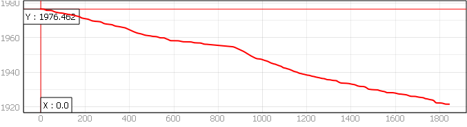

# Modelo Fisiográfico

El análisis fisiográfico es fundamental para caracterizar las propiedades físicas de una zona de estudio, incluyendo su topografía, red de drenaje, tipos de suelo y cobertura vegetal. Estos elementos determinan en gran medida el comportamiento hidrológico de la cuenca y su respuesta ante eventos de precipitación.

```{r setup, include=FALSE}
knitr::opts_chunk$set(echo = TRUE)
```

```{r, include=FALSE}
library(readxl)
library(tidyverse)
library(dplyr)
library(tidyr)
library(magrittr)
library(sf)
library(rgdal)
library(raster)
library(units)
library(jsonlite)
library(knitr)
library(kableExtra)
```

```{r, eval=FALSE, include=FALSE}
if (!require(remotes)) install.packages("remotes")

# on 64-bit Windows
remotes::install_github(c("ropensci/tabulapdf"), INSTALL_opts = "--no-multiarch")

# elsewhere
remotes::install_github(c("ropensci/tabulapdf"))

library("tabulapdf")
```

## Topografía documentada

```{r, include=FALSE}

cuenca_shp <- "tilapia_cuenca_cem.shp"
# Leer el shapefile
cuenca <- readOGR(dsn = cuenca_shp, layer = "tilapia_cuenca_cem", verbose = FALSE)
```

```{r, include=FALSE}
tabla_tamano_cuencas <- data.frame(
  Clasificacion = c("Muy pequeña", "Pequeña", "Intermedia pequeña", "Intermedia grande", "Grande", "Muy grande"),
  Rango_tamaño_km2 = c("< 25", "25 - 250", "250 - 500", "500 - 2,500", "2,500 - 5,000", "> 5,000"))
```

```{r include=FALSE}
#importar archivo con cadenamientos del cauce principal, obtenido con profile tool en qgis

cauce_principal <- read_excel("cauce_principal.xlsx")
```

```{r include=FALSE}
pendiente_uniforme_longitud_total <- cauce_principal$cadenamiento[nrow(cauce_principal)] - cauce_principal$cadenamiento[1]
pendiente_uniforme_deltay <- cauce_principal$elevacion[1] - cauce_principal$elevacion[nrow(cauce_principal)]
pendiente_uniforme <- pendiente_uniforme_deltay / pendiente_uniforme_longitud_total
```

```{r, include=FALSE}
# Crear una función para determinar la clasificación de la cuenca
determinar_clasificacion <- function(area_km2) {
  for (i in seq_along(tabla_tamano_cuencas$Rango_tamaño)) {
    rango_actual <- tabla_tamano_cuencas$Rango_tamaño[i]
    if (rango_actual == "< 25" && area_km2 < 25) {
      return(tabla_tamano_cuencas$Clasificacion[i])
    } else if (rango_actual == "> 5,000" && area_km2 > 5000) {
      return(tabla_tamano_cuencas$Clasificacion[i])
    } else {
      rango_min <- as.numeric(gsub(",", "", strsplit(rango_actual, "-")[[1]][1]))
      rango_max <- as.numeric(gsub(",", "", strsplit(rango_actual, "-")[[1]][2]))
      if (!is.na(rango_min) && !is.na(rango_max) && area_km2 >= rango_min && area_km2 < rango_max) {
        return(tabla_tamano_cuencas$Clasificacion[i])
      }
    }
  }
}

# Obtener la clasificación de la cuenca
clasificacion_cuenca <- determinar_clasificacion(cuenca$area_km2)
```

Para el presente estudio, se utilizó la información publicada en el geoportal **Continuo de Elevaciones Mexicano 3.0** con una resolución de 5 x 5 metros y datum ITRF08 edición 2014. Los datos fueron obtenidos en junio de 2024 y procesados en el Sistema de Referencia de Coordenadas EPSG:32614 WGS 84 / UTM zona 14N, en unidades métricas.

```{r, echo=FALSE, figura-drenajepiem, fig.cap="Avenidas pluviales del Parque Industrial El Marqués"}
knitr::include_graphics("mapa drenaje pluvial piem.png")
```

Al comparar el MDE con la imagen satelital se puede observar que no está actualizado ya que no corresponde al área de escurrimiento que genera el Parque Industrial El Marqués. Sin embargo se propone utilizar esta información para tener una aproximación del caudal que sirva para dimensionar las SbN que permitan mitigar los riesgos de inundación presentes en la granja.

## Delimitación del área de escurrimiento y red hidrográfica

```{r, echo=FALSE, figura-cuencadelim, fig.cap="Delimitación de la cuenca de aportación", fig.alt="cuenca delimitada con QGIS 3.36"}
knitr::include_graphics("Mapa cuenca tilapia.png")
```

La zona analizada, pertenece a la Región Hidrográfica Lerma - Santiago y forma parte de la cuenca abierta Río Laja. Presenta un **área de drenaje** de `r round(cuenca$area_km2, 2)` km^2^, delimitada por un **perímetro** de `r round(cuenca$perim_km, 2)` km y una **longitud** de `r round(cuenca$long_cu_km, 2)` km, clasificándose como una cuenca **`r clasificacion_cuenca`** conforme a la tabla \@ref(tab:tabla-tamanocuencas), de los *Apuntes de Hidrología Urbana* [@conde1995].

```{r, echo=FALSE, tabla-tamanocuencas}

knitr::kable(tabla_tamano_cuencas, 
               digits = 4, 
               booktabs = TRUE, 
               caption = "Clasificación de las cuencas según su tamaño", label = NA)%>%
  kable_classic_2(bootstrap_options = "basic", 
                  full_width = F, 
                  font_size = 12, 
                  position = "center") 

```

La **elevación media de la cuenca**, 1940.98 msnm, y la **pendiente de la cuenca**, `r round(cuenca$pend_med_p, 2)` %, son valores que se obtienen
consultando las estadísticas de los rasters generados en QGIS.

El cauce principal, con una **longitud** de `r round(pendiente_uniforme_longitud_total/1000, 2)` km, nace en el Parque Industrial Bernardo Quintana y descarga en la localidad de Caro, específicamente en el drenaje de tormenta que recién construyeron.

## Descripción del Relieve

Para describir el relieve, se presenta la **relación de enlongación**, que caracteriza el relieve, cuya fórmula es $$R_e = 1.128 \frac{\sqrt{\ A}}{L_m}$$ y el **coeficiente de compacidad**, que indica la geometría de la cuenca, cuya fórmula es $$K_c = 0.282\frac{P}{\sqrt{A}}$$.

```{r,results='asis', comment = "", echo=FALSE}
Re <- round((1.1284 * (cuenca$area_km2**0.5)) / cuenca$long_cu_km, 1)
kc <- 0.28 * (cuenca$perim_km/sqrt(cuenca$area_km2))

cat("El valor de la relación de enlongación, R~e~ es", Re, "\n")

if (Re >= 0.9 & Re <= 1.0) {
  cat(", por lo que consideramos que la cuenca tiene un relieve bajo.\n")
} else if (Re >= 0.6 & Re < 0.9) {
  cat(", por lo que consideramos que la cuenca tiene un relieve fuerte.\n")
} else {
  cat(", por lo que consideramos que la cuenca tiene un relieve fuera de rango.\n")
}

cat("\nEl valor del coeficiente de compacidad, k~c~ es", kc, "\n")

if (kc <= 1) {
  cat(", por lo que consideramos que la cuenca tiene una forma circular.\n")
} else if (kc > 1 & kc <= 3) {
  cat(", por lo que consideramos que la cuenca tiene una forma alargada.\n")
} else {
  cat(", por lo que consideramos que la cuenca tiene una forma desconocida.\n")
}
```

El relieve influye en la velocidad del escurrimiento, la erosión del suelo y el transporte de sedimentos. Un relieve fuera de rango y una forma alargada implican una mayor concentración de los flujos de escorrentía en el cauce principal, lo que aumenta el riesgo de inundaciones repentinas. 


## Red de drenaje

La red de drenaje de una cuenca hidrográfica desempeña un papel crucial en el movimiento y transporte del agua superficial, subsuperficial y subterránea, tanto de manera temporal como permanente [@campos1998]. Las características de esta red reflejan la eficiencia del sistema de drenaje de la cuenca y su capacidad para evacuar los excedentes de agua durante eventos de precipitación intensa.

```{r include=FALSE}
#sirve para determinar la cantidad de tramos a programar

print((cauce_principal$elevacion[1] - cauce_principal$elevacion[nrow(cauce_principal)])*0.04)
print((cauce_principal$cadenamiento[nrow(cauce_principal)] - cauce_principal$cadenamiento[1])*0.04)
```

### Análisis de pendiente del cauce principal de la cuenca

```{r, include=FALSE}
elev_inicial_cauce <- cauce_principal %>% 
  dplyr::select(elevacion) %>% 
  slice(1) %>% 
  pull()

elev_final_cauce <- cauce_principal %>% 
  dplyr::select(elevacion) %>% 
  slice(n()) %>% 
  pull()
```

El análisis del perfil longitudinal del cauce principal proporciona información sobre su pendiente, la cual influye en la velocidad del flujo y la capacidad de transporte de sedimentos. 

```{r, echo=FALSE, figura-cauceperfil, out.width=600, fig.align='center', fig.cap="Perfil del cauce principal"}

```

La pendiente del cauce principal se ha calculado usando tres diferentes fórmulas, las cuales se encuentran referenciadas en el manual de alcantarillado y saneamiento pluvial [@conagua2019].

-   Pendiente uniforme  
-   Pendiente por elevaciones constantes de Taylor - Shwarz  
-   Pendiente por longitudes constantes de Taylor - Shwarz  

#### Pendiente uniforme

Esta pendiente se calcula a partir de la longitud total del cauce y la diferencia de elevación entre su punto inicial y final. La fórmula es
$$ S_c = \frac{\Delta H}{L_{tc}} \label{eq:pendieteuniforme} $$

```{r results='asis', echo=FALSE}
cat("La pendiente media del cauce principal calculada con la fórmula de pendiente uniforme es:", pendiente_uniforme, "m/m\n\n")
```

#### Pendiente Taylor Schwarz - Elevaciones constantes

Esta fórmula considera que el río está formado de canales con pendientes uniformes, por lo que se segmenta en tramos equivalentes para poder calcular la pendiente media.
$$S_{ec} = \left[\frac{l_t}{\sum_{i=1}^n\frac{l_i}{\sqrt{s_i}}} \right]^{2} \label{eq:pendietetaylorelev} $$

```{r include=FALSE}
pendiente_ts_ec <- function(dataframe, paso_elevacion) {
  # Extraer el primer valor de elevación del dataframe
  elevacion_inicial <- dataframe$elevacion[1]

  # Calcular el número de elevaciones constantes descendentes necesarias
  num_elevaciones <- ceiling((elevacion_inicial - min(dataframe$elevacion)) / paso_elevacion) + 1

  # Generar el vector de elevaciones constantes descendentes
  elevaciones_constantes <- seq(elevacion_inicial, by = -paso_elevacion, length.out = num_elevaciones)


  # Crear una lista para almacenar los valores justo arriba y justo abajo de cada elevación constante
  valores_around <- vector("list", length(elevaciones_constantes))

  # Iterar sobre cada valor en elevaciones_constantes
  for (i in 1:length(elevaciones_constantes)) {
    # Encontrar el índice del valor justo arriba del valor actual en elevaciones_constantes
    index_above <- max(which(dataframe$elevacion >= elevaciones_constantes[i]))
    # Encontrar el índice del valor justo abajo del valor actual en elevaciones_constantes
    index_below <- min(which(dataframe$elevacion <= elevaciones_constantes[i]))

    # Almacenar los valores justo arriba y justo abajo en la lista
    valor_arriba <- dataframe$elevacion[index_above]
    valor_abajo <- ifelse(is.infinite(index_below), elevaciones_constantes[i], dataframe$elevacion[index_below])
    valores_around[[i]] <- c(valor_arriba, valor_abajo)
  }

  # Crear una lista para almacenar los cadenamientos asociados a cada valor de elevación
  cadenamientos_around <- vector("list", length(valores_around))

  # Iterar sobre cada elemento en valores_around
  for (i in 1:length(valores_around)) {
    # Extraer los valores de elevación justo arriba y justo abajo
    elev_arriba <- valores_around[[i]][1]
    elev_abajo <- valores_around[[i]][2]

    # Encontrar los índices de los valores justo arriba y justo abajo en el dataframe original
    index_arriba <- which(dataframe$elevacion == elev_arriba)
    index_abajo <- which(dataframe$elevacion == elev_abajo)

    # Extraer los cadenamientos asociados
    cadenamiento_arriba <- dataframe$cadenamiento[index_arriba]
    cadenamiento_abajo <- dataframe$cadenamiento[index_abajo]

    # Almacenar los cadenamientos asociados en la lista
    cadenamientos_around[[i]] <- c(cadenamiento_arriba, cadenamiento_abajo)
  }

  # Obtener el valor de arriba y el valor de abajo de la última fila de valores_around
  valor_arriba_ultima <- valores_around[[length(valores_around)]][1]
  valor_abajo_ultima <- valores_around[[length(valores_around)]][2]

  # Obtener el valor de cadenamiento de la última fila de cadenamientos_around
  cadenamiento_ultima <- cadenamientos_around[[length(cadenamientos_around)]]

  # Interpolar para obtener el valor de cadenamiento faltante
  cadenamiento_interp <- approx(
    x = c(valor_arriba_ultima, valor_abajo_ultima),
    y = c(cadenamiento_ultima, cadenamiento_ultima),
    xout = elevaciones_constantes[length(elevaciones_constantes)],
    method = "linear"
  )$y

  # Agregar el valor interpolado a la última fila de cadenamientos_around
  cadenamientos_around[[length(cadenamientos_around)]] <- c(cadenamientos_around[[length(cadenamientos_around)]], cadenamiento_interp)

  # Crear un dataframe para almacenar los resultados
  resultados <- data.frame(
    elevacion_constante = elevaciones_constantes,
    elev_arriba = numeric(length(elevaciones_constantes)),
    elev_abajo = numeric(length(elevaciones_constantes)),
    cadena_arriba = numeric(length(elevaciones_constantes)),
    cadena_abajo = numeric(length(elevaciones_constantes))
  )

  # Llenar el dataframe con los valores
  for (i in 1:length(valores_around)) {
    resultados[i, "elev_arriba"] <- valores_around[[i]][1]
    resultados[i, "elev_abajo"] <- valores_around[[i]][2]
    resultados[i, "cadena_arriba"] <- cadenamientos_around[[i]][1]
    resultados[i, "cadena_abajo"] <- cadenamientos_around[[i]][2]
  }

  # Calcular la interpolación constante para encontrar el cadenamiento asociado a cada elevación constante
  cadenamientos_interp <- approx(
    x = resultados$elev_abajo,  # Valores de elevación justo abajo
    y = resultados$cadena_abajo, # Cadenamientos asociados justo abajo
    xout = resultados$elevacion_constante, # Valores de elevación constantes
    method = "constant",  # Usar interpolación constante
    yleft = NA,  # No especificar valor para puntos por debajo del rango
    yright = NA,  # No especificar valor para puntos por encima del rango
    rule = 2  # Utilizar el valor más cercano para puntos fuera del rango
  )$y

  # Agregar los resultados de la interpolación al dataframe
  resultados$cadena_interp <- cadenamientos_interp

  # Obtener el último valor de cadenamiento del dataframe original
  ultimo_cadenamiento <- tail(dataframe$cadenamiento, 1)

  # Reemplazar NA en cadena_interp con el último valor de cadenamiento
  resultados$cadena_interp[is.na(resultados$cadena_interp)] <- ultimo_cadenamiento

  # Obtener el último valor de la columna elevacion del dataframe original
  ultimo_valor_elevacion <- tail(dataframe$elevacion, n = 1)

  # Asignar el último valor de elevacion del dataframe original a la última fila de elevacion_constante en resultados
  resultados$elevacion_constante[nrow(resultados)] <- ultimo_valor_elevacion

  # Calcular la diferencia entre los valores de cadenamiento consecutivos
  resultados$diferencia <- c(diff(resultados$cadena_interp), NA)

  # Calcular la diferencia de elevación entre filas consecutivas
  resultados$htramo <- c(-diff(resultados$elevacion_constante), NA)

  # Calcular la longitud_tramo / raíz cuadrada(htramo / longitud_tramo)
  resultados$relacion <- resultados$diferencia / sqrt(resultados$htramo / resultados$diferencia)

  # Calcular la sumatoria de longitud_tramo
  pendiente_taylor_ec_numerador <- sum(resultados$diferencia, na.rm = TRUE)

  # Calcular la sumatoria de relacion
  pendiente_taylor_ec_denominador <- sum(resultados$relacion, na.rm = TRUE)

  # Calcular (sum_longitud_tramo / sum_relacion)^2
  pendiente_taylor_elev <- (pendiente_taylor_ec_numerador / pendiente_taylor_ec_denominador)^2

  # Mostrar el resultado
  cat("La pendiente media del cauce principal calculada con la fórmula de Taylor Schwarz por elevaciones constantes es:", pendiente_taylor_elev, "m/m\n\n")
}

```

```{r results='asis', echo=FALSE, warning=FALSE}
pendiente_ts_ec(cauce_principal, paso_elevacion = 2)
```

#### Pendiente Taylor Schwarz - Longitudes constantes

Esta fórmula considera que el río está formado de canales con pendientes uniformes, por lo que se segmenta en tramos equivalentes para poder calcular la pendiente media.
$$S_{lc} = \left[  \frac{n}{\sum_{i=1}^n\frac{1}{\sqrt{s_i}}} \right]^{2} \label{eq:pendietetaylorlong} $$

```{r include=FALSE}
pendiente_ts_lc <- function(dataframe, paso_cadenamiento) {
  # Extraer el primer valor de cadenamiento del dataframe
  cadenamiento_inicial <- dataframe$cadenamiento[1]

  # Calcular el número de cadenamientos constantes ascendentes necesarios
  num_cadenamientos <- ceiling((max(dataframe$cadenamiento) - cadenamiento_inicial) / paso_cadenamiento) + 1

  # Generar el vector de cadenamientos constantes ascendentes
  cadenamientos_constantes <- seq(cadenamiento_inicial, by = paso_cadenamiento, length.out = num_cadenamientos)

  # Crear una lista para almacenar los valores justo arriba y justo abajo de cada cadenamiento constante
  valores_around <- vector("list", length(cadenamientos_constantes))

  # Iterar sobre cada valor en cadenamientos_constantes
  for (i in 1:length(cadenamientos_constantes)) {
    # Encontrar el índice del valor justo arriba del valor actual en cadenamientos_constantes
    index_above <- min(which(dataframe$cadenamiento >= cadenamientos_constantes[i]))
    # Encontrar el índice del valor justo abajo del valor actual en cadenamientos_constantes
    index_below <- max(which(dataframe$cadenamiento <= cadenamientos_constantes[i]))

    # Almacenar los valores justo arriba y justo abajo en la lista
    valor_arriba <- ifelse(is.infinite(index_above), cadenamientos_constantes[i], dataframe$cadenamiento[index_above])
    valor_abajo <- dataframe$cadenamiento[index_below]
    valores_around[[i]] <- c(valor_arriba, valor_abajo)
  }

  # Crear una lista para almacenar las elevaciones asociadas a cada valor de cadenamiento
  elevaciones_around <- vector("list", length(valores_around))

  # Iterar sobre cada elemento en valores_around
  for (i in 1:length(valores_around)) {
    # Extraer los valores de cadenamiento justo arriba y justo abajo
    cad_arriba <- valores_around[[i]][1]
    cad_abajo <- valores_around[[i]][2]

    # Encontrar los índices de los valores justo arriba y justo abajo en el dataframe original
    index_arriba <- which(dataframe$cadenamiento == cad_arriba)
    index_abajo <- which(dataframe$cadenamiento == cad_abajo)

    # Extraer las elevaciones asociadas
    elevacion_arriba <- dataframe$elevacion[index_arriba]
    elevacion_abajo <- dataframe$elevacion[index_abajo]

    # Almacenar las elevaciones asociadas en la lista
    elevaciones_around[[i]] <- c(elevacion_arriba, elevacion_abajo)
  }

  # Obtener el valor de arriba y el valor de abajo de la última fila de valores_around
  valor_arriba_ultima <- valores_around[[length(valores_around)]][1]
  valor_abajo_ultima <- valores_around[[length(valores_around)]][2]

  # Obtener el valor de elevación de la última fila de elevaciones_around
  elevacion_ultima <- elevaciones_around[[length(elevaciones_around)]]

  # Interpolar para obtener el valor de elevación faltante
  elevacion_interp <- approx(
    x = c(valor_arriba_ultima, valor_abajo_ultima),
    y = c(elevacion_ultima, elevacion_ultima),
    xout = cadenamientos_constantes[length(cadenamientos_constantes)],
    method = "linear"
  )$y

  # Agregar el valor interpolado a la última fila de elevaciones_around
  elevaciones_around[[length(elevaciones_around)]] <- c(elevaciones_around[[length(elevaciones_around)]], elevacion_interp)

  
  # Crear un dataframe para almacenar los resultados
resultados2 <- data.frame(
  cadenamiento_constante = cadenamientos_constantes,
  cad_arriba = numeric(length(cadenamientos_constantes)),
  cad_abajo = numeric(length(cadenamientos_constantes)),
  elev_arriba = numeric(length(cadenamientos_constantes)),
  elev_abajo = numeric(length(cadenamientos_constantes))
)

# Llenar el dataframe con los valores
for (i in 1:length(valores_around)) {
  resultados2[i, "cad_arriba"] <- valores_around[[i]][1]
  resultados2[i, "cad_abajo"] <- valores_around[[i]][2]
  resultados2[i, "elev_arriba"] <- elevaciones_around[[i]][1]
  resultados2[i, "elev_abajo"] <- elevaciones_around[[i]][2]
}

  
# Calcular la interpolación para encontrar la elevación asociada a cada cadenamiento constante
elevaciones_interp <- splinefun(
  x = resultados2$cad_abajo,   # Valores de cadenamiento justo arriba
  y = resultados2$elev_abajo,  # Elevaciones asociadas justo arriba
  method = "natural"  # Utilizar el método spline natural
)(resultados2$cadenamiento_constante)  # Aplicar la interpolación al vector de cadenamientos constantes


# Agregar los resultados de la interpolación al dataframe
resultados2$elevacion_interp <- elevaciones_interp


# Obtener el último valor de elevación del dataframe original
ultima_elevacion <- tail(dataframe$elevacion, 1)

# Reemplazar NA en elevacion_interp con el último valor de elevación
resultados2$elevacion_interp[is.na(resultados2$elevacion_interp)] <- ultima_elevacion

# Obtener el último valor de la columna cadenamiento del dataframe original
ultimo_valor_cadenamiento <- tail(dataframe$cadenamiento, n = 1)

# Asignar el último valor de cadenamiento del dataframe original a la última fila de cadenamiento_constante en resultados
resultados2$cadenamiento_constante[nrow(resultados2)] <- ultimo_valor_cadenamiento


  # Calcular la diferencia entre los valores de cadenamiento consecutivos
resultados2$longitud_tramo <- c(diff(resultados2$cadenamiento_constante), NA)

# Calcular la diferencia de elevación entre filas consecutivas
resultados2$htramo <- c(-diff(resultados2$elevacion_interp), NA)

# Calcular la longitud_tramo / raíz cuadrada(htramo / longitud_tramo)
resultados2$relacion <- 1 / sqrt(resultados2$htramo / resultados2$longitud_tramo)

# Calcular la sumatoria de longitud_tramo
pendiente_taylor_lc_numerador <- nrow(resultados2)

# Calcular la sumatoria de relacion
pendiente_taylor_lc_denominador <- sum(resultados2$relacion, na.rm = TRUE)

# Calcular (sum_longitud_tramo / sum_relacion)^2
pendiente_taylor_long <- (pendiente_taylor_lc_numerador / pendiente_taylor_lc_denominador)^2

 # Mostrar el resultado
  cat("La pendiente media del cauce principal calculada con la fórmula de Taylor Schwarz por longitudes constantes es:", pendiente_taylor_long, "m/m\n\n")
  
}
```

```{r results='asis', echo=FALSE, warning=FALSE}
pendiente_ts_lc(cauce_principal, paso_cadenamiento = 70)
```

Se hicieron corridas del modelo hidrológico con las pendientes de Taylor - Shwarz y uniforme, y se decidió usar la pendiente uniforme, debido a que genera resultados más conservadores. 

Las memorias de cálculo que generan las pendientes Taylor - Shwarz se encuentran en el Ápéndice.

Las imágenes que se presentan a continuación muestran las condiciones actuales del drenaje de tormenta que pasa por un costado de la Granja La Familia Tilapia, el cual drena las aguas pluviales del Parque Industrial El Marqués. El drenaje comienza con unas rejillas circulares de 90 cm de diámetro, las cuales encauzan el agua en un canal abierto y al llegar a la escuela se convierte en un cajón pluvial de 2 metros x 2 metros.

```{r, echo=FALSE, figura-drenajetormenta1, out.width=600, fig.align='center', fig.cap="Inicio del drenaje de tormenta"}
knitr::include_graphics("drenajetormenta1.png")
```

```{r, echo=FALSE, figura-drenajetormenta2, out.width=600, fig.align='center', fig.cap="Canal drenaje de tormenta"}

```

```{r, echo=FALSE, figura-drenajetormenta3, out.width=600, fig.align='center', fig.cap="Cajón pluvial"}

```

Las imágenes que se presentan a continuación muestran las condiciones de las avenidas del Parque Industrial El Marqués, las cuales drenan las aguas pluviales y las dirigen al drenaje de tormenta.

```{r, echo=FALSE, figura-piem2, out.width=600, fig.align='center', fig.cap="Avenida que drena las aguas pluviales del Parque Industrial El Marqués"}

```

```{r, echo=FALSE, figura-piem, out.width=600, fig.align='center', fig.cap="Fin de la avenida que drena las aguas pluviales del Parque Industrial El Marqués"}

```

Los parámetros fisiográficos y geomorfológicos calculados se muestran en la siguiente tabla.

```{r, echo=FALSE, tabla-resumenparametrosfisio}
# Crear un dataframe con los datos
resumen_paramatros_fisiogeom <- data.frame(
  Variable = c("Área de la cuenca (km^2)", "Perímetro de la cuenca (km)", "Longitud de la cuenca (km)",
               "Pendiente media de la cuenca (%)", "Elevación media de la cuenca (msnm)", "Relación de elongación",
               "Coeficiente de compacidad", "Elevación inicial del cauce (msnm)", "Elevación final del cauce (msnm)",
               "Longitud total del cauce (km)", "Pendiente uniforme del cauce (%)"),
  Valor = c(cuenca$area_km2, cuenca$perim_km, cuenca$long_cu_km, cuenca$pend_med_p, 1940.98, Re, kc,
            elev_inicial_cauce, elev_final_cauce, pendiente_uniforme_longitud_total/1000, pendiente_uniforme*100)
)

# Mostrar la tabla
knitr::kable(resumen_paramatros_fisiogeom,
                      digits = 4,
                      booktabs = TRUE,
                      caption = "Características de la cuenca y el cauce principal",
                      label = NA) %>%
  kable_classic_2(bootstrap_options = "condensed",
                  full_width = F,
                  font_size = 12,
                  position = "center")
```


## Estimación del coeficiente de escurrimiento

Dadas las características de la cuenca en estudio, con un área de `r round(cuenca$area_km2, 2)` km^2^ y una naturaleza predominantemente urbana, se considera el uso del método racional, el cual es más adecuado para cuencas pequeñas y zonas urbanas. Por lo que en el estudio solo se usará el cálculo del **Número de Curva** para calcular el coeficiente de escurrimiento en La Granja.


## Tiempos de estudio

En el presente estudio, se han revisado y comparado diferentes fórmulas empíricas propuestas por diversos autores para el cálculo de T~c~. Si bien la fórmula de Kirpich es ampliamente aceptada a nivel internacional, es importante evaluar y comparar los resultados obtenidos con otros enfoques para garantizar la robustez y confiabilidad de los análisis.

### Tiempo de concentracion por kirpich

La fórmula para calcular el tiempo por el autor Kirpich es la más usada a nivel global, su fórmula es
$$ t_{c} = 0.0003245 \left(\frac{l_t}{\sqrt{S_{tc}}}\right)^{0.77} $$.

```{r results='asis', comment = "", echo=FALSE, warning=FALSE}
# define the constants
k = 0.0195
const1 = 0.77
const2 = -0.385

# Calculate tc

tc = set_units((k * (pendiente_uniforme_longitud_total ** const1) * (pendiente_uniforme ** const2)), "min") #tiempo de concentración por Kirpich
tc_hr <- tc %>%  set_units("hour")
#0.0003245 * (((pendiente_uniforme_longitud_total)**const1) / (pendiente_uniforme **0.385))  #toc aparicio
#0.0003245 * ((pendiente_uniforme_longitud_total) / sqrt(pendiente_uniforme ))**0.77 

cat("El valor del tiempo de concentración calculado por Kirpich para toda el área de estudio es: ", round(tc_hr,2), "horas"," ", "o ", round(tc,2), "minutos", ".")
```

### Tiempo de concentracion por Rowe

La fórmula para calcular el tiempo por el autor Rowe se define en [@conagua2019, pág. 41] con la siguiente expresión
$$ t_{c} =  \left(\frac{0.86l_t^{2}}{\sqrt{S_{lcm}}}\right)^{0.385} $$.

```{r results='asis', comment = "", echo=FALSE, warning=FALSE}
tc_rowe = set_units(((0.86 * (pendiente_uniforme_longitud_total/1000)**2) / (pendiente_uniforme*1000))**0.385,"hr")

cat("El valor del tiempo de concentración calculado por Rowe para toda el área de estudio es: ", round(tc_rowe,2), "horas",".")
```

## Granja Familia Tilapia 

Se estudia la fisiografía de La Granja para poder diseñar las SbN con las dimensiones y características apropiadas para conducir el agua pluvial excedente hacia zonas inundables que permitan un mejor manejo del agua.

```{r, echo=FALSE, figura-ortomosaico, fig.align='center', fig.cap="Ortomosaico de La Granja La Familia Tilapia"}
knitr::include_graphics("Mapa Ortomosaico.png")
```

```{r, echo=FALSE, figura-mdt, fig.align='center', fig.cap="Modelo Digital del Terreno de La Granja La Familia Tilapia"}
knitr::include_graphics("Mapa MDT.png")
```

Los trazos de las curvas de nivel sirven para determinar los canales-camino que se tendrán que diseñar para dirigir el agua hacia las zonas inundables.

```{r, echo=FALSE, figura-pendientereclasificada, fig.align='center', fig.cap="Prendiente reclasificada de La Granja La Familia Tilapia"}
knitr::include_graphics("Mapa pendiente reclasificada.png")
```

El mapa de pendientes reclasificadas permite analizar que zonas son propensas a escurrir el agua con mayor velocidad y que zonas pueden ser inundables.

```{r, echo=FALSE, figura-tipodesuelo, fig.align='center', fig.cap="Tipo de suelo de La Granja La Familia Tilapia"}
knitr::include_graphics("Mapa tipo de suelo.png")
```

El tipo de suelo es extraído del geoportal de la INEGI, especificamente la serie III de edafología, en donde se aprecia que La Granja se compone del suelo de tipo vertisol. Los vertisoles son suelos llamados pesados, se crean bajo condiciones alternadas de saturación-sequía, se forman grietas anchas, abundantes y profundas cuando están secos y tienen más de 30% de arcillas expandibles. Mediante un buen programa de labranza y drenaje son bastante fértiles para la agricultura por su alta capacidad de retención de humedad y sus propiedades de intercambio mineral con las plantas.

Es necesario realizar pruebas de infiltración en el terreno para saber con mayor precisión las áreas idóneas para implemetar las SbN.

```{r, echo=FALSE, figura-ortomosaico2, fig.align='center', fig.cap="Red de drenaje de La Granja La Familia Tilapia"}
knitr::include_graphics("Mapa Ortomosaico 2.png")
```

Se creó la red de drenaje de La Granja, generando cuencas de aportación que generen un escurrimiento aprovechable que pueda ser dirigido hacia zonas que actualmente están en desuso y se podrían aprovechar como áreas inundables.


La cuenca de aportación 1 es la que tiene riesgos de inundación, debido a que cuando hay tormentas el canal abierto se desborda e inunda la cuenca de aportación 2 y algunas instalaciones en la cuenca de aportación 5. 
