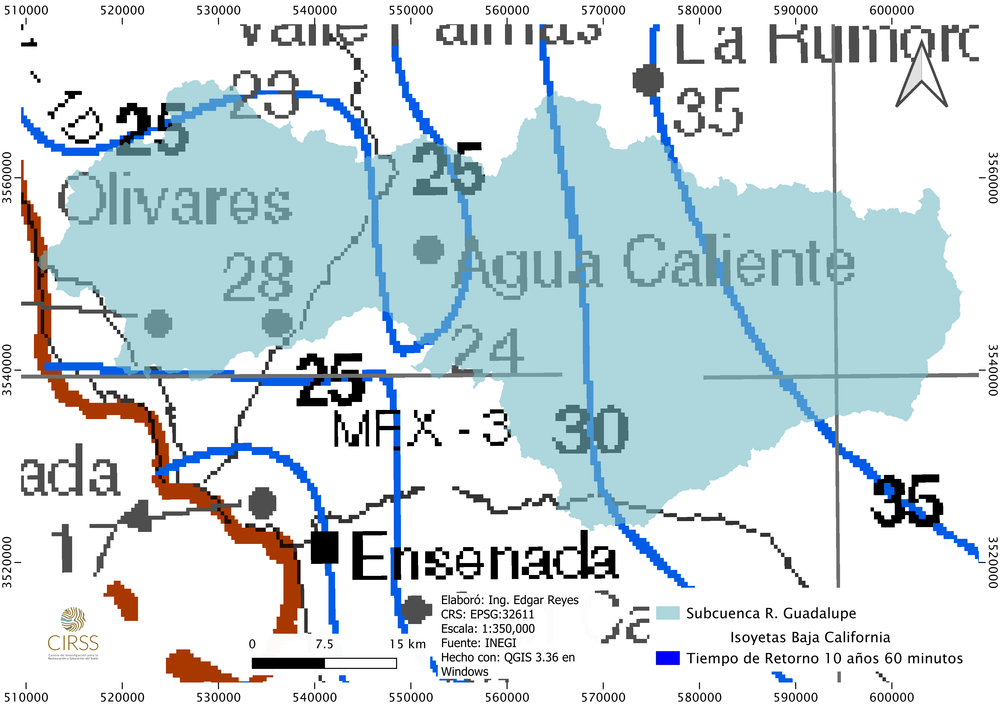

# Modelo meteorológico

En el análisis hidrológico de una cuenca, el estudio de los datos climatológicos es fundamental para dimensionar adecuadamente la precipitación que alimenta la red de drenaje. La serie temporal de interés en este caso es la de valores mensuales de la precipitación máxima en 24 horas, ya que esta variable es la más ampliamente disponible según la Comisión Nacional del Agua [@conagua1987]. Esta variable sirve como entrada en el modelo hidrológico para simular el ciclo hidrológico y predecir el suministro de agua en la región. Debido a la naturaleza aleatoria de la precipitación, es necesario abordar el ciclo hidrológico desde un enfoque probabilístico.

```{r include=FALSE}

library(tidyverse)
library(dplyr)
library(ggplot2)
library(magrittr) # %<>%
library(latexpdf)
library(tinytex)
library(climatol) #quality control, homogenization and missing data in-filling of climatological series 
library(readxl)
library(writexl)
library(vegan) #prueba de independencia, Cochran-Mantel-Haenszel Chi-Squared Test 
library(FAdist) #logpearson III y otras
library(nsRFA) #analisis frecuencias. talvez es el que impera.
library(fitdistrplus) #ajustar distribuciones
library(sp) #objetos espaciales
library(sf) #objetos vectoriales
library(raster)
library(rgdal) #lee shapefiles
library(units) #scales with units
library(knitr)
library(kableExtra)
```

A fin de generar un modelo probabilístico robusto, se han estudiado diferentes metodologías para el tratamiento de series temporales de datos climatológicos, con el propósito de homogeneizar los datos, identificar y tratar valores faltantes y atípicos. En este contexto, RStudio se presenta como una herramienta valiosa, ya que permite explorar las metodologías propuestas por diversos autores, aprovechando el poder computacional del software estadístico.

Para el trabajo con los datos climatológicos, se ha decidido utilizar la librería *climatol* [@guijarro2024], debido a que se basa en las guías de homogeneización establecidas por la Organización Meteorológica Mundial y ha sido referenciada en comunidades de hidrólogos.

En cuanto a la selección de las distribuciones probabilísticas de los eventos hidrológicos futuros, se utiliza principalmente la librería *nsRFA* [@nsRFA2023], ya que ofrece una colección de herramientas estadísticas para la aplicación objetiva (no supervisada) de los métodos de Análisis de Frecuencia Regional en Hidrología. En otras palabras, permite al hidrólogo ajustar funciones de distribución a las curvas de crecimiento regionales empíricas haciendo uso de modelos de aprendizaje automático.

En los últimos años, se han realizado numerosos estudios en diferentes países sobre el análisis regional de frecuencias de precipitaciones [@dominguez2018]. Por tanto, el uso de estas aplicaciones no supervisadas puede ser de gran valor para la creación de modelos probabilísticos que permitan estimar de manera confiable las tormentas de diseño, contribuyendo así a una gestión eficiente y sostenible de los recursos hídricos en la cuenca.

## Selección de estaciones climatológicas

En el proceso de modelación hidrológica, la selección adecuada de estaciones climatológicas es crucial para garantizar la calidad y representatividad de los datos de precipitación utilizados. En el presente estudio, el criterio para determinar la cantidad de estaciones a considerar se fundamenta en las recomendaciones de la librería climatol, la cual sugiere el uso de al menos seis estaciones para obtener mejores resultados en la homogeneización de los datos climatológicos.

Afortunadamente, la cuenca en estudio cuenta con un número suficiente de estaciones climatológicas para cumplir con este criterio. Las tablas con los datos climatológicos de las seis estaciones seleccionadas fueron descargadas del portal de CONAGUA e importadas en RStudio para ser tratadas mediante las funciones de la librería climatol.

La selección de estaciones climatológicas representativas es un paso crucial en el análisis hidrológico, ya que los datos de precipitación obtenidos servirán como entrada en el modelo hidrológico para simular el ciclo hidrológico y predecir el suministro de agua en la región. Una adecuada cobertura espacial de las estaciones garantiza que se capturen las variaciones locales en los patrones de precipitación, lo cual es esencial para obtener estimaciones precisas de los caudales y volúmenes de escorrentía.

Además de la cantidad de estaciones, es importante considerar otros factores como la distribución espacial, la longitud y calidad de los registros históricos, y la presencia de posibles fuentes de error o inconsistencias en los datos. La aplicación de técnicas de homogeneización, como las proporcionadas por la librería climatol, permiten identificar y tratar valores atípicos o faltantes, mejorando la confiabilidad de los datos utilizados en el modelo hidrológico.

```{r, echo=FALSE, figura-voronoi , fig.cap="Polígonos de Voronoi para analizar la influencia de las estaciones en la subcuenca R. Guadalupe"}
knitr::include_graphics("voronoi.png")
```

```{r, include=FALSE}
#Función para importar lluvia maxima 24h de estación
importar_estacion <- function(nombre_df, ruta_archivo) {
  # Lee todas las líneas del archivo
  lineas <- readLines(ruta_archivo)
  
  # Encuentra la línea que contiene el encabezado de la tabla
  indice_encabezado <- grep("^LLUVIA MÁXIMA 24H", lineas)
  
  # Encuentra la línea que contiene el último dato de la tabla
  indice_fin_tabla <- grep("MÍNIMA", lineas, fixed = TRUE)[1]
  
  # Calcula el número de filas
  nrows <- indice_fin_tabla - indice_encabezado - 2  # Resta 2 para excluir las líneas finales que sobran
  
  # Lee los datos con el número calculado de filas
  df <- read.table(ruta_archivo, 
                   header = TRUE, 
                   sep = "\t", 
                   skip = indice_encabezado,  
                   nrows = nrows,
                   colClasses = c(rep("numeric", 13), rep("NULL", 3)))
  
  # Asigna un nombre al dataframe
  assign(nombre_df, df, envir = .GlobalEnv)
  
  # Imprime la estructura del dataframe
  str(get(nombre_df))
}
```


```{r, include=FALSE}
#Importamos lluvia maxima de 24 horas de las estaciones de interés
# estacion 2001
importar_estacion("estacion_2001", "mes02001.TXT")

# estacion 2036
importar_estacion("estacion_2036", "mes02036.TXT")

# estacion 2118
importar_estacion("estacion_2118", "mes02118.TXT")

# estacion 2164
importar_estacion("estacion_2164", "mes02164.TXT") 

# estacion 2004
importar_estacion("estacion_2004", "mes02004.TXT") 

# estacion 2077
importar_estacion("estacion_2077", "mes02077.TXT") 
```

Se muestra una extracción de la tabla \@ref(tab:tabla-pre2001) con las precipitaciones extremas de la estación 2001 . Las 6 tablas originales se encuentran en el [Apéndice del Modelo Meteorológico][Apéndice del Modelo Meteorológico].

```{r, tabla-pre2001, echo=FALSE}
 knitr::kable(estacion_2001%>%
                head(10), 
               digits = 4, 
               booktabs = TRUE, 
               caption = "Previsualización de los registros mensuales de Pmax~24h~ de la estación 2001", label = NA)%>%
  kable_classic_2(bootstrap_options = "condensed", 
                  full_width = F, 
                  font_size = 12, 
                  position = "center") 
```


```{r, eval=FALSE, include=FALSE}
#Revisar estaciones y quitar año en curso para que no se incluya en el análisis de datos faltantes.
estacion_2164  %<>%
  filter(AÑO != '2024')
```


## Homogenización de datos climatológicos

Se tiene que preparar la información para presentarla conforme los requerimientos de las funciones de la librería climatol.

```{r, eval=FALSE, include=FALSE}

#preparar dataframes para poder usar paquete climatol()
estacion_2001clima <- pivot_longer(estacion_2001, cols = c(2:13), names_to = "mes", values_to = "precipitacion")


estacion_2001clima %<>%
  mutate(dia = 1, codigo = 2001) %>%
  dplyr::select(codigo, year = AÑO, mes, dia, precipitacion)

# Crear un vector de nombres de meses
nombres_meses <- c("ENE", "FEB", "MAR", "ABR", "MAY", "JUN", "JUL", "AGO", "SEP", "OCT", "NOV", "DIC")

# Aplicar la correspondencia a la columna mes del dataframe
estacion_2001clima$mes <- match(estacion_2001clima$mes, nombres_meses)

library("xlsx")    
# Escribir el dataframe en un archivo CSV
write.xlsx(estacion_2001clima, file = "D:/CIRSS/hidrologia/T8_Proyecto Final/clima/data_xls/dir1/estacion_2001clima.xls", showNA = FALSE)


estacion_2004clima <- pivot_longer(estacion_2004, cols = c(2:13), names_to = "mes", values_to = "precipitacion")

estacion_2004clima %<>%
  mutate(dia = 1, codigo = 2004) %>%
 dplyr::select(codigo, year = AÑO, mes, dia, precipitacion)

# Aplicar la correspondencia a la columna mes del dataframe
estacion_2004clima$mes <- match(estacion_2004clima$mes, nombres_meses)

# Escribir el dataframe en un archivo CSV
write.xlsx(estacion_2004clima, file = "D:/CIRSS/hidrologia/T8_Proyecto Final/clima/data_xls/dir1/estacion_2004clima.xls", showNA = FALSE)


estacion_2036clima <- pivot_longer(estacion_2036, cols = c(2:13), names_to = "mes", values_to = "precipitacion")

estacion_2036clima %<>%
  mutate(dia = 1, codigo = 2036) %>%
  dplyr::select(codigo, year = AÑO, mes, dia, precipitacion)

# Aplicar la correspondencia a la columna mes del dataframe
estacion_2036clima$mes <- match(estacion_2036clima$mes, nombres_meses)

# Escribir el dataframe en un archivo CSV
write.xlsx(estacion_2036clima, file = "D:/CIRSS/hidrologia/T8_Proyecto Final/clima/data_xls/dir1/estacion_2036clima.xls", showNA = FALSE)


estacion_2077clima <- pivot_longer(estacion_2077, cols = c(2:13), names_to = "mes", values_to = "precipitacion")

estacion_2077clima %<>%
  mutate(dia = 1, codigo = 2077) %>%
  dplyr::select(codigo, year = AÑO, mes, dia, precipitacion)

# Aplicar la correspondencia a la columna mes del dataframe
estacion_2077clima$mes <- match(estacion_2077clima$mes, nombres_meses)

# Escribir el dataframe en un archivo CSV
write.xlsx(estacion_2077clima, file = "D:/CIRSS/hidrologia/T8_Proyecto Final/clima/data_xls/dir1/estacion_2077clima.xls", showNA = FALSE)


estacion_2118clima <- pivot_longer(estacion_2118, cols = c(2:13), names_to = "mes", values_to = "precipitacion")

estacion_2118clima %<>%
  mutate(dia = 1, codigo = 2118) %>%
  dplyr::select(codigo, year = AÑO, mes, dia, precipitacion)

# Aplicar la correspondencia a la columna mes del dataframe
estacion_2118clima$mes <- match(estacion_2118clima$mes, nombres_meses)

# Escribir el dataframe en un archivo CSV
write.xlsx(estacion_2118clima, file = "D:/CIRSS/hidrologia/T8_Proyecto Final/clima/data_xls/dir1/estacion_2118clima.xls", showNA = FALSE)


estacion_2164clima <- pivot_longer(estacion_2164, cols = c(2:13), names_to = "mes", values_to = "precipitacion")

estacion_2164clima %<>%
  mutate(dia = 1, codigo = 2164) %>%
  dplyr::select(codigo, year = AÑO, mes, dia, precipitacion)

# Aplicar la correspondencia a la columna mes del dataframe
estacion_2164clima$mes <- match(estacion_2164clima$mes, nombres_meses)

# Escribir el dataframe en un archivo CSV
write.xlsx(estacion_2164clima, file = "D:/CIRSS/hidrologia/T8_Proyecto Final/clima/data_xls/dir1/estacion_2164clima.xls", showNA = FALSE)


```


```{r, eval=FALSE, include=FALSE}
#climatol, guardar archivos xls en un csv, ya borra los años que tienen NA
#antes de este paso hay que corregir los csv, borrar la primer columna que se genera extra

## Set a temporal working directory:
#setwd("D:/CIRSS/hidrologia/T8_Proyecto Final/clima/data_xls")

## Now run the example:
xls2csv('dir1', 'dir2', 'precipitacion', datcols = c(1:5))
```

La función **csv2climatol** ocupa un archivo con el código de las estaciones, sus coordenadas geográficas en decimales y su nombre; y otro archivo con los datos climatológicos.   

Para este segundo archivo, el algoritmo toma los archivos de cada estación en formato csv, borra los años que tengan al menos una NA y genera un archivo único.  

```{r, eval=FALSE, include=FALSE}
# Generar csv con la geodata de las estaciones
datos <- data.frame(
  x = c(-115.852, -116.234, -116.681, -116.454),
  y = c(32.1064, 31.9189, 32.0492, 32.1075),
  z = c(330, 721, 340, 400),
  codigo = c(2164, 2118, 2036, 2001),
  nombre = c("EJIDO_EL_PORVENIR", "VALLE_DE_SAN_RAFAEL", "OLIVARES_MEXICANOS", "AGUACALIENTE")
)

# Guardar en un archivo CSV
write.csv(datos, file = "estaciones.csv", row.names = FALSE)
getwd()
```

La metodología estadística usada para la homogenización de datos es la *Standard Normal Homogeneity Test (SNHT)* que usa la siguiente expresión para calcular la prueba estadística. 

$$ T_k = k z_1^2 + \left(n - k\right) z_2^2 \qquad (1 \le k < n) $$

donde

$$ \begin{array}{l l} z_1 = \frac{1}{k} \sum_{i=1}^k \frac{x_i - \bar{x}}{\sigma} & z_2 = \frac{1}{n-k} \sum_{i=k+1}^n \frac{x_i - \bar{x}}{\sigma}. \\ \end{array} $$

El valor crítico es:

$$T = \max T_k$$

```{r, include=FALSE}

# Utilizar la función csv2climatol con el dataframe corregido
csv2climatol("xls_precipitacion_data.csv", 
             datacol = 2:6, 
             stnfile = "estaciones.csv", 
             stncol = 1:5,
             varcli = "precipitacion", 
             anyi = 1980,
             anyf = 2020,
             mindat = 60, 
             sep = ",",
             dec = ".",
             na.strings = 'NA',
             cf = 1, 
             ndec = 1,     
             header = TRUE)


```


El algoritmo realiza una serie de pasos y presenta parámetros estadigráficos de la prueba, el error cuadrático medio del valor estimado, el porcentaje de los datos originales, las anomalías presentes en los diferentes intervalos de confianza y el rango derecho del intervalo de confianza para la prueba estadística. El algoritmo también genera archivos que se pueden usar para cálculos posteriores, así como un reporte de los diferentes resultados que genera el proceso de homogenización de datos como el control de calidad de las series, el resumen de los datos disponibles, gráficos de detección y corrección de anomalías, etc.

```{r, collapse=TRUE, comment = "", echo=FALSE, warning=FALSE} 
#results='hide'
#obtener estaciones homogenizadas
homogen(varcli = "precipitacion",  # Nombre corto de la variable climática
        anyi = 1980,                # Año inicial de los datos
        anyf = 2020,                # Año final de los datos
        test = "snht",              # Prueba de homogeneidad a aplicar
        nref = NULL,                # Número máximo de referencias para la estimación de datos
        std = NA,                   # Tipo de normalización
        swa = NA,                   # Tamaño del paso adelante para la aplicación de la ventana de solapamiento
        ndec = 1,                   # Número de dígitos decimales para redondear los datos homogeneizados
        niqd = c(4, 1),             # Número de distancias intercuartílicas para eliminar valores atípicos grandes y corridas demasiado largas de valores idénticos
        dz.max = 0.01,              # Umbral de tolerancia para valores atípicos
        dz.min = -0.01,             # Umbral inferior de tolerancia para valores atípicos
        cumc = NA,                  # Código de datos faltantes acumulados
        wd = NULL,                  # Distancia (en km) en la que los datos de referencia ponderarán la mitad de los ubicados a distancia cero
        inht = 25,                  # Umbrales para los cambios en las pruebas de detección de la media
        sts = 5,                    # Tamaño de la cola de la serie que no se prueba para inhomogeneidades
        maxdif = NA,                # Diferencia máxima de datos de la iteración anterior
        maxite = 999,               # Número máximo de iteraciones para calcular las medias de la serie
        force = FALSE,              # Forzar homogeneización directa de series diarias o sub-diarias
        wz = 0.001,                 # Parámetro de escala de la coordenada vertical Z
        mindat = NA,                # Número mínimo de datos para que un fragmento dividido se convierta en una nueva serie
        onlyQC = FALSE,             # Establecer en TRUE si solo se solicitan controles de calidad iniciales
        annual = c("mean", "sum", "total"),  # Valor anual en ejecución para graficar en la salida PDF
        x = NULL,                   # Vector de tiempo
        ini = NA,                   # Fecha inicial si la serie no comienza el 1 de enero
        na.strings = "NA",          # Cadenas de caracteres que se tratarán como datos faltantes
        vmin = NA,                  # Valor mínimo posible de la variable estudiada
        vmax = NA,                  # Valor máximo posible de la variable estudiada
        hc.method = "ward.D2",      # Método de agrupamiento jerárquico
        nclust = 300,               # Número máximo de series para el análisis de agrupamiento
        cutlev = NA,                # Nivel para cortar el dendrograma para definir grupos
        grdcol = grey(0.4),         # Color de las cuadrículas de fondo del gráfico
        mapcol = grey(0.4),         # Color de las líneas costeras y fronteras en el mapa de estaciones
        expl = FALSE,               # Realizar un análisis exploratorio
        metad = FALSE,              # Usar el archivo de puntos de quiebre como metadatos
        sufbrk = "m",               # Sufijo para agregar a varcli para formar el nombre del archivo de metadatos
        tinc = NA,                  # Incremento de tiempo entre datos
        tz = "utc",                 # Zona horaria
        rlemin = NA,                # Longitud mínima de las series de datos en el control de calidad
        rlemax = NA,                # Longitud máxima de las series de datos en el control de calidad
        cex = 1.1,                  # Factor de expansión de caracteres para etiquetas y títulos de gráficos
        uni = NA,                   # Unidades para usar en algunas etiquetas de ejes
        raway = TRUE,               # Aumentar las distancias internas para las series de reanálisis para dar más peso a las series observadas
        graphics = TRUE,            # Generar gráficos en un archivo PDF
        verb = TRUE,                # Verbosidad
        logf = TRUE,                # Guardar mensajes de la consola en un archivo de registro
        snht1 = NA,                 # Obsoleto, conservado para compatibilidad con versiones anteriores
        snht2 = NA,                 # Obsoleto, conservado para compatibilidad con versiones anteriores
        gp = NA)                    # Obsoleto, conservado para compatibilidad con versiones anteriores

```


```{r, include=FALSE}
#extraer csv con estaciones homogenizadas
dahstat('Precipitacion', 1980, 2020, stat = 'series', all = TRUE, long = TRUE)
```


Se extrae uno de los archivos generados por la función para poder construir la tabla de estaciones con los datos climatológicos homogenizados \@ref(tab:tabla-esthomog).

```{r, include=FALSE}
#importar csv con estaciones
estaciones_homogenizadas <- read.csv("Precipitacion_1980-2020_series.csv")

# Convertir la columna Date a objeto de fecha
#estaciones_homogenizadas$Date <- as.Date(estaciones_homogenizadas$Date, format = "%m/%d/%Y")
```

```{r, tabla-esthomog, comment = "", echo=FALSE, warning=FALSE}
# Agrupar los datos por año y calcular el máximo valor de precipitación para cada estación
estaciones_lluviamax24h <- estaciones_homogenizadas %>%
  group_by(Year = lubridate::year(Date)) %>%
  summarise(across(starts_with("X"), ~ max(., na.rm = TRUE)))


# Mostrar el nuevo dataframe
  knitr::kable(estaciones_lluviamax24h, 
               digits = 4, 
               booktabs = TRUE, 
               caption = "Estaciones homogenizadas", label = NA) %>%
  kable_classic_2(bootstrap_options = "condensed", 
                  full_width = F, 
                  font_size = 12, 
                  position = "center")

```


```{r, include=FALSE, eval=FALSE}
# Convertir Year a factor para evitar que se interprete como variable continua en el gráfico
estaciones_lluviamax24h$Year <- as.factor(estaciones_lluviamax24h$Year)

# Función para crear gráficos de líneas para cada estación
plot_station_line <- function(data, station_name) {
  ggplot(data, aes(x = Year, y = !!rlang::sym(station_name), group = 1)) +
    geom_line(color = "skyblue") +
    labs(title = paste("Distribución de lluvias máximas en 24 horas -", station_name),
         x = "Año", y = "Precipitaciones") +
    theme_minimal()
}

# Crear gráficos de líneas para cada estación
line_plots <- lapply(names(estaciones_lluviamax24h)[-1], function(station) {
  plot_station_line(estaciones_lluviamax24h, station)
})


# Visualizar los gráficos de líneas y de dispersión para las demás estaciones
for (i in 1:length(line_plots)) {
  print(line_plots[[i]])    # Mostrar el gráfico de líneas para la estación i
}

```

Se genera el gráfico \@ref(fig:figura-precipesthomogen) para visualizar la distribución temporal de los datos climatológicos de las 6 estaciones homogenizadas.

```{r, figura-precipesthomogen, fig.cap=  "Distribución de precipitaciones homogenizadas", echo=FALSE, warning=FALSE}
# Convertir el dataframe a formato largo
estaciones_lluviamax24h_long <- pivot_longer(estaciones_lluviamax24h, 
                                             cols = starts_with("X"),
                                             names_to = "Estacion", 
                                             values_to = "Precipitacion")

# Convertir Year a factor para evitar que se interprete como variable continua en el gráfico
#estaciones_lluviamax24h_long$Year <- as.factor(estaciones_lluviamax24h_long$Year)

# Función para crear un único gráfico con las distribuciones de todas las estaciones
plot_all_stations_lines <- function(data) {
  ggplot(data, aes(x = Year, y = Precipitacion, color = Estacion, group = Estacion)) +
    geom_line() +
    labs(x = "Año", y = "Precipitaciones homogenizadas") +
    theme(axis.text.x = element_text(angle = 90, hjust = 1, vjust = 0.5)) 
}

# Generar el gráfico
all_stations_line_plot <- plot_all_stations_lines(estaciones_lluviamax24h_long)
print(all_stations_line_plot)
```


Se ha optado por aplicar la prueba de $X$^2^ para la prueba de independencia a los datos climatológicos homogenizados, en donde, para determinar que las muestras son independientes se revisa *p>0.05*. 

```{r, results='asis', comment = "", echo=FALSE, warning=FALSE}
#prueba de independencia, p>0.05 para ser independiente

#prueba chi cuadrada o chi cuadrada de pearson
# Crear una lista para almacenar los resultados
resultados_pruebaindependencia_chi2 <- list()

# Iterar sobre las columnas que comienzan con 'X'
for (col_name in names(estaciones_lluviamax24h)[startsWith(names(estaciones_lluviamax24h), "X")]) {
  # Calcular la tabla de contingencia
  contingency_table <- table(estaciones_lluviamax24h$Year, estaciones_lluviamax24h[[col_name]])
  # Realizar la prueba de independencia
  independence_test <- chisq.test(contingency_table)
  # Almacenar los resultados
  resultados_pruebaindependencia_chi2[[col_name]] <- independence_test
}

# Ver los resultados
 resultados_pruebaindependencia_chi2

#prueba de fisher
#result_fisher <- fisher.test(table(estaciones_lluviamax24h$Year, estaciones_lluviamax24h$X2001), simulate.p.value = TRUE)

#result_fisher


```

Conforme a los resultados de las pruebas de independencia se puede decir que las muestras son independientes.

```{r, include=FALSE}
# Obtener el nombre de las columnas que empiezan con "X"
columnas_X <- names(estaciones_lluviamax24h)[grepl("^X", names(estaciones_lluviamax24h))]

# Iterar sobre las columnas X y crear un dataframe para cada combinación de Year y la columna X
for (col_X in columnas_X) {
  nombre_df <- paste0("estacion_", gsub("X", "", col_X), "_final")
  nuevo_df <- data.frame(Year = estaciones_lluviamax24h$Year, 
                         precipitacion = estaciones_lluviamax24h[[col_X]])
  
  # Ordenar el dataframe por la columna precipitacion en orden descendente
  nuevo_df <- nuevo_df[order(-nuevo_df$precipitacion), ]
  
  # Calcular Tr Weibull utilizando el índice original
  nuevo_df$Tr_Weibull <- (nrow(nuevo_df) + 1) / (1:nrow(nuevo_df))
  
  # Imprimir el nombre del dataframe creado
  cat("Dataframe creado:", nombre_df, "\n")
  
  # Guardar el nuevo dataframe
  assign(nombre_df, nuevo_df)
  
  # Guardar la columna precipitacion en un archivo de texto
  write.table(nuevo_df$precipitacion, file = paste0("D:/CIRSS/hidrologia/T8_Proyecto Final/clima/", nombre_df, "_precipitacion.txt"), row.names = FALSE)
}

# Verificar los nombres de los nuevos dataframes creados
ls(pattern = "estacion_.*_final")
```

## Funciones de las distribuciones probabilísticas de las estaciones climatológicas

```{r, include=FALSE}
# Crear el dataframe probabilidad_Tr
probabilidad_Tr <- data.frame(
  Tr = c(2, 5, 10, 20, 25, 50, 100, 200, 500, 1000, 5000, 10000),
  Probabilidad_Porcentaje = c("50.000%", "20.000%", "10.000%", "5.000%", "4.000%", "2.000%", "1.000%", "0.500%", "0.200%", "0.100%", "0.020%", "0.010%"),
  Probabilidad_Inversa = c(0.5, 0.8, 0.9, 0.95, 0.96, 0.98, 0.99, 0.995, 0.998, 0.999, 0.9998, 0.9999)
)

# Mostrar el dataframe
probabilidad_Tr
```

En el ámbito de la hidrología, existen diversas funciones de distribución de probabilidad que se han empleado con éxito para modelar eventos hidrológicos extremos, como las precipitaciones máximas. Entre las funciones más comúnmente utilizadas se encuentran: Normal, Log-Normal, Exponencial, Gamma, Pearson tipo III (o Gamma de tres parámetros), Log-Pearson tipo III y de valores extremos (VE tipos I, II y III; o respectivamente Gumbel, Frechet y Weibull).

En este estudio se comparan las funciones Normal, Log-Normal, Gumbel, Pearson 3 parámetros, Log Pearson 3 parámetros y de Valor Extremo Generalizado por 3 parámetros, haciendo uso de las funciones de nsRFA.

Citando la documentación de nsRFA: "El problema de la selección de modelos se puede formalizar de la siguiente manera: se dispone de una muestra de n datos, $D = (x~1~, ..., x~n~)$, ordenados de manera ascendente, muestreados de una distribución parental desconocida _f(x)_; se utilizan N~m~ modelos operativos, $M~j~, j = 1, ...$, N~m~, para representar los datos. Los modelos operativos son en forma de distribuciones de probabilidad, M~j~ = g~j~(x, $\hat{\theta}$), con parámetros $\hat{\theta}$ estimados a partir de la muestra de datos disponible *D*. El objetivo de la selección de modelos es identificar el modelo M~opt~ que mejor se adapta para representar los datos, es decir, el modelo que está más cercano en algún sentido a la distribución parental _f(x)_. Aquí se consideran tres criterios diferentes de selección de modelos, a saber, el *Criterio de Información de Akaike (AIC)*, el *Criterio de Información Bayesiano (BIC)* y el *Criterio de Anderson-Darling (ADC)*. De los tres métodos, los dos primeros pertenecen a la categoría de enfoques clásicos de la literatura, mientras que el tercero se deriva de una interpretación heurística de los resultados de una prueba estándar de bondad de ajuste." [@nsRFA2023]

El algoritmo grafica la función de la distribución empírica de la muestra (*posición de trazado de Weibull*) en una gráfica de probabilidad log-normal, y grafica las distribuciones candidatas (cuyos parámetros se evalúan con la técnica de *máxima verosimilitud*).

Para cada estación se documenta:  

- histograma,  
- los resultados de la función **MSClaio2008** de la librería nsRFA [@nsRFA2023] y  
- la tabla con las distribuciones de eventos extremos para diferentes períodos de retorno.  

En este capítulo, se presentará la información completa de una estación climatológica como ejemplo. Para el resto de las estaciones solo se presenta la tabla con la distribución de probabilidad ajustada a los parámetros de la función recomendada por MSClaio2008. La información completa de las 5 estaciones restantes se encuentra en el [Apéndice del Modelo Meteorológico][Apéndice del Modelo Meteorológico].

Se presenta la información de la **estación 2118** para comparar las distribuciones probabilísticas *Gumbel* y *Log-Normal*. Ya que en algunos reportes puede ser obligatorio calcular las disrtibuciones probabilísticas usando la distribución de Gumbel, sin embargo para este estudio, ocuparemos las distribuciones recomendadas por los resultados que arroja la función *MSClaio2008*.

```{r,  echo=FALSE, warning=FALSE, comment = ""}
hist(estaciones_lluviamax24h$X2118, freq = FALSE, col = "skyblue", main = "Histograma de precipitaciones de  la estación 2118")
lines(density(estaciones_lluviamax24h$X2118), col = "red", lwd = 2)

MSClaio2008(estaciones_lluviamax24h$X2118, 
                         dist = c("NORM", "LN", "GUMBEL", "P3", "LP3", "GEV"), crit=c("AIC", "AICc", "BIC", "ADC"))

summary(MSClaio2008(estaciones_lluviamax24h$X2118, 
                         dist = c("NORM", "LN", "GUMBEL", "P3", "LP3", "GEV"), crit=c("AIC", "AICc", "BIC", "ADC")))

plot(MSClaio2008(estaciones_lluviamax24h$X2118, 
                         dist = c("NORM", "LN", "GUMBEL", "P3", "LP3", "GEV"), crit=c("AIC", "AICc", "BIC", "ADC")))
```


```{r,  echo=FALSE, warning=FALSE, comment = ""}
# Parámetros de la distribución Log-Normal
mu <- 3.594576
sigma <- 0.3719667

# Calcular los cuantiles para cada período de retorno
est2118_LN_cuantiles <- qlnorm(probabilidad_Tr$Probabilidad_Inversa, meanlog = mu, sdlog = sigma)
```


```{r,  echo=FALSE, warning=FALSE, comment = ""}
# Calcular los L-momentos de los datos de la estación X2118
est2118_LMOM <- Lmoments(estaciones_lluviamax24h$X2118)

# Calcular los parámetros de la distribución Gumbel
est2118_params_gumbel <- par.gumb(est2118_LMOM[1], est2118_LMOM[2])

# Calcular los cuantiles para cada período de retorno
est2118_cuantiles_gumbel <- invF.gumb(probabilidad_Tr$Probabilidad_Inversa, est2118_params_gumbel$xi, est2118_params_gumbel$alfa)
```


```{r, echo=FALSE}

# Crear la tabla de períodos de retorno y cuantiles
  knitr::kable(data.frame(Tr = probabilidad_Tr$Tr, 
                          Precipitación_2118_LN = est2118_LN_cuantiles, 
                          Precipitación_2118_Gumbel = est2118_cuantiles_gumbel), 
               digits = 4, 
               booktabs = TRUE, 
               caption = "Comparación de distribuciones probabilísticas de precipitaciones de la estación 2118 (Log-Nom vs Gumbel)", label = NA) %>%
  kable_classic_2(full_width = F, 
                  font_size = 12, 
                  position = "center")
```


```{r,  echo=FALSE, warning=FALSE, comment = ""}
# Calcular los L-momentos de la muestra
lmom <- Lmoments(estaciones_lluviamax24h$X2164)

# Extraer los L-momentos necesarios
lambda1 <- lmom[1]
lambda2 <- lmom[2]
tau3 <- lmom[4]

# Estimar los parámetros de la distribución de Pearson III utilizando L-momentos
parametros <- par.gamma(lambda1, lambda2, tau3)

# Extraer los parámetros estimados
xi <- parametros$xi
beta <- parametros$beta
alfa <- parametros$alfa

# Calcular los cuantiles correspondientes a las probabilidades dadas
est2164_P3_cuantiles <- invF.gamma(probabilidad_Tr$Probabilidad_Inversa, xi, beta, alfa)
```

```{r, echo=FALSE, warning=FALSE, comment = ""}

# Calcular los L-momentos de la muestra
lmom <- Lmoments(estaciones_lluviamax24h$X2036)

# Extraer los L-momentos necesarios
lambda1 <- lmom[1]
lambda2 <- lmom[2]
tau3 <- lmom[4]

# Estimar los parámetros de la distribución de Pearson III utilizando L-momentos
parametros <- par.gamma(lambda1, lambda2, tau3)

# Extraer los parámetros estimados
xi <- parametros$xi
beta <- parametros$beta
alfa <- parametros$alfa

# Calcular los cuantiles correspondientes a las probabilidades dadas
est2036_P3_cuantiles <- invF.gamma(probabilidad_Tr$Probabilidad_Inversa, xi, beta, alfa)
```

```{r,  echo=FALSE, warning=FALSE, comment = ""}
# Parámetros de la distribución Log-Normal
mu <- 3.536975
sigma <- 0.4772446

# Calcular los cuantiles para cada período de retorno
est2001_LN_cuantiles <- qlnorm(probabilidad_Tr$Probabilidad_Inversa, meanlog = mu, sdlog = sigma)

```

```{r, echo=FALSE, warning=FALSE, comment = ""}
# Parámetros de la distribución Log-Normal
mu <- 3.710509
sigma <- 0.4278393

# Calcular los cuantiles para cada período de retorno
est2004_LN_cuantiles <- qlnorm(probabilidad_Tr$Probabilidad_Inversa, meanlog = mu, sdlog = sigma)


```

```{r, echo=FALSE, warning=FALSE, comment = ""}

# Calcular los L-momentos de la muestra
lmom <- Lmoments(estaciones_lluviamax24h$X2077)

# Extraer los L-momentos necesarios
lambda1 <- lmom[1]
lambda2 <- lmom[2]
tau3 <- lmom[4]

# Estimar los parámetros de la distribución de Pearson III utilizando L-momentos
parametros <- par.gamma(lambda1, lambda2, tau3)

# Extraer los parámetros estimados
xi <- parametros$xi
beta <- parametros$beta
alfa <- parametros$alfa

# Calcular los cuantiles correspondientes a las probabilidades dadas
est2077_P3_cuantiles <- invF.gamma(probabilidad_Tr$Probabilidad_Inversa, xi, beta, alfa)
```

Realmente las dos distribuciones presentan resultados muy similares. Por lo que no representa problema escoger una sobre la otra.

Después de procesar las 5 estaciones, se obtiene la tabla final con las distribuciones de las 6 estaciones.

```{r, echo=FALSE, tabla-estacionesdistribuidas}
# Mostrar los resultados
  knitr::kable(data.frame(Tr = probabilidad_Tr$Tr,
                          Precipitación_2164_P3 = est2164_P3_cuantiles,
                          Precipitación_2077_P3 = est2077_P3_cuantiles,
                          Precipitación_2004_LN = est2004_LN_cuantiles,
                          Precipitación_2001_LN = est2001_LN_cuantiles,
                          Precipitación_2036_P3 = est2036_P3_cuantiles,
                          Precipitación_2118_LN = est2118_LN_cuantiles), 
               digits = 4, 
               booktabs = TRUE, 
               caption = "Distribuciones probabilísticas de precipitaciones de las 6 estaciones", label = NA) %>%
  kable_classic_2(bootstrap_options = "condensed", 
                  full_width = F, 
                  font_size = 10, 
                  position = "center")
```

Ahora, se obtiene la precipitación ponderada de las 6 estaciones. Se presentan dos propuestas para obtener el valor ponderado.  

En la primera propuesta, se asignaron pesos a cada estación tomando como criterio los resultados de la calidad/singularidad de las estaciones del proceso de homogenización.

```{r, tabla-esthomogenclimatol, comment = "", echo=FALSE, warning=FALSE}
# Combinar los 6 dataframes en una lista
estaciones_pma <- list(
  data.frame(Tr = probabilidad_Tr$Tr, Precipitacion = est2164_P3_cuantiles),
  data.frame(Tr = probabilidad_Tr$Tr, Precipitacion = est2118_LN_cuantiles),
  data.frame(Tr = probabilidad_Tr$Tr, Precipitacion = est2036_P3_cuantiles),
  data.frame(Tr = probabilidad_Tr$Tr, Precipitacion = est2001_LN_cuantiles),
  data.frame(Tr = probabilidad_Tr$Tr, Precipitacion = est2004_LN_cuantiles),
  data.frame(Tr = probabilidad_Tr$Tr, Precipitacion = est2077_P3_cuantiles)
)

# Función para calcular la media ponderada
weighted_mean <- function(values, weights) {
  sum(values * weights) / sum(weights)
}

# Calcular los pesos para cada estación
pesos <- c(0.15, 0.1, 0.1, 0.4, 0.2, 0.05)  # Ajusta los pesos según tus criterios

# Calcular los cuantiles ponderados para cada período de retorno
estaciones_cuantiles_ponderados <- sapply(estaciones_pma[[1]]$Tr, function(tr) {
  cuantiles <- sapply(estaciones_pma, function(df) df$Precipitacion[df$Tr == tr])
  weighted_mean(cuantiles, pesos)
})

# Crear un nuevo dataframe con los períodos de retorno y los cuantiles ponderados
estacion_pma <- data.frame(Tr_años = estaciones_pma[[1]]$Tr, lluvia_max_24h = estaciones_cuantiles_ponderados)

# Imprimir el resultado
  knitr::kable(estacion_pma, 
               digits = 4, 
               booktabs = TRUE, 
               caption = "Estaciones homogenizadas", label = NA) %>%
  kable_classic_2(bootstrap_options = "condensed", 
                  full_width = F, 
                  font_size = 12, 
                  position = "center")
```


En la segunda propuesta se obtiene la precipitación ponderada por polígonos de Voronoi. 

```{r, include=FALSE}
estaciones_poligonos <- st_read("poligonos_thiessen_30%buffer.shp")
estaciones_poligonos$area <- st_area(estaciones_poligonos)
estaciones_poligonos$prop_influencia <- (estaciones_poligonos$area / sum(estaciones_poligonos$area))
estaciones_poligonos$prop_influencia<-set_units(estaciones_poligonos$prop_influencia, "%")
estaciones_poligonos$prop_influencia<-drop_units(estaciones_poligonos$prop_influencia)
estaciones_poligonos$prop_influencia <- estaciones_poligonos$prop_influencia/100

```

```{r, tabla-esthogemvoronoi, comment = "", echo=FALSE, warning=FALSE}
estacion_pma_ponderada <- lapply(1:length(estaciones_pma), function(i) {
  Tr <- estaciones_pma[[i]]$Tr
  Precipitacion <- estaciones_pma[[i]]$Precipitacion * estaciones_poligonos$prop_influencia[i]
  data.frame(Tr, Precipitacion)
})

estacion_pma_ponderada1 <- do.call(rbind, estacion_pma_ponderada)

estacion_pma_ponderada2 <- aggregate(Precipitacion ~ Tr, data = estacion_pma_ponderada1, sum)


  knitr::kable(estacion_pma_ponderada2, 
               digits = 4, 
               booktabs = TRUE, 
               caption = "Estaciones homogenizadas", label = NA) %>%
  kable_classic_2(bootstrap_options = "condensed", 
                  full_width = F, 
                  font_size = 12, 
                  position = "center")
```

Las precipitaciones ponderadas por polígonos de Voronoi tienen valores más elevados que las precipitaciones ponderadas usando el criterio de la calidad/singularidad de las estaciones. Para los cálculos posteriores se usa la ponderación por polígonos de Voronoi.

## Curvas IDTR  y PDTR

En el análisis hidrológico, las características de las precipitaciones se definen mediante tres variables: magnitud o lámina, duración y frecuencia. La magnitud de lluvia se refiere a la precipitación total ocurrida (en milímetros) durante la duración de la tormenta, mientras que la frecuencia se expresa como el período de retorno, el cual representa el tiempo promedio en años en el que un evento puede ser igualado o excedido, al menos una vez, en promedio [@camposaranda1990].

Las curvas Intensidad-Duración-Período de Retorno (IDTR) son herramientas gráficas que permiten definir las características de las tormentas en una región específica, considerando las variables mencionadas.

Para obtener las curvas IDTR, es necesario transformar los datos de precipitación máxima en 24 horas a precipitaciones de diferentes duraciones y períodos de retorno. Debido a la escasez de registros de lluvia de corta duración, ha surgido la necesidad de utilizar las relaciones promedio entre lluvias encontradas en otros países [@camposaranda1990]. La Secretaría de Comunicaciones y Transportes (SCT) ha documentado estas relaciones en forma de isoyetas, las cuales permiten representar cartográficamente los puntos terrestres que comparten el mismo indicador de pluviosidad media anual.

```{r, echo=FALSE, isoyetas1060, fig.cap="Ejemplo del uso de las isoyetas para calcular las precipitaciones asociadas al Tr"}

```

Para el cálculo de las curvas de Intensidad - Duración - Tiempo de Retorno se usa la metodología de *Chen modificado*.

Se importan a RStudio las capas vectoriales de la cuenca cortadas por mapas de Isoyetas (las vigentes datan del año 2015). Estos mapas de isoyetas se han georeferenciado para poder usar las herramientas de QGIS y superponer la cuenca para obtener la pluviosidad asociada a la cuenca.

```{r, include=FALSE}
isoyetas_1060 <- st_read("cem_cuenca_tr10_60.shp")
isoyetas_2560 <- st_read("cem_cuenca_tr25_60.shp")
isoyetas_5060 <- st_read("cem_cuenca_tr50_60.shp")

# Guardar el shapefile
#st_write(cuenca, "D:/CIRSS/hidrologia/T8_Proyecto Final/cem_cuenca_geomcorreg.shp")

```


Se localizan las intensidades con duración de 60 minutos para los periodos de retorno de 10, 25 y 50 años.

```{r, results='asis', comment = "", echo=FALSE, warning=FALSE}
P1hr_10a <- sum(isoyetas_1060$isoyet_pro * isoyetas_1060$area_km2) / sum(isoyetas_1060$area_km2)

P1hr_25a <- sum(isoyetas_2560$isoyet_pro * isoyetas_2560$area_km2) / sum(isoyetas_2560$area_km2)

P1hr_50a <- sum(isoyetas_5060$isoyet_pro * isoyetas_5060$area_km2) / sum(isoyetas_5060$area_km2)

cat("P~1hr~^10años^: ", P1hr_10a, " mm/hr\n", sep = "\n")
cat("P~1hr~^25años^: ", P1hr_25a, " mm/hr\n", sep = "\n")
cat("P~1hr~^50años^: ", P1hr_50a, " mm/hr\n", sep = "\n")
```

Se corrigen las frecuencias por factor de Weiss y se obtienen los diferentes parámetros que se ocupan para el cálculo de la tabla IDTR.

```{r, include=FALSE}
#corregir frecuencias por factor de weiss

estacion_pma_ponderada2$frecuencia_ajustada_weiss <- estacion_pma_ponderada2$Precipitacion * 1.13
```

Primero se obteniene R~prom~, se debe revisar si cae en rango [0.1-0.6] o [0.2-0.7] para cálculos posteriores. 

```{r, results='asis', comment = "", echo=FALSE, warning=FALSE}
R_prom <- mean(P1hr_10a/as.numeric(estacion_pma_ponderada2$frecuencia_ajustada_weiss[estacion_pma_ponderada2$Tr == 10]),
               P1hr_25a/as.numeric(estacion_pma_ponderada2$frecuencia_ajustada_weiss[estacion_pma_ponderada2$Tr == 25]),
               P1hr_50a/as.numeric(estacion_pma_ponderada2$frecuencia_ajustada_weiss[estacion_pma_ponderada2$Tr == 50]))

cat(" R~prom~: ", R_prom)
```


Dependiendo del rango en el que este R~prom~ se usan diferentes ecuaciones para obtener los parámetros a,b,c. 


```{r, results='asis', comment = "", echo=FALSE, warning=FALSE}
#a,b,c para rango [0.1-0.6]
# Cálculo de los parámetros a, b y c
a <- -2.297536 + 100.0389 * R_prom - 432.5438 * R_prom^2 + 1256.228 * R_prom^3 - 1028.902 * R_prom^4
b <- -9.845761 + 96.94864 * R_prom - 341.4349 * R_prom^2 + 757.9172 * R_prom^3 - 598.7461 * R_prom^4
c <- -0.06498345 + 5.069294 * R_prom - 16.08111 * R_prom^2 + 29.09596 * R_prom^3 - 20.06288 * R_prom^4

# Imprimir los resultados
cat("Parámetro a:", a, "\n", sep = "\n")
cat("Parámetro b:", b, "\n", sep = "\n")
cat("Parámetro c:", c, "\n", sep = "\n")
```


```{r, eval=FALSE, include=FALSE}
#a,b,c para rango [0.2-0.7]
# Cálculo de los parámetros a, b y c
a <- 21.03453 - 186.4683 * R_prom + 825.4915 * R_prom^2 - 1084.846 * R_prom^3 + 524.06 * R_prom^4
b <- 3.487775 - 68.13976 * R_prom + 389.4625 * R_prom^2 - 612.4041 * R_prom^3 + 315.8721 * R_prom^4
c <- 0.2677553 + 0.9481759 * R_prom + 2.109415 * R_prom^2 - 4.827012 * R_prom^3 + 2.459584 * R_prom^4

# Imprimir los resultados
cat("Parámetro a:", a, "\n", sep = "\n")
cat("Parámetro b:", b, "\n", sep = "\n")
cat("Parámetro c:", c, "\n", sep = "\n")
```

Se obtiene F.

```{r, results='asis', comment = "", echo=FALSE, warning=FALSE}
F_ <- as.numeric(estacion_pma_ponderada2$frecuencia_ajustada_weiss[estacion_pma_ponderada2$Tr == 100]) / as.numeric(estacion_pma_ponderada2$frecuencia_ajustada_weiss[estacion_pma_ponderada2$Tr == 10])

cat("F: ", F_)
```

Con los parámetros calculados se procede a graficar las curvas IDTR.

```{r, figura-IDTR,fig.cap= "Gráfico de las curvas Intensidad - Duración -  Tiempo de Retorno" , comment = "", echo=FALSE, warning=FALSE}
# Definir los rangos de duración y período de retorno
duraciones <- seq(5, 1440, 5)  # Duración de 5 a 1440 minutos, con incrementos de 5 minutos
periodos_retorno <- c(2, 5, 10, 20, 25, 50, 100, 200, 500, 1000, 2000, 5000, 10000)  # Períodos de retorno en años

# Crear una matriz para almacenar los resultados
tabla_IDTR <- matrix(0, nrow = length(duraciones), ncol = length(periodos_retorno))
colnames(tabla_IDTR) <- periodos_retorno
rownames(tabla_IDTR) <- duraciones

# Calcular las intensidades de lluvia para cada combinación de duración y período de retorno
for (i in 1:length(duraciones)) {
  for (j in 1:length(periodos_retorno)) {
    t <- duraciones[i]
    Tr <- periodos_retorno[j]
    
    alpha_Tr <- a * P1hr_10a * log10(10^(2-F_) * Tr^(F_-1))
    intensidad <- alpha_Tr / ((t + b)^c)
    
    tabla_IDTR[i, j] <- intensidad
  }
}


# Convertir la matriz en un data frame y ajustar los nombres de las columnas
tabla_IDTR_df <- as.data.frame(tabla_IDTR)
colnames(tabla_IDTR_df) <- paste(periodos_retorno, "años", sep = " ")

# Agregar una columna con las duraciones
tabla_IDTR_df$Duración <- duraciones

# Reestructurar los datos a formato largo para el gráfico
tabla_IDTR_long <- reshape2::melt(tabla_IDTR_df, id.vars = "Duración", variable.name = "Periodo_Retorno", value.name = "Intensidad")

# Crear el gráfico utilizando ggplot2
ggplot(tabla_IDTR_long, aes(x = Duración, y = Intensidad, color = Periodo_Retorno)) +
  geom_line() +
  labs(x = "Duración (minutos)", y = "Intensidad (mm/hr)", color = "Periodo de Retorno") +
  theme_minimal() +
  theme(legend.position = "bottom")
```

Después se hacen los cálculos necesarios para obtener las curvas PDTR. La memoria de cálculo se encuentra en el [Apéndice del Modelo Meteorológico][Apéndice del Modelo Meteorológico].

```{r, figura-PDTR,fig.cap= "Gráfico de las curvas Precipitación - Duración -  Tiempo de Retorno" , comment = "", echo=FALSE, warning=FALSE}
# Definir los rangos de duración y período de retorno
duraciones <- seq(5, 1440, 5)  # Duración de 5 a 1440 minutos, con incrementos de 5 minutos
periodos_retorno <- c(2, 5, 10, 20, 25, 50, 100, 200, 500, 1000, 2000, 5000, 10000)  # Períodos de retorno en años

# Crear una matriz para almacenar los resultados
tabla_PDTR <- matrix(0, nrow = length(duraciones), ncol = length(periodos_retorno))
colnames(tabla_IDTR) <- periodos_retorno
rownames(tabla_IDTR) <- duraciones

# Calcular las intensidades de lluvia para cada combinación de duración y período de retorno
for (i in 1:length(duraciones)) {
  for (j in 1:length(periodos_retorno)) {
    t <- duraciones[i]
    Tr <- periodos_retorno[j]
    
    alpha_Tr <- a * P1hr_10a * (log10(10^(2-F_) * Tr^(F_-1))*t)
    precipitacion <- alpha_Tr / (60*((t + b)^c))
    
    tabla_PDTR[i, j] <- precipitacion
  }
}


# Convertir la matriz en un data frame y ajustar los nombres de las columnas
tabla_PDTR_df <- as.data.frame(tabla_PDTR)
colnames(tabla_PDTR_df) <- paste(periodos_retorno, "años", sep = " ")

# Agregar una columna con las duraciones
tabla_PDTR_df$Duración <- duraciones

# Reestructurar los datos a formato largo para el gráfico
tabla_PDTR__long <- reshape2::melt(tabla_PDTR_df, id.vars = "Duración", variable.name = "Periodo_Retorno", value.name = "Precipitacion")

# Crear el gráfico utilizando ggplot2
ggplot(tabla_PDTR__long, aes(x = Duración, y = Precipitacion, color = Periodo_Retorno)) +
  geom_line() +
  labs(x = "Duración (minutos)", y = "Precipitación (mm)", color = "Periodo de Retorno") +
  theme_minimal() +
  theme(legend.position = "bottom")
```


## Hietograma

Cuando no se dispone de registros climáticos e hidrométricos completos, el proceso de conversión de precipitación en escorrentía se aborda mediante la modelación de la tormenta incidente en la cuenca y la fase terrestre del ciclo hidrológico que se desarrolla en ella. En este enfoque, las tormentas de diseño son el punto de partida para las estimaciones hidrológicas de escurrimientos, tanto en cuencas rurales como urbanas, en ausencia de información hidrométrica directa.

Existen dos tipos fundamentales de tormentas de diseño: históricas y sintéticas o hipotéticas. Las tormentas históricas son eventos severos o extraordinarios que han ocurrido en el pasado y fueron registrados, pudiendo estar bien documentados en relación con los problemas y daños causados a las áreas urbanas y sus sistemas de drenaje. Por otro lado, las tormentas sintéticas o hipotéticas se obtienen a partir del estudio y generalización de un gran número de tormentas severas observadas, con el objetivo de estimar un hietograma que represente las características de las tormentas en la zona de estudio [@campos2010].

En el presente estudio, se obtendrá el hietograma de diseño utilizando la metodología propuesta por el NRCS. El período de retorno se selecciona con base en en la tabla del Anexo 1 del memorando de CONAGUA de 2017 [@conagua2017]. El período de retorno que marca el memorando para el punto de control de la zona de estudio es de 50 a 100 años para puentes carreteros en caminos regionales. Para los cálculos de este estudio se usará un período de retorno de 100 años.

```{r, include=FALSE}
distribuciones_NRCS <- read_excel("D:\\CIRSS\\hidrologia\\T5_ModeloMeteorologico\\tabla_hietograma1.xlsx")
```

```{r, figura-hietograma, fig.cap= "Hietograma para el Periodo de Retorno 100 años" , comment = "", echo=FALSE, warning=FALSE}
# Crear la columna "duracion" con incrementos de 30 hasta 1440. El profesor recomienda 20 o 30, de preferencia 30.
duracion <- seq(0, 1440, by = 30)

# Convertir los valores de "duracion" dividiéndolos entre 60
duracion_convertida <- duracion / 60

# Crear el dataframe con la columna "duracion" convertida
hietograma_duracion <- data.frame(duracion = duracion_convertida)

# Buscar los valores correspondientes de TYPE I y agregarlos a hietograma_duracion
hietograma_duracion$distr_acum <- distribuciones_NRCS$`TYPE I`[match(hietograma_duracion$duracion, distribuciones_NRCS$Tiempo)]
hietograma_duracion$distr_temp <- c(NA, diff(hietograma_duracion$distr_acum))
FRA <- (1 - (0.091293*(1 - exp(-0.005794*cuenca$area_km2))))


# Crear columnas en hietograma_duracion para cada Tr
for (tr in estacion_pma_ponderada2$Tr) {
  # Obtener el valor de frecuencia_ajustada_weiss correspondiente a Tr
  frecuencia <- estacion_pma_ponderada2$frecuencia_ajustada_weiss[estacion_pma_ponderada2$Tr == tr]
  
  # Calcular los valores para la columna
  valores <- hietograma_duracion$distr_temp * frecuencia * FRA
  
  # Agregar la columna a hietograma_duracion con el nombre "Tr_X"
  hietograma_duracion[[paste0("Tr_", tr)]] <- valores
}

# Reemplazar NA por 0 en todas las columnas
hietograma_duracion[] <- lapply(hietograma_duracion, function(x) replace(x, is.na(x), 0))

# Seleccionar las columnas que comienzan con "Tr"
columnas_tr <- grep("^Tr", names(hietograma_duracion), value = TRUE)

ggplot(data = hietograma_duracion, aes(x = duracion, y = Tr_100)) +
  geom_bar(stat = "identity", fill = "steelblue") +
  labs(x = "Duración (horas)",
       y = "Precipitación") +
  theme_minimal() +
  theme(axis.text.x = element_text(angle = 45, hjust = 1))
```
