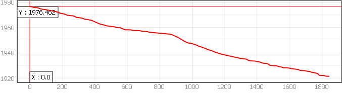
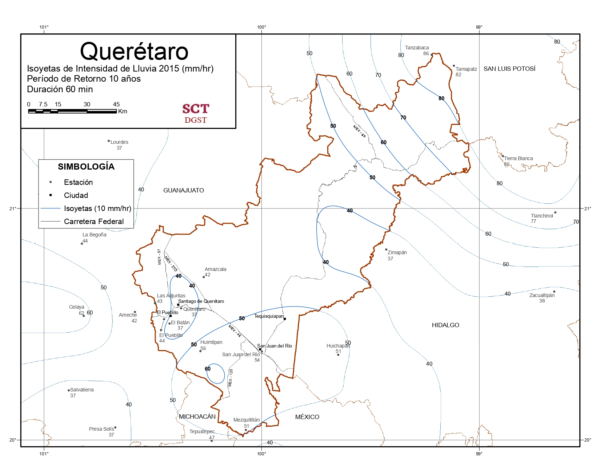

--- 
title: ""
author: ""
date: "`r Sys.Date()`"
bibliography:
- book.bib
- packages.bib
biblio-style: apalike
link-citations: true
cover-image: logo.png
description: Este es un estudio hidrológico de la Granja Tilapia
site: bookdown::bookdown_site
---
```{r include=FALSE, cache=FALSE}
knitr::opts_chunk$set(
  echo = FALSE,
  message = FALSE,
  warning = FALSE
)
```

<div style="text-align:center;">

# Presentación {.unlisted .unnumbered}

**Estudio hidrológico de La Granja Tilapia**

**Regenerative Skills*

**Centro de Investigación para la Restauración y Saturación del Suelo**

**Elaboró: Ing. Edgar Reyes Vargas **

**Revisor: Ing. Oliver Goshey**

<div style="display:flex; justify-content:center; align-items:center; margin-top:20px;">

</div>

</div>

<!--chapter:end:index.Rmd-->

```{r include=FALSE, cache=FALSE}
knitr::opts_chunk$set(
  echo = FALSE,
  message = FALSE,
  warning = FALSE
)
```
# Introducción


El presente reporte tiene como objetivo presentar soluciones que mitiguen los riesgos de inundación en la granja Familia Tilapia y además aprovechar el agua en ciertas zonas que están actualmente desaprovechadas. Para ello, se requiere un análisis detallado de la geomorfología de la zona de estudio, que contemple los parámetros que describen las propiedades de la superficie y determinan el movimiento del agua, así como un análisis meteorológico que caracterice los patrones de precipitación en la región.

El contexto de La Granja es que se encuentra aguas abajo del Parque Industrial El Marqués, el cual descarga sus aguas pluviales en un drenaje de tormenta que pasa por un costado de La Granja, el cual se desborda en algunas secciones generando inundaciones en La Granga. 

Se realizó un levantamiento topográfico con Dron Mavic 3 Enterprise con módulo RTK y GNSS Emlid Reach RS2 del terreno, por medidas de seguridad se optó por no volar sobre el Parque Industrial El Marqués, por lo que se uso el MDE del **Continuo de Elevaciones Mexicano 3.0** [@CEM3.0] para el análisis geomorfológico que se usará para calcular el caudal que pasa por el drenaje de tormenta. La información levantada con el dron y GNSS se usará para el diseño de las SbN en La Granja.
 
Para la generación del modelo fisiográfico se usa el software GIS de código libre **QGIS**, y dentro del ambiente se usan las  extensiones *GDAL* para gestionar capas vectoriales y rasters, *GRASS* para delimitar el área y red de drenaje, y  *SAGA NEXT GEN* para procesos auxiliares. 

Para la generación del modelo meteorológico, se utiliza el software de código libre **RStudio** que se basa en el lenguaje *R*, un lenguaje de programación computacional estadística. Dentro del ambiente, se hace uso de librerías especializadas para el uso de datos climatológicos y para la selección de modelos probabilísticos para estimar las tormentas de diseño.


## Objetivo

Diseñar Soluciones basadas en la Naturaleza (SbN) para mitigar los riesgos presentes por inundación que permitan aprovechar las aguas pluviales en zonas que actualmente están desaprovechadas. 


## Normativa aplicada

Para el diseño del modelo hidrológico se ha seguido la normativa establecida en el Manual de Agua Potable, Alcantarillado y Saneamiento [@conagua2019] y el Instructivo de Hidrología para Determinar la Avenida Máxima Ordinaria [@conagua1987]. 


## Localización del proyecto


El área de estudio comprende una una granja de tilapias ubicada en el estado de Querétaro, México, en el municipio del Marqués. La granja se encuentra en la localidad Caro, dentro del Colorado, pertenece a la región hidrográfica Lerma - Santiago, a la cuenca Río Laja y específicamente a la subcuenca Río Apaseo.

El punto de control establecido para el análisis hidrológico se encuentra en el un drenaje de tormenta, localizado en las coordenadas UTM 369084.2299,	2273451.56, con SRC EPSG:32614 - WGS 84 / UTM zona 14N, en unidades métricas. El drenaje de tormenta drena el agua pluvial del parque industrial El Marqués, el cual pasa a un costado de la granja y por debajo de una escuela primaria que acaban de construir. 


```{r, echo=FALSE, figura-contextoterritorial , fig.cap="Contexto territorial de la granja Familia Tilapia"}
knitr::include_graphics("Mapa contexto territorial.png")
```

<!--chapter:end:01-intoduccion.Rmd-->

```{r include=FALSE, cache=FALSE}
knitr::opts_chunk$set(
  echo = FALSE,
  message = FALSE,
  warning = FALSE
)
```
# Modelo Fisiográfico

El análisis fisiográfico es fundamental para caracterizar las propiedades físicas de una zona de estudio, incluyendo su topografía, red de drenaje, tipos de suelo y cobertura vegetal. Estos elementos determinan en gran medida el comportamiento hidrológico de la cuenca y su respuesta ante eventos de precipitación.

```{r setup, include=FALSE}
knitr::opts_chunk$set(echo = TRUE)
```

```{r, include=FALSE}
library(readxl)
library(tidyverse)
library(dplyr)
library(tidyr)
library(magrittr)
library(sf)
library(rgdal)
library(raster)
library(units)
library(jsonlite)
library(knitr)
library(kableExtra)
```

```{r, eval=FALSE, include=FALSE}
if (!require(remotes)) install.packages("remotes")

# on 64-bit Windows
remotes::install_github(c("ropensci/tabulapdf"), INSTALL_opts = "--no-multiarch")

# elsewhere
remotes::install_github(c("ropensci/tabulapdf"))

library("tabulapdf")
```

## Topografía documentada

```{r, include=FALSE}

cuenca_shp <- "tilapia_cuenca_cem.shp"
# Leer el shapefile
cuenca <- readOGR(dsn = cuenca_shp, layer = "tilapia_cuenca_cem", verbose = FALSE)
```

```{r, include=FALSE}
tabla_tamano_cuencas <- data.frame(
  Clasificacion = c("Muy pequeña", "Pequeña", "Intermedia pequeña", "Intermedia grande", "Grande", "Muy grande"),
  Rango_tamaño_km2 = c("< 25", "25 - 250", "250 - 500", "500 - 2,500", "2,500 - 5,000", "> 5,000"))
```

```{r include=FALSE}
#importar archivo con cadenamientos del cauce principal, obtenido con profile tool en qgis

cauce_principal <- read_excel("cauce_principal.xlsx")
```

```{r include=FALSE}
pendiente_uniforme_longitud_total <- cauce_principal$cadenamiento[nrow(cauce_principal)] - cauce_principal$cadenamiento[1]
pendiente_uniforme_deltay <- cauce_principal$elevacion[1] - cauce_principal$elevacion[nrow(cauce_principal)]
pendiente_uniforme <- pendiente_uniforme_deltay / pendiente_uniforme_longitud_total
```

```{r, include=FALSE}
# Crear una función para determinar la clasificación de la cuenca
determinar_clasificacion <- function(area_km2) {
  for (i in seq_along(tabla_tamano_cuencas$Rango_tamaño)) {
    rango_actual <- tabla_tamano_cuencas$Rango_tamaño[i]
    if (rango_actual == "< 25" && area_km2 < 25) {
      return(tabla_tamano_cuencas$Clasificacion[i])
    } else if (rango_actual == "> 5,000" && area_km2 > 5000) {
      return(tabla_tamano_cuencas$Clasificacion[i])
    } else {
      rango_min <- as.numeric(gsub(",", "", strsplit(rango_actual, "-")[[1]][1]))
      rango_max <- as.numeric(gsub(",", "", strsplit(rango_actual, "-")[[1]][2]))
      if (!is.na(rango_min) && !is.na(rango_max) && area_km2 >= rango_min && area_km2 < rango_max) {
        return(tabla_tamano_cuencas$Clasificacion[i])
      }
    }
  }
}

# Obtener la clasificación de la cuenca
clasificacion_cuenca <- determinar_clasificacion(cuenca$area_km2)
```

Para el presente estudio, se utilizó la información publicada en el geoportal **Continuo de Elevaciones Mexicano 3.0** con una resolución de 5 x 5 metros y datum ITRF08 edición 2014. Los datos fueron obtenidos en junio de 2024 y procesados en el Sistema de Referencia de Coordenadas EPSG:32614 WGS 84 / UTM zona 14N, en unidades métricas.

Al comparar el MDE con la imagen satelital se puede observar que no está actualizado ya que no corresponde al área de escurrimiento que genera el Parque Industrial El Marqués. Sin embargo se propone utilizar esta información para tener una aproximación del caudal que sirva para dimensionar las SbN que permitan mitigar los riesgos de inundación presentes en la granja.

## Delimitación del área de escurrimiento y red hidrográfica

La zona analizada, pertenece a la Región Hidrográfica Lerma - Santiago y forma parte de la cuenca abierta Río Laja. Presenta un **área de drenaje** de `r round(cuenca$area_km2, 2)` km^2^, delimitada por un **perímetro** de `r round(cuenca$perim_km, 2)` km y una **longitud** de `r round(cuenca$long_cu_km, 2)` km, clasificándose como una cuenca **`r clasificacion_cuenca`** conforme a la tabla \@ref(tab:tabla-tamanocuencas), de los *Apuntes de Hidrología Urbana* [@conde1995].

```{r, echo=FALSE, tabla-tamanocuencas}

knitr::kable(tabla_tamano_cuencas, 
               digits = 4, 
               booktabs = TRUE, 
               caption = "Clasificación de las cuencas según su tamaño", label = NA)%>%
  kable_classic_2(bootstrap_options = "basic", 
                  full_width = F, 
                  font_size = 12, 
                  position = "center") 

```

La **elevación media de la cuenca**, 891 msnm, y la **pendiente de la cuenca**, `r round(cuenca$pend_med_p, 2)` %, son valores que se obtienen
consultando las estadísticas de los rasters generados en QGIS.

El cauce principal, con una **longitud** de `r round(pendiente_uniforme_longitud_total/1000, 2)` km, nace en el Parque Industrial Bernardo Quintana y descarga en la localidad de Caro, específicamente en el drenaje de tormenta que recién construyeron.

```{r, echo=FALSE, figura-cuencadelim, fig.cap="Delimitación de la cuenca de aportación", fig.alt="cuenca delimitada con QGIS 3.36"}
knitr::include_graphics("Mapa cuenca tilapia .png")
```

## Descripción del Relieve

Para describir el relieve, se presenta la **relación de enlongación**, que caracteriza el relieve, cuya fórmula es $$R_e = 1.128 \frac{\sqrt{\ A}}{L_m}$$ y el **coeficiente de compacidad**, que indica la geometría de la cuenca, cuya fórmula es $$K_c = 0.282\frac{P}{\sqrt{A}}$$.

```{r,results='asis', comment = "", echo=FALSE}
Re <- round((1.1284 * (cuenca$area_km2**0.5)) / cuenca$long_cu_km, 1)
kc <- 0.28 * (cuenca$perim_km/sqrt(cuenca$area_km2))

cat("El valor de la relación de enlongación, R~e~ es", Re, "\n")

if (Re >= 0.9 & Re <= 1.0) {
  cat(", por lo que consideramos que la cuenca tiene un relieve bajo.\n")
} else if (Re >= 0.6 & Re < 0.9) {
  cat(", por lo que consideramos que la cuenca tiene un relieve fuerte.\n")
} else {
  cat(", por lo que consideramos que la cuenca tiene un relieve fuera de rango.\n")
}

cat("\nEl valor del coeficiente de compacidad, k~c~ es", kc, "\n")

if (kc <= 1) {
  cat(", por lo que consideramos que la cuenca tiene una forma circular.\n")
} else if (kc > 1 & kc <= 3) {
  cat(", por lo que consideramos que la cuenca tiene una forma alargada.\n")
} else {
  cat(", por lo que consideramos que la cuenca tiene una forma desconocida.\n")
}
```

El relieve influye en la velocidad del escurrimiento, la erosión del suelo y el transporte de sedimentos. Un relieve fuera de rango y una forma alargada implican una mayor concentración de los flujos de escorrentía en el cauce principal, lo que aumenta el riesgo de inundaciones repentinas. 


## Red de drenaje

La red de drenaje de una cuenca hidrográfica desempeña un papel crucial en el movimiento y transporte del agua superficial, subsuperficial y subterránea, tanto de manera temporal como permanente [@campos1998]. Las características de esta red reflejan la eficiencia del sistema de drenaje de la cuenca y su capacidad para evacuar los excedentes de agua durante eventos de precipitación intensa.

```{r include=FALSE}
#sirve para determinar la cantidad de tramos a programar

print((cauce_principal$elevacion[1] - cauce_principal$elevacion[nrow(cauce_principal)])*0.04)
print((cauce_principal$cadenamiento[nrow(cauce_principal)] - cauce_principal$cadenamiento[1])*0.04)
```

### Análisis de pendiente del cauce principal de la cuenca

```{r, include=FALSE}
elev_inicial_cauce <- cauce_principal %>% 
  dplyr::select(elevacion) %>% 
  slice(1) %>% 
  pull()

elev_final_cauce <- cauce_principal %>% 
  dplyr::select(elevacion) %>% 
  slice(n()) %>% 
  pull()
```

El análisis del perfil longitudinal del cauce principal proporciona información sobre su pendiente, la cual influye en la velocidad del flujo y la capacidad de transporte de sedimentos. 

```{r, echo=FALSE, figura-cauceperfil, out.width=600, fig.align='center', fig.cap="Perfil del cauce principal"}

```

La pendiente del cauce principal se ha calculado usando tres diferentes fórmulas, las cuales se encuentran referenciadas en el manual de alcantarillado y saneamiento pluvial [@conagua2019].

-   Pendiente uniforme  
-   Pendiente por elevaciones constantes de Taylor - Shwarz  
-   Pendiente por longitudes constantes de Taylor - Shwarz  

#### Pendiente uniforme

Esta pendiente se calcula a partir de la longitud total del cauce y la diferencia de elevación entre su punto inicial y final. La fórmula es
$$ S_c = \frac{\Delta H}{L_{tc}} \label{eq:pendieteuniforme} $$

```{r results='asis', echo=FALSE}
cat("La pendiente media del cauce principal calculada con la fórmula de pendiente uniforme es:", pendiente_uniforme, "m/m\n\n")
```

#### Pendiente Taylor Schwarz - Elevaciones constantes

Esta fórmula considera que el río está formado de canales con pendientes uniformes, por lo que se segmenta en tramos equivalentes para poder calcular la pendiente media.
$$S_{ec} = \left[\frac{l_t}{\sum_{i=1}^n\frac{l_i}{\sqrt{s_i}}} \right]^{2} \label{eq:pendietetaylorelev} $$

```{r include=FALSE}
pendiente_ts_ec <- function(dataframe, paso_elevacion = 10) {
  # Extraer el primer valor de elevación del dataframe
  elevacion_inicial <- dataframe$elevacion[1]

  # Calcular el número de elevaciones constantes descendentes necesarias
  num_elevaciones <- ceiling((elevacion_inicial - min(dataframe$elevacion)) / paso_elevacion) + 1

  # Generar el vector de elevaciones constantes descendentes
  elevaciones_constantes <- seq(elevacion_inicial, by = -paso_elevacion, length.out = num_elevaciones)


  # Crear una lista para almacenar los valores justo arriba y justo abajo de cada elevación constante
  valores_around <- vector("list", length(elevaciones_constantes))

  # Iterar sobre cada valor en elevaciones_constantes
  for (i in 1:length(elevaciones_constantes)) {
    # Encontrar el índice del valor justo arriba del valor actual en elevaciones_constantes
    index_above <- max(which(dataframe$elevacion >= elevaciones_constantes[i]))
    # Encontrar el índice del valor justo abajo del valor actual en elevaciones_constantes
    index_below <- min(which(dataframe$elevacion <= elevaciones_constantes[i]))

    # Almacenar los valores justo arriba y justo abajo en la lista
    valor_arriba <- dataframe$elevacion[index_above]
    valor_abajo <- ifelse(is.infinite(index_below), elevaciones_constantes[i], dataframe$elevacion[index_below])
    valores_around[[i]] <- c(valor_arriba, valor_abajo)
  }

  # Crear una lista para almacenar los cadenamientos asociados a cada valor de elevación
  cadenamientos_around <- vector("list", length(valores_around))

  # Iterar sobre cada elemento en valores_around
  for (i in 1:length(valores_around)) {
    # Extraer los valores de elevación justo arriba y justo abajo
    elev_arriba <- valores_around[[i]][1]
    elev_abajo <- valores_around[[i]][2]

    # Encontrar los índices de los valores justo arriba y justo abajo en el dataframe original
    index_arriba <- which(dataframe$elevacion == elev_arriba)
    index_abajo <- which(dataframe$elevacion == elev_abajo)

    # Extraer los cadenamientos asociados
    cadenamiento_arriba <- dataframe$cadenamiento[index_arriba]
    cadenamiento_abajo <- dataframe$cadenamiento[index_abajo]

    # Almacenar los cadenamientos asociados en la lista
    cadenamientos_around[[i]] <- c(cadenamiento_arriba, cadenamiento_abajo)
  }

  # Obtener el valor de arriba y el valor de abajo de la última fila de valores_around
  valor_arriba_ultima <- valores_around[[length(valores_around)]][1]
  valor_abajo_ultima <- valores_around[[length(valores_around)]][2]

  # Obtener el valor de cadenamiento de la última fila de cadenamientos_around
  cadenamiento_ultima <- cadenamientos_around[[length(cadenamientos_around)]]

  # Interpolar para obtener el valor de cadenamiento faltante
  cadenamiento_interp <- approx(
    x = c(valor_arriba_ultima, valor_abajo_ultima),
    y = c(cadenamiento_ultima, cadenamiento_ultima),
    xout = elevaciones_constantes[length(elevaciones_constantes)],
    method = "linear"
  )$y

  # Agregar el valor interpolado a la última fila de cadenamientos_around
  cadenamientos_around[[length(cadenamientos_around)]] <- c(cadenamientos_around[[length(cadenamientos_around)]], cadenamiento_interp)

  # Crear un dataframe para almacenar los resultados
  resultados <- data.frame(
    elevacion_constante = elevaciones_constantes,
    elev_arriba = numeric(length(elevaciones_constantes)),
    elev_abajo = numeric(length(elevaciones_constantes)),
    cadena_arriba = numeric(length(elevaciones_constantes)),
    cadena_abajo = numeric(length(elevaciones_constantes))
  )

  # Llenar el dataframe con los valores
  for (i in 1:length(valores_around)) {
    resultados[i, "elev_arriba"] <- valores_around[[i]][1]
    resultados[i, "elev_abajo"] <- valores_around[[i]][2]
    resultados[i, "cadena_arriba"] <- cadenamientos_around[[i]][1]
    resultados[i, "cadena_abajo"] <- cadenamientos_around[[i]][2]
  }

  # Calcular la interpolación constante para encontrar el cadenamiento asociado a cada elevación constante
  cadenamientos_interp <- approx(
    x = resultados$elev_abajo,  # Valores de elevación justo abajo
    y = resultados$cadena_abajo, # Cadenamientos asociados justo abajo
    xout = resultados$elevacion_constante, # Valores de elevación constantes
    method = "constant",  # Usar interpolación constante
    yleft = NA,  # No especificar valor para puntos por debajo del rango
    yright = NA,  # No especificar valor para puntos por encima del rango
    rule = 2  # Utilizar el valor más cercano para puntos fuera del rango
  )$y

  # Agregar los resultados de la interpolación al dataframe
  resultados$cadena_interp <- cadenamientos_interp

  # Obtener el último valor de cadenamiento del dataframe original
  ultimo_cadenamiento <- tail(dataframe$cadenamiento, 1)

  # Reemplazar NA en cadena_interp con el último valor de cadenamiento
  resultados$cadena_interp[is.na(resultados$cadena_interp)] <- ultimo_cadenamiento

  # Obtener el último valor de la columna elevacion del dataframe original
  ultimo_valor_elevacion <- tail(dataframe$elevacion, n = 1)

  # Asignar el último valor de elevacion del dataframe original a la última fila de elevacion_constante en resultados
  resultados$elevacion_constante[nrow(resultados)] <- ultimo_valor_elevacion

  # Calcular la diferencia entre los valores de cadenamiento consecutivos
  resultados$diferencia <- c(diff(resultados$cadena_interp), NA)

  # Calcular la diferencia de elevación entre filas consecutivas
  resultados$htramo <- c(-diff(resultados$elevacion_constante), NA)

  # Calcular la longitud_tramo / raíz cuadrada(htramo / longitud_tramo)
  resultados$relacion <- resultados$diferencia / sqrt(resultados$htramo / resultados$diferencia)

  # Calcular la sumatoria de longitud_tramo
  pendiente_taylor_ec_numerador <- sum(resultados$diferencia, na.rm = TRUE)

  # Calcular la sumatoria de relacion
  pendiente_taylor_ec_denominador <- sum(resultados$relacion, na.rm = TRUE)

  # Calcular (sum_longitud_tramo / sum_relacion)^2
  pendiente_taylor_elev <- (pendiente_taylor_ec_numerador / pendiente_taylor_ec_denominador)^2

  # Mostrar el resultado
  cat("La pendiente media del cauce principal calculada con la fórmula de Taylor Schwarz por elevaciones constantes es:", pendiente_taylor_elev, "m/m\n\n")
}

```

```{r results='asis', echo=FALSE, warning=FALSE}
pendiente_ts_ec(cauce_principal, paso_elevacion = 50)
```

#### Pendiente Taylor Schwarz - Longitudes constantes

Esta fórmula considera que el río está formado de canales con pendientes uniformes, por lo que se segmenta en tramos equivalentes para poder calcular la pendiente media.
$$S_{lc} = \left[  \frac{n}{\sum_{i=1}^n\frac{1}{\sqrt{s_i}}} \right]^{2} \label{eq:pendietetaylorlong} $$

```{r include=FALSE}
pendiente_ts_lc <- function(dataframe, paso_cadenamiento = 500) {
  # Extraer el primer valor de cadenamiento del dataframe
  cadenamiento_inicial <- dataframe$cadenamiento[1]

  # Calcular el número de cadenamientos constantes ascendentes necesarios
  num_cadenamientos <- ceiling((max(dataframe$cadenamiento) - cadenamiento_inicial) / paso_cadenamiento) + 1

  # Generar el vector de cadenamientos constantes ascendentes
  cadenamientos_constantes <- seq(cadenamiento_inicial, by = paso_cadenamiento, length.out = num_cadenamientos)

  # Crear una lista para almacenar los valores justo arriba y justo abajo de cada cadenamiento constante
  valores_around <- vector("list", length(cadenamientos_constantes))

  # Iterar sobre cada valor en cadenamientos_constantes
  for (i in 1:length(cadenamientos_constantes)) {
    # Encontrar el índice del valor justo arriba del valor actual en cadenamientos_constantes
    index_above <- min(which(dataframe$cadenamiento >= cadenamientos_constantes[i]))
    # Encontrar el índice del valor justo abajo del valor actual en cadenamientos_constantes
    index_below <- max(which(dataframe$cadenamiento <= cadenamientos_constantes[i]))

    # Almacenar los valores justo arriba y justo abajo en la lista
    valor_arriba <- ifelse(is.infinite(index_above), cadenamientos_constantes[i], dataframe$cadenamiento[index_above])
    valor_abajo <- dataframe$cadenamiento[index_below]
    valores_around[[i]] <- c(valor_arriba, valor_abajo)
  }

  # Crear una lista para almacenar las elevaciones asociadas a cada valor de cadenamiento
  elevaciones_around <- vector("list", length(valores_around))

  # Iterar sobre cada elemento en valores_around
  for (i in 1:length(valores_around)) {
    # Extraer los valores de cadenamiento justo arriba y justo abajo
    cad_arriba <- valores_around[[i]][1]
    cad_abajo <- valores_around[[i]][2]

    # Encontrar los índices de los valores justo arriba y justo abajo en el dataframe original
    index_arriba <- which(dataframe$cadenamiento == cad_arriba)
    index_abajo <- which(dataframe$cadenamiento == cad_abajo)

    # Extraer las elevaciones asociadas
    elevacion_arriba <- dataframe$elevacion[index_arriba]
    elevacion_abajo <- dataframe$elevacion[index_abajo]

    # Almacenar las elevaciones asociadas en la lista
    elevaciones_around[[i]] <- c(elevacion_arriba, elevacion_abajo)
  }

  # Obtener el valor de arriba y el valor de abajo de la última fila de valores_around
  valor_arriba_ultima <- valores_around[[length(valores_around)]][1]
  valor_abajo_ultima <- valores_around[[length(valores_around)]][2]

  # Obtener el valor de elevación de la última fila de elevaciones_around
  elevacion_ultima <- elevaciones_around[[length(elevaciones_around)]]

  # Interpolar para obtener el valor de elevación faltante
  elevacion_interp <- approx(
    x = c(valor_arriba_ultima, valor_abajo_ultima),
    y = c(elevacion_ultima, elevacion_ultima),
    xout = cadenamientos_constantes[length(cadenamientos_constantes)],
    method = "linear"
  )$y

  # Agregar el valor interpolado a la última fila de elevaciones_around
  elevaciones_around[[length(elevaciones_around)]] <- c(elevaciones_around[[length(elevaciones_around)]], elevacion_interp)

  
  # Crear un dataframe para almacenar los resultados
resultados2 <- data.frame(
  cadenamiento_constante = cadenamientos_constantes,
  cad_arriba = numeric(length(cadenamientos_constantes)),
  cad_abajo = numeric(length(cadenamientos_constantes)),
  elev_arriba = numeric(length(cadenamientos_constantes)),
  elev_abajo = numeric(length(cadenamientos_constantes))
)

# Llenar el dataframe con los valores
for (i in 1:length(valores_around)) {
  resultados2[i, "cad_arriba"] <- valores_around[[i]][1]
  resultados2[i, "cad_abajo"] <- valores_around[[i]][2]
  resultados2[i, "elev_arriba"] <- elevaciones_around[[i]][1]
  resultados2[i, "elev_abajo"] <- elevaciones_around[[i]][2]
}

  
# Calcular la interpolación para encontrar la elevación asociada a cada cadenamiento constante
elevaciones_interp <- splinefun(
  x = resultados2$cad_abajo,   # Valores de cadenamiento justo arriba
  y = resultados2$elev_abajo,  # Elevaciones asociadas justo arriba
  method = "natural"  # Utilizar el método spline natural
)(resultados2$cadenamiento_constante)  # Aplicar la interpolación al vector de cadenamientos constantes


# Agregar los resultados de la interpolación al dataframe
resultados2$elevacion_interp <- elevaciones_interp


# Obtener el último valor de elevación del dataframe original
ultima_elevacion <- tail(dataframe$elevacion, 1)

# Reemplazar NA en elevacion_interp con el último valor de elevación
resultados2$elevacion_interp[is.na(resultados2$elevacion_interp)] <- ultima_elevacion

# Obtener el último valor de la columna cadenamiento del dataframe original
ultimo_valor_cadenamiento <- tail(dataframe$cadenamiento, n = 1)

# Asignar el último valor de cadenamiento del dataframe original a la última fila de cadenamiento_constante en resultados
resultados2$cadenamiento_constante[nrow(resultados2)] <- ultimo_valor_cadenamiento


  # Calcular la diferencia entre los valores de cadenamiento consecutivos
resultados2$longitud_tramo <- c(diff(resultados2$cadenamiento_constante), NA)

# Calcular la diferencia de elevación entre filas consecutivas
resultados2$htramo <- c(-diff(resultados2$elevacion_interp), NA)

# Calcular la longitud_tramo / raíz cuadrada(htramo / longitud_tramo)
resultados2$relacion <- 1 / sqrt(resultados2$htramo / resultados2$longitud_tramo)

# Calcular la sumatoria de longitud_tramo
pendiente_taylor_lc_numerador <- nrow(resultados2)

# Calcular la sumatoria de relacion
pendiente_taylor_lc_denominador <- sum(resultados2$relacion, na.rm = TRUE)

# Calcular (sum_longitud_tramo / sum_relacion)^2
pendiente_taylor_long <- (pendiente_taylor_lc_numerador / pendiente_taylor_lc_denominador)^2

 # Mostrar el resultado
  cat("La pendiente media del cauce principal calculada con la fórmula de Taylor Schwarz por longitudes constantes es:", pendiente_taylor_long, "m/m\n\n")
  
}
```

```{r results='asis', echo=FALSE, warning=FALSE}
pendiente_ts_lc(cauce_principal, paso_cadenamiento = 5000)
```

Se hicieron corridas del modelo hidrológico con las pendientes de Taylor - Shwarz y uniforme, y se decidió usar la pendiente uniforme, debido a que genera resultados más conservadores. 

Las memorias de cálculo que generan las pendientes Taylor - Shwarz se encuentran en el Ápéndice.

Los parámetros fisiográficos y geomorfológicos calculados se muestran en la siguiente tabla.

```{r, echo=FALSE, tabla-resumenparametrosfisio}
# Crear un dataframe con los datos
resumen_paramatros_fisiogeom <- data.frame(
  Variable = c("Área de la cuenca (km^2)", "Perímetro de la cuenca (km)", "Longitud de la cuenca (km)",
               "Pendiente media de la cuenca (%)", "Elevación media de la cuenca (msnm)", "Relación de elongación",
               "Coeficiente de compacidad", "Elevación inicial del cauce (msnm)", "Elevación final del cauce (msnm)",
               "Longitud total del cauce (km)", "Pendiente uniforme del cauce (%)"),
  Valor = c(cuenca$area_km2, cuenca$perim_km, cuenca$long_cu_km, cuenca$pend_med_p, 891, Re, kc,
            elev_inicial_cauce, elev_final_cauce, pendiente_uniforme_longitud_total/1000, pendiente_uniforme*100)
)

# Mostrar la tabla
knitr::kable(resumen_paramatros_fisiogeom,
                      digits = 4,
                      booktabs = TRUE,
                      caption = "Características de la cuenca y el cauce principal",
                      label = NA) %>%
  kable_classic_2(bootstrap_options = "condensed",
                  full_width = F,
                  font_size = 12,
                  position = "center")
```


## Estimación del coeficiente de escurrimiento

Dadas las características de la cuenca en estudio, con un área de `r round(cuenca$area_km2, 2)` km^2^ y una naturaleza predominantemente urbana, se considera el uso del método racional, el cual es más adecuado para cuencas pequeñas y zonas urbanas. Por lo que en el estudio solo se usará el cálculo del **Número de Curva** para calcular el coeficiente de escurrimiento en La Granja.


## Tiempos de estudio

En el presente estudio, se han revisado y comparado diferentes fórmulas empíricas propuestas por diversos autores para el cálculo de T~c~. Si bien la fórmula de Kirpich es ampliamente aceptada a nivel internacional, es importante evaluar y comparar los resultados obtenidos con otros enfoques para garantizar la robustez y confiabilidad de los análisis.

### Tiempo de concentracion por kirpich

La fórmula para calcular el tiempo por el autor Kirpich es la más usada a nivel global, su fórmula es
$$ t_{c} = 0.0003245 \left(\frac{l_t}{\sqrt{S_{tc}}}\right)^{0.77} $$.

```{r results='asis', comment = "", echo=FALSE, warning=FALSE}
# define the constants
k = 0.0195
const1 = 0.77
const2 = -0.385

# Calculate tc

tc = set_units((k * (pendiente_uniforme_longitud_total ** const1) * (pendiente_uniforme ** const2)), "min") #tiempo de concentración por Kirpich
tc_hr <- tc %>%  set_units("hour")
#0.0003245 * (((pendiente_uniforme_longitud_total)**const1) / (pendiente_uniforme **0.385))  #toc aparicio
#0.0003245 * ((pendiente_uniforme_longitud_total) / sqrt(pendiente_uniforme ))**0.77 

cat("El valor del tiempo de concentración calculado por Kirpich para toda el área de estudio es: ", round(tc_hr,2), "horas"," ", "o ", round(tc,2), "minutos", ".")
```

### Tiempo de concentracion por Rowe

La fórmula para calcular el tiempo por el autor Rowe se define en [@conagua2019, pág. 41] con la siguiente expresión
$$ t_{c} =  \left(\frac{0.86l_t^{2}}{\sqrt{S_{lcm}}}\right)^{0.385} $$.

```{r results='asis', comment = "", echo=FALSE, warning=FALSE}
tc_rowe = set_units(((0.86 * (pendiente_uniforme_longitud_total/1000)**2) / (pendiente_uniforme*1000))**0.385,"hr")

cat("El valor del tiempo de concentración calculado por Rowe para toda el área de estudio es: ", round(tc_rowe,2), "horas",".")
```


<!--chapter:end:02-modelo_fisiografico.Rmd-->

```{r include=FALSE, cache=FALSE}
knitr::opts_chunk$set(
  echo = FALSE,
  message = FALSE,
  warning = FALSE
)
```
# Modelo meteorológico

En el análisis hidrológico de una cuenca, el estudio de los datos climatológicos es fundamental para dimensionar adecuadamente la precipitación que alimenta la red de drenaje. La serie temporal de interés en este caso es la de valores mensuales de la precipitación máxima en 24 horas, ya que esta variable es la más ampliamente disponible según la Comisión Nacional del Agua [@conagua1987]. Esta variable sirve como entrada en el modelo hidrológico para simular el ciclo hidrológico y predecir el suministro de agua en la región. Debido a la naturaleza aleatoria de la precipitación, es necesario abordar el ciclo hidrológico desde un enfoque probabilístico.

```{r include=FALSE}

library(tidyverse)
library(dplyr)
library(ggplot2)
library(magrittr) # %<>%
library(latexpdf)
library(tinytex)
library(climatol) #quality control, homogenization and missing data in-filling of climatological series 
library(readxl)
library(writexl)
library(vegan) #prueba de independencia, Cochran-Mantel-Haenszel Chi-Squared Test 
library(FAdist) #logpearson III y otras
library(nsRFA) #analisis frecuencias. talvez es el que impera.
library(fitdistrplus) #ajustar distribuciones
library(sp) #objetos espaciales
library(sf) #objetos vectoriales
library(raster)
library(rgdal) #lee shapefiles
library(units) #scales with units
library(knitr)
library(kableExtra)
```

A fin de generar un modelo probabilístico robusto, se han estudiado diferentes metodologías para el tratamiento de series temporales de datos climatológicos, con el propósito de homogeneizar los datos, identificar y tratar valores faltantes y atípicos. En este contexto, RStudio se presenta como una herramienta valiosa, ya que permite explorar las metodologías propuestas por diversos autores, aprovechando el poder computacional del software estadístico.

Para el trabajo con los datos climatológicos, se ha decidido utilizar la librería *climatol* [@guijarro2024], debido a que se basa en las guías de homogeneización establecidas por la Organización Meteorológica Mundial y ha sido referenciada en comunidades de hidrólogos.

En cuanto a la selección de las distribuciones probabilísticas de los eventos hidrológicos futuros, se utiliza principalmente la librería *nsRFA* [@nsRFA2023], ya que ofrece una colección de herramientas estadísticas para la aplicación objetiva (no supervisada) de los métodos de Análisis de Frecuencia Regional en Hidrología. En otras palabras, permite al hidrólogo ajustar funciones de distribución a las curvas de crecimiento regionales empíricas haciendo uso de modelos de aprendizaje automático.

En los últimos años, se han realizado numerosos estudios en diferentes países sobre el análisis regional de frecuencias de precipitaciones [@dominguez2018]. Por tanto, el uso de estas aplicaciones no supervisadas puede ser de gran valor para la creación de modelos probabilísticos que permitan estimar de manera confiable las tormentas de diseño, contribuyendo así a una gestión eficiente y sostenible de los recursos hídricos en la cuenca.

## Selección de estaciones climatológicas

En el proceso de modelación hidrológica, la selección adecuada de estaciones climatológicas es crucial para garantizar la calidad y representatividad de los datos de precipitación utilizados. En el presente estudio, el criterio para determinar la cantidad de estaciones a considerar se fundamenta en las recomendaciones de la librería climatol, la cual sugiere el uso de al menos seis estaciones para obtener mejores resultados en la homogeneización de los datos climatológicos.

Afortunadamente, la zona de estudio cuenta con un número suficiente de estaciones climatológicas para cumplir con este criterio. Las tablas con los datos climatológicos de las seis estaciones seleccionadas fueron descargadas del portal de CONAGUA e importadas en RStudio para ser tratadas mediante las funciones de la librería climatol.

La selección de estaciones climatológicas representativas es un paso crucial en el análisis hidrológico, ya que los datos de precipitación obtenidos servirán como entrada en el modelo hidrológico para simular el ciclo hidrológico y predecir el suministro de agua en la región. Una adecuada cobertura espacial de las estaciones garantiza que se capturen las variaciones locales en los patrones de precipitación, lo cual es esencial para obtener estimaciones precisas de los caudales y volúmenes de escorrentía.

Además de la cantidad de estaciones, es importante considerar otros factores como la distribución espacial, la longitud y calidad de los registros históricos, y la presencia de posibles fuentes de error o inconsistencias en los datos. La aplicación de técnicas de homogeneización, como las proporcionadas por la librería climatol, permiten identificar y tratar valores atípicos o faltantes, mejorando la confiabilidad de los datos utilizados en el modelo hidrológico.

Se usan los polígonos de Voronoi para determinar que estación es la que se va a usar después de que se haya homogenizado, haciendo uso de 5 estaciones adicionales para homogenizar los datos de la estación Santa Teresa, que es la que según los polígonos de Voronoi tiene influencia sobre el predio.

```{r, echo=FALSE, figura-voronoi , fig.cap="Polígonos de Voronoi para seleccionar la estación de influencia en la zona de estudio"}
knitr::include_graphics("voronoi.png")
```


```{r, include=FALSE}
#Función para importar lluvia maxima 24h de estación
importar_estacion <- function(nombre_df, ruta_archivo) {
  # Lee todas las líneas del archivo
  lineas <- readLines(ruta_archivo)
  
  # Encuentra la línea que contiene el encabezado de la tabla
  indice_encabezado <- grep("^LLUVIA MÁXIMA 24H", lineas)
  
  # Encuentra la línea que contiene el último dato de la tabla
  indice_fin_tabla <- grep("MÍNIMA", lineas, fixed = TRUE)[1]
  
  # Calcula el número de filas
  nrows <- indice_fin_tabla - indice_encabezado - 2  # Resta 2 para excluir las líneas finales que sobran
  
  # Lee los datos con el número calculado de filas
  df <- read.table(ruta_archivo, 
                   header = TRUE, 
                   sep = "\t", 
                   skip = indice_encabezado,  
                   nrows = nrows,
                   colClasses = c(rep("numeric", 13), rep("NULL", 3)))
  
  # Asigna un nombre al dataframe
  assign(nombre_df, df, envir = .GlobalEnv)
  
  # Imprime la estructura del dataframe
  str(get(nombre_df))
}
```


```{r, include=FALSE}
#Importamos lluvia maxima de 24 horas de las estaciones de interés
# estacion_elbatan
importar_estacion("estacion_elbatan", "mes22004.TXT")

# estacion_nogales
importar_estacion("estacion_nogales", "mes22046.TXT")

# estacion_santateresa
importar_estacion("estacion_santateresa", "mes22058.TXT")

# estacion_queretaro
importar_estacion("estacion_queretaro", "mes22063.TXT") 

# estacion_laventa
importar_estacion("estacion_laventa", "mes22067.TXT") 

# estacion_plantel7
importar_estacion("estacion_plantel7", "mes22070.TXT") 
```

Se muestra una extracción de la tabla \@ref(tab:tabla-pre2001) con las precipitaciones extremas de la estación de Santa Teresa . Las 6 tablas originales se encuentran en el [Apéndice del Modelo Meteorológico][Apéndice del Modelo Meteorológico].

```{r, tabla-pre2001, echo=FALSE}
 knitr::kable(estacion_santateresa%>%
                head(10), 
               digits = 4, 
               booktabs = TRUE, 
               caption = "Previsualización de los registros mensuales de Pmax~24h~ de la estación Santa Teresa", label = NA)%>%
  kable_classic_2(bootstrap_options = "condensed", 
                  full_width = F, 
                  font_size = 12, 
                  position = "center") 
```


```{r, eval=FALSE, include=FALSE}
#Revisar estaciones y quitar año en curso para que no se incluya en el análisis de datos faltantes.

#ejemplo

estacion_2164  %<>%
  filter(AÑO != '2024')
```


## Homogenización de datos climatológicos

Se tiene que preparar la información para presentarla conforme los requerimientos de las funciones de la librería climatol.

```{r, eval=FALSE, include=FALSE}

#preparar dataframes para poder usar paquete climatol()
estacion_elbatanclima <- pivot_longer(estacion_elbatan, cols = c(2:13), names_to = "mes", values_to = "precipitacion")


estacion_elbatanclima %<>%
  mutate(dia = 1, codigo = 22004) %>%
  dplyr::select(codigo, year = AÑO, mes, dia, precipitacion)

# Crear un vector de nombres de meses
nombres_meses <- c("ENE", "FEB", "MAR", "ABR", "MAY", "JUN", "JUL", "AGO", "SEP", "OCT", "NOV", "DIC")

# Aplicar la correspondencia a la columna mes del dataframe
estacion_elbatanclima$mes <- match(estacion_elbatanclima$mes, nombres_meses)

library("xlsx")    
# Escribir el dataframe en un archivo CSV
write.xlsx(estacion_elbatanclima, file = "D:/CIRSS/proyectos/Tilapia/clima/data_xls/dir1/estacion_elbatanclima.xls", showNA = FALSE)


estacion_laventaclima <- pivot_longer(estacion_laventa, cols = c(2:13), names_to = "mes", values_to = "precipitacion")

estacion_laventaclima %<>%
  mutate(dia = 1, codigo = 22067) %>%
 dplyr::select(codigo, year = AÑO, mes, dia, precipitacion)

# Aplicar la correspondencia a la columna mes del dataframe
estacion_laventaclima$mes <- match(estacion_laventaclima$mes, nombres_meses)

# Escribir el dataframe en un archivo CSV
write.xlsx(estacion_laventaclima, file = "D:/CIRSS/proyectos/Tilapia/clima/data_xls/dir1/estacion_laventaclima.xls", showNA = FALSE)


estacion_nogalesclima <- pivot_longer(estacion_nogales, cols = c(2:13), names_to = "mes", values_to = "precipitacion")

estacion_nogalesclima %<>%
  mutate(dia = 1, codigo = 22046) %>%
  dplyr::select(codigo, year = AÑO, mes, dia, precipitacion)

# Aplicar la correspondencia a la columna mes del dataframe
estacion_nogalesclima$mes <- match(estacion_nogalesclima$mes, nombres_meses)

# Escribir el dataframe en un archivo CSV
write.xlsx(estacion_nogalesclima, file = "D:/CIRSS/proyectos/Tilapia/clima/data_xls/dir1/estacion_nogalesclima.xls", showNA = FALSE)


estacion_plantel7clima <- pivot_longer(estacion_plantel7, cols = c(2:13), names_to = "mes", values_to = "precipitacion")

estacion_plantel7clima %<>%
  mutate(dia = 1, codigo = 22070) %>%
  dplyr::select(codigo, year = AÑO, mes, dia, precipitacion)

# Aplicar la correspondencia a la columna mes del dataframe
estacion_plantel7clima$mes <- match(estacion_plantel7clima$mes, nombres_meses)

# Escribir el dataframe en un archivo CSV
write.xlsx(estacion_plantel7clima, file = "D:/CIRSS/proyectos/Tilapia/clima/data_xls/dir1/estacion_plantel7clima.xls", showNA = FALSE)


estacion_queretaroclima <- pivot_longer(estacion_queretaro, cols = c(2:13), names_to = "mes", values_to = "precipitacion")

estacion_queretaroclima %<>%
  mutate(dia = 1, codigo = 22063) %>%
  dplyr::select(codigo, year = AÑO, mes, dia, precipitacion)

# Aplicar la correspondencia a la columna mes del dataframe
estacion_queretaroclima$mes <- match(estacion_queretaroclima$mes, nombres_meses)

# Escribir el dataframe en un archivo CSV
write.xlsx(estacion_queretaroclima, file = "D:/CIRSS/proyectos/Tilapia/clima/data_xls/dir1/estacion_queretaroclima.xls", showNA = FALSE)


estacion_santateresaclima <- pivot_longer(estacion_santateresa, cols = c(2:13), names_to = "mes", values_to = "precipitacion")

estacion_santateresaclima %<>%
  mutate(dia = 1, codigo = 22058) %>%
  dplyr::select(codigo, year = AÑO, mes, dia, precipitacion)

# Aplicar la correspondencia a la columna mes del dataframe
estacion_santateresaclima$mes <- match(estacion_santateresaclima$mes, nombres_meses)

# Escribir el dataframe en un archivo CSV
write.xlsx(estacion_santateresaclima, file = "D:/CIRSS/proyectos/Tilapia/clima/data_xls/dir1/estacion_santateresaclima.xls", showNA = FALSE)


```


```{r, eval=FALSE, include=FALSE}
#climatol, guardar archivos xls en un csv, ya borra los años que tienen NA
#antes de este paso hay que corregir los csv, borrar la primer columna que se genera extra

## Set a temporal working directory:
#setwd("D:/CIRSS/hidrologia/T8_Proyecto Final/clima/data_xls")

## Now run the example:
xls2csv('dir1', 'dir2', 'precipitacion', datcols = c(1:5))
```

La función **csv2climatol** ocupa un archivo con el código de las estaciones, sus coordenadas geográficas en decimales y su nombre; y otro archivo con los datos climatológicos.   

Para este segundo archivo, el algoritmo toma los archivos de cada estación en formato csv, borra los años que tengan al menos una NA y genera un archivo único.  

```{r, eval=FALSE, include=FALSE}
# Generar csv con la geodata de las estaciones
datos <- data.frame(
  x = c(-115.852, -116.234, -116.681, -116.454),
  y = c(32.1064, 31.9189, 32.0492, 32.1075),
  z = c(330, 721, 340, 400),
  codigo = c(2164, 2118, 2036, 2001),
  nombre = c("EJIDO_EL_PORVENIR", "VALLE_DE_SAN_RAFAEL", "OLIVARES_MEXICANOS", "AGUACALIENTE")
)

# Guardar en un archivo CSV
write.csv(datos, file = "estaciones.csv", row.names = FALSE)
getwd()
```

La metodología estadística usada para la homogenización de datos es la *Standard Normal Homogeneity Test (SNHT)* que usa la siguiente expresión para calcular la prueba estadística. 

$$ T_k = k z_1^2 + \left(n - k\right) z_2^2 \qquad (1 \le k < n) $$

donde

$$ \begin{array}{l l} z_1 = \frac{1}{k} \sum_{i=1}^k \frac{x_i - \bar{x}}{\sigma} & z_2 = \frac{1}{n-k} \sum_{i=k+1}^n \frac{x_i - \bar{x}}{\sigma}. \\ \end{array} $$

El valor crítico es:

$$T = \max T_k$$

```{r, include=FALSE}

# Utilizar la función csv2climatol con el dataframe corregido
csv2climatol("xls_precipitacion_data.csv", 
             datacol = 2:6, 
             stnfile = "estaciones.csv", 
             stncol = 1:5,
             varcli = "precipitacion", 
             anyi = 1983,
             anyf = 2019,
             mindat = 60, 
             sep = ",",
             dec = ".",
             na.strings = 'NA',
             cf = 1, 
             ndec = 1,     
             header = TRUE)


```


El algoritmo realiza una serie de pasos y presenta parámetros estadigráficos de la prueba, el error cuadrático medio del valor estimado, el porcentaje de los datos originales, las anomalías presentes en los diferentes intervalos de confianza y el rango derecho del intervalo de confianza para la prueba estadística. 
El algoritmo también genera archivos que se pueden usar para cálculos posteriores, así como un reporte de los diferentes resultados que genera el proceso de homogenización de datos como el control de calidad de las series, el resumen de los datos disponibles, gráficos de detección y corrección de anomalías, etc.

De las estaciones climatológicas se usan los años de 1983 a 2019, pues en casi todas las estaciones incluyen este rango de años.

```{r, collapse=TRUE, comment = "", echo=FALSE, warning=FALSE} 
#results='hide'
#obtener estaciones homogenizadas
homogen(varcli = "precipitacion",  # Nombre corto de la variable climática
        anyi = 1983,                # Año inicial de los datos
        anyf = 2019,                # Año final de los datos
        test = "snht",              # Prueba de homogeneidad a aplicar
        nref = NULL,                # Número máximo de referencias para la estimación de datos
        std = NA,                   # Tipo de normalización
        swa = NA,                   # Tamaño del paso adelante para la aplicación de la ventana de solapamiento
        ndec = 1,                   # Número de dígitos decimales para redondear los datos homogeneizados
        niqd = c(4, 1),             # Número de distancias intercuartílicas para eliminar valores atípicos grandes y corridas demasiado largas de valores idénticos
        dz.max = 0.01,              # Umbral de tolerancia para valores atípicos
        dz.min = -0.01,             # Umbral inferior de tolerancia para valores atípicos
        cumc = NA,                  # Código de datos faltantes acumulados
        wd = NULL,                  # Distancia (en km) en la que los datos de referencia ponderarán la mitad de los ubicados a distancia cero
        inht = 25,                  # Umbrales para los cambios en las pruebas de detección de la media
        sts = 5,                    # Tamaño de la cola de la serie que no se prueba para inhomogeneidades
        maxdif = NA,                # Diferencia máxima de datos de la iteración anterior
        maxite = 999,               # Número máximo de iteraciones para calcular las medias de la serie
        force = FALSE,              # Forzar homogeneización directa de series diarias o sub-diarias
        wz = 0.001,                 # Parámetro de escala de la coordenada vertical Z
        mindat = NA,                # Número mínimo de datos para que un fragmento dividido se convierta en una nueva serie
        onlyQC = FALSE,             # Establecer en TRUE si solo se solicitan controles de calidad iniciales
        annual = c("mean", "sum", "total"),  # Valor anual en ejecución para graficar en la salida PDF
        x = NULL,                   # Vector de tiempo
        ini = NA,                   # Fecha inicial si la serie no comienza el 1 de enero
        na.strings = "NA",          # Cadenas de caracteres que se tratarán como datos faltantes
        vmin = NA,                  # Valor mínimo posible de la variable estudiada
        vmax = NA,                  # Valor máximo posible de la variable estudiada
        hc.method = "ward.D2",      # Método de agrupamiento jerárquico
        nclust = 300,               # Número máximo de series para el análisis de agrupamiento
        cutlev = NA,                # Nivel para cortar el dendrograma para definir grupos
        grdcol = grey(0.4),         # Color de las cuadrículas de fondo del gráfico
        mapcol = grey(0.4),         # Color de las líneas costeras y fronteras en el mapa de estaciones
        expl = FALSE,               # Realizar un análisis exploratorio
        metad = FALSE,              # Usar el archivo de puntos de quiebre como metadatos
        sufbrk = "m",               # Sufijo para agregar a varcli para formar el nombre del archivo de metadatos
        tinc = NA,                  # Incremento de tiempo entre datos
        tz = "utc",                 # Zona horaria
        rlemin = NA,                # Longitud mínima de las series de datos en el control de calidad
        rlemax = NA,                # Longitud máxima de las series de datos en el control de calidad
        cex = 1.1,                  # Factor de expansión de caracteres para etiquetas y títulos de gráficos
        uni = NA,                   # Unidades para usar en algunas etiquetas de ejes
        raway = TRUE,               # Aumentar las distancias internas para las series de reanálisis para dar más peso a las series observadas
        graphics = TRUE,            # Generar gráficos en un archivo PDF
        verb = TRUE,                # Verbosidad
        logf = TRUE,                # Guardar mensajes de la consola en un archivo de registro
        snht1 = NA,                 # Obsoleto, conservado para compatibilidad con versiones anteriores
        snht2 = NA,                 # Obsoleto, conservado para compatibilidad con versiones anteriores
        gp = NA)                    # Obsoleto, conservado para compatibilidad con versiones anteriores

```


```{r, include=FALSE}
#extraer csv con estaciones homogenizadas
dahstat('Precipitacion', 1983, 2019, stat = 'series', all = TRUE, long = TRUE)
```


Se extrae uno de los archivos generados por la función para poder construir la tabla de estaciones con los datos climatológicos homogenizados \@ref(tab:tabla-esthomog).

```{r, include=FALSE}
#importar csv con estaciones
estaciones_homogenizadas <- read.csv("Precipitacion_1983-2019_series.csv")

# Convertir la columna Date a objeto de fecha
#estaciones_homogenizadas$Date <- as.Date(estaciones_homogenizadas$Date, format = "%m/%d/%Y")
```

```{r, tabla-esthomog, comment = "", echo=FALSE, warning=FALSE}
# Agrupar los datos por año y calcular el máximo valor de precipitación para cada estación
estaciones_lluviamax24h <- estaciones_homogenizadas %>%
  group_by(Year = lubridate::year(Date)) %>%
  summarise(across(starts_with("X"), ~ max(., na.rm = TRUE)))


# Mostrar el nuevo dataframe
  knitr::kable(estaciones_lluviamax24h, 
               digits = 4, 
               booktabs = TRUE, 
               caption = "Estaciones homogenizadas", label = NA) %>%
  kable_classic_2(bootstrap_options = "condensed", 
                  full_width = F, 
                  font_size = 12, 
                  position = "center")

```


Se genera el gráfico \@ref(fig:figura-precipesthomogen) para visualizar la distribución temporal de los datos climatológicos de las 6 estaciones homogenizadas.

```{r, figura-precipesthomogen, fig.cap=  "Distribución de precipitaciones homogenizadas", echo=FALSE, warning=FALSE}
# Convertir el dataframe a formato largo
estaciones_lluviamax24h_long <- pivot_longer(estaciones_lluviamax24h, 
                                             cols = starts_with("X"),
                                             names_to = "Estacion", 
                                             values_to = "Precipitacion")

# Convertir Year a factor para evitar que se interprete como variable continua en el gráfico
#estaciones_lluviamax24h_long$Year <- as.factor(estaciones_lluviamax24h_long$Year)

# Función para crear un único gráfico con las distribuciones de todas las estaciones
plot_all_stations_lines <- function(data) {
  ggplot(data, aes(x = Year, y = Precipitacion, color = Estacion, group = Estacion)) +
    geom_line() +
    labs(x = "Año", y = "Precipitaciones homogenizadas") +
    theme(axis.text.x = element_text(angle = 90, hjust = 1, vjust = 0.5)) 
}

# Generar el gráfico
all_stations_line_plot <- plot_all_stations_lines(estaciones_lluviamax24h_long)
print(all_stations_line_plot)
```


Se ha optado por aplicar la prueba de $X$^2^ para la prueba de independencia a los datos climatológicos homogenizados, en donde, para determinar que las muestras son independientes se revisa *p>0.05*. 

```{r, results='asis', comment = "", echo=FALSE, warning=FALSE}
#prueba de independencia, p>0.05 para ser independiente

#prueba chi cuadrada o chi cuadrada de pearson
# Crear una lista para almacenar los resultados
resultados_pruebaindependencia_chi2 <- list()

# Iterar sobre las columnas que comienzan con 'X'
for (col_name in names(estaciones_lluviamax24h)[startsWith(names(estaciones_lluviamax24h), "X")]) {
  # Calcular la tabla de contingencia
  contingency_table <- table(estaciones_lluviamax24h$Year, estaciones_lluviamax24h[[col_name]])
  # Realizar la prueba de independencia
  independence_test <- chisq.test(contingency_table)
  # Almacenar los resultados
  resultados_pruebaindependencia_chi2[[col_name]] <- independence_test
}

# Ver los resultados
 resultados_pruebaindependencia_chi2

#prueba de fisher
#result_fisher <- fisher.test(table(estaciones_lluviamax24h$Year, estaciones_lluviamax24h$X2001), simulate.p.value = TRUE)

#result_fisher


```

Conforme a los resultados de las pruebas de independencia se puede decir que las muestras son independientes.

```{r, include=FALSE}
# Obtener el nombre de las columnas que empiezan con "X"
columnas_X <- names(estaciones_lluviamax24h)[grepl("^X", names(estaciones_lluviamax24h))]

# Iterar sobre las columnas X y crear un dataframe para cada combinación de Year y la columna X
for (col_X in columnas_X) {
  nombre_df <- paste0("estacion_", gsub("X", "", col_X), "_final")
  nuevo_df <- data.frame(Year = estaciones_lluviamax24h$Year, 
                         precipitacion = estaciones_lluviamax24h[[col_X]])
  
  # Ordenar el dataframe por la columna precipitacion en orden descendente
  nuevo_df <- nuevo_df[order(-nuevo_df$precipitacion), ]
  
  # Calcular Tr Weibull utilizando el índice original
  nuevo_df$Tr_Weibull <- (nrow(nuevo_df) + 1) / (1:nrow(nuevo_df))
  
  # Imprimir el nombre del dataframe creado
  cat("Dataframe creado:", nombre_df, "\n")
  
  # Guardar el nuevo dataframe
  assign(nombre_df, nuevo_df)
  
  # Guardar la columna precipitacion en un archivo de texto
  write.table(nuevo_df$precipitacion, file = paste0("D:/CIRSS/proyectos/Tilapia/Hidrologia/", nombre_df, "_precipitacion.txt"), row.names = FALSE)
}

# Verificar los nombres de los nuevos dataframes creados
ls(pattern = "estacion_.*_final")
```

## Funciones de las distribuciones probabilísticas de las estaciones climatológicas

```{r, include=FALSE}
# Crear el dataframe probabilidad_Tr
probabilidad_Tr <- data.frame(
  Tr = c(2, 5, 10, 20, 25, 50, 100, 200, 500, 1000, 5000, 10000),
  Probabilidad_Porcentaje = c("50.000%", "20.000%", "10.000%", "5.000%", "4.000%", "2.000%", "1.000%", "0.500%", "0.200%", "0.100%", "0.020%", "0.010%"),
  Probabilidad_Inversa = c(0.5, 0.8, 0.9, 0.95, 0.96, 0.98, 0.99, 0.995, 0.998, 0.999, 0.9998, 0.9999)
)

# Mostrar el dataframe
probabilidad_Tr
```

En el ámbito de la hidrología, existen diversas funciones de distribución de probabilidad que se han empleado con éxito para modelar eventos hidrológicos extremos, como las precipitaciones máximas. Entre las funciones más comúnmente utilizadas se encuentran: Normal, Log-Normal, Exponencial, Gamma, Pearson tipo III (o Gamma de tres parámetros), Log-Pearson tipo III y de valores extremos (VE tipos I, II y III; o respectivamente Gumbel, Frechet y Weibull).

En este estudio se comparan las funciones Normal, Log-Normal, Gumbel, Pearson 3 parámetros, Log Pearson 3 parámetros y de Valor Extremo Generalizado por 3 parámetros, haciendo uso de las funciones de nsRFA.

Citando la documentación de nsRFA: "El problema de la selección de modelos se puede formalizar de la siguiente manera: se dispone de una muestra de n datos, $D = (x~1~, ..., x~n~)$, ordenados de manera ascendente, muestreados de una distribución parental desconocida _f(x)_; se utilizan N~m~ modelos operativos, $M~j~, j = 1, ...$, N~m~, para representar los datos. Los modelos operativos son en forma de distribuciones de probabilidad, M~j~ = g~j~(x, $\hat{\theta}$), con parámetros $\hat{\theta}$ estimados a partir de la muestra de datos disponible *D*. El objetivo de la selección de modelos es identificar el modelo M~opt~ que mejor se adapta para representar los datos, es decir, el modelo que está más cercano en algún sentido a la distribución parental _f(x)_. Aquí se consideran tres criterios diferentes de selección de modelos, a saber, el *Criterio de Información de Akaike (AIC)*, el *Criterio de Información Bayesiano (BIC)* y el *Criterio de Anderson-Darling (ADC)*. De los tres métodos, los dos primeros pertenecen a la categoría de enfoques clásicos de la literatura, mientras que el tercero se deriva de una interpretación heurística de los resultados de una prueba estándar de bondad de ajuste." [@nsRFA2023]

El algoritmo grafica la función de la distribución empírica de la muestra (*posición de trazado de Weibull*) en una gráfica de probabilidad log-normal, y grafica las distribuciones candidatas (cuyos parámetros se evalúan con la técnica de *máxima verosimilitud*).

Para cada estación se documenta:  

- histograma,  
- los resultados de la función **MSClaio2008** de la librería nsRFA [@nsRFA2023] y  
- la tabla con las distribuciones de eventos extremos para diferentes períodos de retorno.  

En este capítulo, se presentará la información completa de una estación climatológica como ejemplo. Para el resto de las estaciones solo se presenta la tabla con la distribución de probabilidad ajustada a los parámetros de la función recomendada por MSClaio2008. La información completa de las 5 estaciones restantes se encuentra en el [Apéndice del Modelo Meteorológico][Apéndice del Modelo Meteorológico].

Se presenta la información de la **estación Santa Teresa**.

```{r,  echo=FALSE, warning=FALSE, comment = ""}
hist(estaciones_lluviamax24h$X22058, freq = FALSE, col = "skyblue", main = "Histograma de precipitaciones de  la estación Santa Teresa")
lines(density(estaciones_lluviamax24h$X22058), col = "red", lwd = 2)

MSClaio2008(estaciones_lluviamax24h$X22058, 
                         dist = c("NORM", "LN", "GUMBEL", "P3", "LP3", "GEV"), crit=c("AIC", "AICc", "BIC", "ADC"))

summary(MSClaio2008(estaciones_lluviamax24h$X22058, 
                         dist = c("NORM", "LN", "GUMBEL", "P3", "LP3", "GEV"), crit=c("AIC", "AICc", "BIC", "ADC")))

plot(MSClaio2008(estaciones_lluviamax24h$X22058, 
                         dist = c("NORM", "LN", "GUMBEL", "P3", "LP3", "GEV"), crit=c("AIC", "AICc", "BIC", "ADC")))
```


```{r,  echo=FALSE, warning=FALSE, comment = ""}
# Calcular los L-momentos de los datos de la estación X2118
est222058_LMOM <- Lmoments(estaciones_lluviamax24h$X22058)

# Calcular los parámetros de la distribución Gumbel
est22058_params_gumbel <- par.gumb(est222058_LMOM[1], est222058_LMOM[2])

# Calcular los cuantiles para cada período de retorno
est22058_cuantiles_gumbel <- invF.gumb(probabilidad_Tr$Probabilidad_Inversa, est22058_params_gumbel$xi, est22058_params_gumbel$alfa)
```


```{r,  echo=FALSE, warning=FALSE, comment = ""}
# Parámetros de la distribución normal
mu <- 49.91351
sigma <- 19.46211

# Cálculo de los cuantiles utilizando la distribución normal
est22058_cuantiles_norm <- qnorm(probabilidad_Tr$Probabilidad_Inversa, mean = mu, sd = sigma)


```


```{r}
# Calcular los cuantiles correspondientes a las probabilidades dadas usando los parametros que arroja MSClaio2008, se usa exp para transformar el log de vuelta.

est22058_LP3mv_cuantiles <- exp(invF.gamma(probabilidad_Tr$Probabilidad_Inversa, 4.758897, -0.2155336, 4.342562))

#ahora se calcula los cuantiles pero usando los momentos que calcula la libreria nsRFA
# Calcular los L-momentos de los datos transformados a log de la estación X22058
est22058_LMOM <- Lmoments(log(estaciones_lluviamax24h$X22058))

# Extraer los L-momentos necesarios
lambda1 <- est22058_LMOM[1]
lambda2 <- est22058_LMOM[2]
tau3 <- est22058_LMOM[4]

# Estimar los parámetros de la distribución de Pearson III utilizando L-momentos
parametros <- par.gamma(lambda1, lambda2, tau3)

# Extraer los parámetros estimados
xi <- parametros$xi
beta <- parametros$beta
alfa <- parametros$alfa


est22058_LP3mom_cuantiles <- exp(invF.gamma(probabilidad_Tr$Probabilidad_Inversa, xi, beta, alfa))
```


```{r, echo=FALSE}

# Crear la tabla de períodos de retorno y cuantiles
  knitr::kable(data.frame(Tr = probabilidad_Tr$Tr, 
                          Precipitación_SantaTeresa_Gumbell = est22058_cuantiles_gumbel,
                          Precipitación_SantaTeresa_Normal = est22058_cuantiles_norm,
                          Precipitación_SantaTeresa_LP3mom = est22058_LP3mom_cuantiles,
                          Precipitación_SantaTeresa_LP3mv = est22058_LP3mv_cuantiles), 
               digits = 4, 
               booktabs = TRUE, 
               caption = "Comparación de las distribuciones probabilísticas de precipitaciones de la estación Santa Teresa", label = NA) %>%
  kable_classic_2(full_width = F, 
                  font_size = 12, 
                  position = "center")
```


## Curvas IDTR  y PDTR

En el análisis hidrológico, las características de las precipitaciones se definen mediante tres variables: magnitud o lámina, duración y frecuencia. La magnitud de lluvia se refiere a la precipitación total ocurrida (en milímetros) durante la duración de la tormenta, mientras que la frecuencia se expresa como el período de retorno, el cual representa el tiempo promedio en años en el que un evento puede ser igualado o excedido, al menos una vez, en promedio [@camposaranda1990].

Las curvas Intensidad-Duración-Período de Retorno (IDTR) son herramientas gráficas que permiten definir las características de las tormentas en una región específica, considerando las variables mencionadas.

Para obtener las curvas IDTR, es necesario transformar los datos de precipitación máxima en 24 horas a precipitaciones de diferentes duraciones y períodos de retorno. Debido a la escasez de registros de lluvia de corta duración, ha surgido la necesidad de utilizar las relaciones promedio entre lluvias encontradas en otros países [@camposaranda1990]. La Secretaría de Comunicaciones y Transportes (SCT) ha documentado estas relaciones en forma de isoyetas, las cuales permiten representar cartográficamente los puntos terrestres que comparten el mismo indicador de pluviosidad media anual.

```{r, echo=FALSE, isoyetas1060, fig.cap="Ejemplo del uso de las isoyetas para calcular las precipitaciones asociadas al Tr"}

```

Para el cálculo de las curvas de Intensidad - Duración - Tiempo de Retorno se usa la metodología de *Chen modificado*.

Se importan a RStudio las capas vectoriales de la cuenca cortadas por mapas de Isoyetas (las vigentes datan del año 2015). Estos mapas de isoyetas se han georeferenciado para poder usar las herramientas de QGIS y superponer la cuenca para obtener la pluviosidad asociada a la cuenca.

```{r, include=FALSE}
isoyetas_1060 <- st_read("cem_cuenca_tr10_60.shp")
isoyetas_2560 <- st_read("cem_cuenca_tr25_60.shp")
isoyetas_5060 <- st_read("cem_cuenca_tr50_60.shp")

# Guardar el shapefile
#st_write(cuenca, "D:/CIRSS/hidrologia/T8_Proyecto Final/cem_cuenca_geomcorreg.shp")

```


Se localizan las intensidades con duración de 60 minutos para los periodos de retorno de 10, 25 y 50 años.

```{r, results='asis', comment = "", echo=FALSE, warning=FALSE}
P1hr_10a <- 40

P1hr_25a <- 50

P1hr_50a <- 55

cat("P~1hr~^10años^: ", P1hr_10a, " mm/hr\n", sep = "\n")
cat("P~1hr~^25años^: ", P1hr_25a, " mm/hr\n", sep = "\n")
cat("P~1hr~^50años^: ", P1hr_50a, " mm/hr\n", sep = "\n")
```

Se corrigen las frecuencias por factor de Weiss y se obtienen los diferentes parámetros que se ocupan para el cálculo de la tabla IDTR.

```{r, include=FALSE}
#corregir frecuencias por factor de weiss

est22058_homogenizada <- data.frame(est22058_LP3mv_cuantiles)

est22058_homogenizada$frecuencia_ajustada_weiss <- est22058_homogenizada$est22058_LP3mv_cuantiles * 1.13
```

Primero se obteniene R~prom~, se debe revisar si cae en rango [0.1-0.6] o [0.2-0.7] para cálculos posteriores. 

```{r, results='asis', comment = "", echo=FALSE, warning=FALSE}
R_prom <- mean(P1hr_10a/as.numeric(est22058_homogenizada$frecuencia_ajustada_weiss[est22058_homogenizada$Tr == 10]),
               P1hr_25a/as.numeric(est22058_homogenizada$frecuencia_ajustada_weiss[est22058_homogenizada$Tr == 25]),
               P1hr_50a/as.numeric(est22058_homogenizada$frecuencia_ajustada_weiss[est22058_homogenizada$Tr == 50]))

cat(" R~prom~: ", R_prom)
```


Dependiendo del rango en el que este R~prom~ se usan diferentes ecuaciones para obtener los parámetros a,b,c. 


```{r, results='asis', comment = "", echo=FALSE, warning=FALSE}
#a,b,c para rango [0.1-0.6]
# Cálculo de los parámetros a, b y c
a <- -2.297536 + 100.0389 * R_prom - 432.5438 * R_prom^2 + 1256.228 * R_prom^3 - 1028.902 * R_prom^4
b <- -9.845761 + 96.94864 * R_prom - 341.4349 * R_prom^2 + 757.9172 * R_prom^3 - 598.7461 * R_prom^4
c <- -0.06498345 + 5.069294 * R_prom - 16.08111 * R_prom^2 + 29.09596 * R_prom^3 - 20.06288 * R_prom^4

# Imprimir los resultados
cat("Parámetro a:", a, "\n", sep = "\n")
cat("Parámetro b:", b, "\n", sep = "\n")
cat("Parámetro c:", c, "\n", sep = "\n")
```


```{r, eval=FALSE, include=FALSE}
#a,b,c para rango [0.2-0.7]
# Cálculo de los parámetros a, b y c
a <- 21.03453 - 186.4683 * R_prom + 825.4915 * R_prom^2 - 1084.846 * R_prom^3 + 524.06 * R_prom^4
b <- 3.487775 - 68.13976 * R_prom + 389.4625 * R_prom^2 - 612.4041 * R_prom^3 + 315.8721 * R_prom^4
c <- 0.2677553 + 0.9481759 * R_prom + 2.109415 * R_prom^2 - 4.827012 * R_prom^3 + 2.459584 * R_prom^4

# Imprimir los resultados
cat("Parámetro a:", a, "\n", sep = "\n")
cat("Parámetro b:", b, "\n", sep = "\n")
cat("Parámetro c:", c, "\n", sep = "\n")
```

Se obtiene F.

```{r, results='asis', comment = "", echo=FALSE, warning=FALSE}
F_ <- as.numeric(est22058_homogenizada$frecuencia_ajustada_weiss[est22058_homogenizada$Tr == 100]) / as.numeric(est22058_homogenizada$frecuencia_ajustada_weiss[est22058_homogenizada$Tr == 10])

cat("F: ", F_)
```

Con los parámetros calculados se procede a graficar las curvas IDTR.

```{r, figura-IDTR,fig.cap= "Gráfico de las curvas Intensidad - Duración -  Tiempo de Retorno" , comment = "", echo=FALSE, warning=FALSE}
# Definir los rangos de duración y período de retorno
duraciones <- seq(5, 1440, 5)  # Duración de 5 a 1440 minutos, con incrementos de 5 minutos
periodos_retorno <- c(2, 5, 10, 20, 25, 50, 100, 200, 500, 1000, 2000, 5000, 10000)  # Períodos de retorno en años

# Crear una matriz para almacenar los resultados
tabla_IDTR <- matrix(0, nrow = length(duraciones), ncol = length(periodos_retorno))
colnames(tabla_IDTR) <- periodos_retorno
rownames(tabla_IDTR) <- duraciones

# Calcular las intensidades de lluvia para cada combinación de duración y período de retorno
for (i in 1:length(duraciones)) {
  for (j in 1:length(periodos_retorno)) {
    t <- duraciones[i]
    Tr <- periodos_retorno[j]
    
    alpha_Tr <- a * P1hr_10a * log10(10^(2-F_) * Tr^(F_-1))
    intensidad <- alpha_Tr / ((t + b)^c)
    
    tabla_IDTR[i, j] <- intensidad
  }
}


# Convertir la matriz en un data frame y ajustar los nombres de las columnas
tabla_IDTR_df <- as.data.frame(tabla_IDTR)
colnames(tabla_IDTR_df) <- paste(periodos_retorno, "años", sep = " ")

# Agregar una columna con las duraciones
tabla_IDTR_df$Duración <- duraciones

# Reestructurar los datos a formato largo para el gráfico
tabla_IDTR_long <- reshape2::melt(tabla_IDTR_df, id.vars = "Duración", variable.name = "Periodo_Retorno", value.name = "Intensidad")

# Crear el gráfico utilizando ggplot2
ggplot(tabla_IDTR_long, aes(x = Duración, y = Intensidad, color = Periodo_Retorno)) +
  geom_line() +
  labs(x = "Duración (minutos)", y = "Intensidad (mm/hr)", color = "Periodo de Retorno") +
  theme_minimal() +
  theme(legend.position = "bottom")
```

Después se hacen los cálculos necesarios para obtener las curvas PDTR. La memoria de cálculo se encuentra en el [Apéndice del Modelo Meteorológico][Apéndice del Modelo Meteorológico].

```{r, figura-PDTR,fig.cap= "Gráfico de las curvas Precipitación - Duración -  Tiempo de Retorno" , comment = "", echo=FALSE, warning=FALSE}
# Definir los rangos de duración y período de retorno
duraciones <- seq(5, 1440, 5)  # Duración de 5 a 1440 minutos, con incrementos de 5 minutos
periodos_retorno <- c(2, 5, 10, 20, 25, 50, 100, 200, 500, 1000, 2000, 5000, 10000)  # Períodos de retorno en años

# Crear una matriz para almacenar los resultados
tabla_PDTR <- matrix(0, nrow = length(duraciones), ncol = length(periodos_retorno))
colnames(tabla_IDTR) <- periodos_retorno
rownames(tabla_IDTR) <- duraciones

# Calcular las intensidades de lluvia para cada combinación de duración y período de retorno
for (i in 1:length(duraciones)) {
  for (j in 1:length(periodos_retorno)) {
    t <- duraciones[i]
    Tr <- periodos_retorno[j]
    
    alpha_Tr <- a * P1hr_10a * (log10(10^(2-F_) * Tr^(F_-1))*t)
    precipitacion <- alpha_Tr / (60*((t + b)^c))
    
    tabla_PDTR[i, j] <- precipitacion
  }
}


# Convertir la matriz en un data frame y ajustar los nombres de las columnas
tabla_PDTR_df <- as.data.frame(tabla_PDTR)
colnames(tabla_PDTR_df) <- paste(periodos_retorno, "años", sep = " ")

# Agregar una columna con las duraciones
tabla_PDTR_df$Duración <- duraciones

# Reestructurar los datos a formato largo para el gráfico
tabla_PDTR__long <- reshape2::melt(tabla_PDTR_df, id.vars = "Duración", variable.name = "Periodo_Retorno", value.name = "Precipitacion")

# Crear el gráfico utilizando ggplot2
ggplot(tabla_PDTR__long, aes(x = Duración, y = Precipitacion, color = Periodo_Retorno)) +
  geom_line() +
  labs(x = "Duración (minutos)", y = "Precipitación (mm)", color = "Periodo de Retorno") +
  theme_minimal() +
  theme(legend.position = "bottom")
```


## Hietograma

Cuando no se dispone de registros climáticos e hidrométricos completos, el proceso de conversión de precipitación en escorrentía se aborda mediante la modelación de la tormenta incidente en la cuenca y la fase terrestre del ciclo hidrológico que se desarrolla en ella. En este enfoque, las tormentas de diseño son el punto de partida para las estimaciones hidrológicas de escurrimientos, tanto en cuencas rurales como urbanas, en ausencia de información hidrométrica directa.

Existen dos tipos fundamentales de tormentas de diseño: históricas y sintéticas o hipotéticas. Las tormentas históricas son eventos severos o extraordinarios que han ocurrido en el pasado y fueron registrados, pudiendo estar bien documentados en relación con los problemas y daños causados a las áreas urbanas y sus sistemas de drenaje. Por otro lado, las tormentas sintéticas o hipotéticas se obtienen a partir del estudio y generalización de un gran número de tormentas severas observadas, con el objetivo de estimar un hietograma que represente las características de las tormentas en la zona de estudio [@campos2010].

En el presente estudio, se obtendrá el hietograma de diseño utilizando la metodología propuesta por el NRCS. El período de retorno se selecciona con base en en la tabla del Anexo 1 del memorando de CONAGUA de 2017 [@conagua2017]. El período de retorno que marca el memorando para el punto de control de la zona de estudio es de 50 a 100 años para puentes carreteros en caminos regionales. Para los cálculos de este estudio se usará un período de retorno de 100 años.

```{r, include=FALSE}
distribuciones_NRCS <- read_excel("D:\\CIRSS\\hidrologia\\T5_ModeloMeteorologico\\tabla_hietograma1.xlsx")
```

```{r, figura-hietograma, fig.cap= "Hietograma para el Periodo de Retorno 100 años" , comment = "", echo=FALSE, warning=FALSE}
# Crear la columna "duracion" con incrementos de 30 hasta 1440. El profesor recomienda 20 o 30, de preferencia 30.
duracion <- seq(0, 1440, by = 30)

# Convertir los valores de "duracion" dividiéndolos entre 60
duracion_convertida <- duracion / 60

# Crear el dataframe con la columna "duracion" convertida
hietograma_duracion <- data.frame(duracion = duracion_convertida)

# Buscar los valores correspondientes de TYPE I y agregarlos a hietograma_duracion
hietograma_duracion$distr_acum <- distribuciones_NRCS$`TYPE I`[match(hietograma_duracion$duracion, distribuciones_NRCS$Tiempo)]
hietograma_duracion$distr_temp <- c(NA, diff(hietograma_duracion$distr_acum))
FRA <- (1 - (0.091293*(1 - exp(-0.005794*cuenca$area_km2))))


# Crear columnas en hietograma_duracion para cada Tr
for (tr in est22058_homogenizada$Tr) {
  # Obtener el valor de frecuencia_ajustada_weiss correspondiente a Tr
  frecuencia <- est22058_homogenizada$frecuencia_ajustada_weiss[est22058_homogenizada$Tr == tr]
  
  # Calcular los valores para la columna
  valores <- hietograma_duracion$distr_temp * frecuencia * FRA
  
  # Agregar la columna a hietograma_duracion con el nombre "Tr_X"
  hietograma_duracion[[paste0("Tr_", tr)]] <- valores
}

# Reemplazar NA por 0 en todas las columnas
hietograma_duracion[] <- lapply(hietograma_duracion, function(x) replace(x, is.na(x), 0))

# Seleccionar las columnas que comienzan con "Tr"
columnas_tr <- grep("^Tr", names(hietograma_duracion), value = TRUE)

ggplot(data = hietograma_duracion, aes(x = duracion, y = Tr_100)) +
  geom_bar(stat = "identity", fill = "steelblue") +
  labs(x = "Duración (horas)",
       y = "Precipitación") +
  theme_minimal() +
  theme(axis.text.x = element_text(angle = 45, hjust = 1))
```

<!--chapter:end:03-modelo_meteorologico.Rmd-->

```{r include=FALSE, cache=FALSE}
knitr::opts_chunk$set(
  echo = FALSE,
  message = FALSE,
  warning = FALSE
)
```
# Modelo Hidrológico

El diseño hidrológico para el control de aguas tiene como objetivo principal la mitigación de los efectos adversos causados por caudales altos. Se considera una creciente a cualquier caudal elevado que desborde los terraplenes, ya sean artificiales o naturales, debido a sus elevadas elevaciones y volúmenes [@chow1994].

```{r, include=FALSE}
library(tidyverse)
library(dplyr)
library(ggplot2)
library(magrittr) # %<>%
library(readxl)
library(sf)
#library(RHydro)
library(units)
```

```{r, eval=FALSE, include=FALSE}
remotes::install_github("geocompr/geocompkg")
```

## Cálculo de caudales

Ante la falta de información hidrológica en una zona en estudio, para hacer una estimación de los gastos de escurrimiento se recomiendan los métodos empíricos, ecuaciones que consideran uno o dos parámetros deducidos de una región o ciudad [@conagua2019].

Los parámetros que se ocupan para los cálculos de las metodologías presentadas, son los siguientes. 


```{r, include=FALSE}

S <- ((25400 / 100) - 254) #   Retención Potencial Máxima del Suelo. rango 0-1. valor relacionado con el suelo y calidad de la cobertura 
#se usa el valor de CN corregido por pendiente

Ia <- 0.2*S #precipitacion/abstraccion inicial, son los milimietros (altura de la lluvia) que requiere el suelo para poder saturarse. capacidad de retencion del agua

tr = drop_units(tc_hr * 0.6) #tiempo de retraso

de <- 2 * sqrt(drop_units(tc_hr)) #duración efectiva para cuencas grandes, para cuencas menores a 250km2, de = tc. Mi cuenca es intermedia grande

tp = (de / 2) + tr #tiempo pico

tb = 2.67 * tp   #tiempo base
```


```{r, results='asis', message=FALSE, echo=FALSE}
cat("El área de la cuenca es:", round(cuenca$area_km2, 2), "km^2^", "\n\n")

cat("El número de curva es:", 100, "\n\n") 

cat("La retención potencial máxima del suelo es:", round(S, 2), "mm", "\n\n")

cat("La abstracción inicial es:", round(Ia, 2), "mm", ".\n\n")

cat("El tiempo de concentración calculado por Kirpich para toda el área de estudio es:", round(tc_hr, 2), "horas", "o", round(tc, 2), "minutos", "\n\n")

cat("El tiempo de retraso es:", round(tr, 2), "horas", "\n\n")

cat("La duración efectiva es:", round(de, 2), "horas", "\n\n")

cat("El tiempo pico es:", round(tp, 2), "horas", "\n\n")

cat("El tiempo base es:", round(tb, 2), "horas", "\n\n")

cat("El coeficiente FRA es:", round(FRA, 2), "\n")
```

El FRA se calcula con la ecuación $$ FRA = 1.0 - 0.091293 \cdot \left(1.0 - e^{-0.005794 \cdot A}\right) $$  

El tiempo de retraso se calcula con la ecuación $$ T~r~ = 0.6 \cdot \ T~c~ $$

La duración efectiva se calcula con la ecuación $$ de = 2 \cdot \sqrt{T~c~} $$

El tiempo pico se calcula con la ecuación $$ T~p~ = \frac{de}{2} + T~r~ $$

El tiempo base se calcula con la ecuación $$ T~b~ = 2.67 \cdot T~p~ $$

### Caudal Q por HUT (Hidrograma Uniforme Triangular)

La técnica del hidrograma unitario tiene una base teórica y es bastante consistente, por ello ha alcanzado gran universalidad. El hidrograma unitario se define como el hidrograma de gasto resultante de una lluvia en exceso unitaria ocurriendo uniformemente sobre la cuenca y durante la duración unitaria especificada. La definición anterior limita a los 1,300 km^2^, el tamaño máximo de las cuencas en las que el método puede ser aplicado sin ser subdivididas, ya que en tales cuencas es todavía muy probable que la lluvia procedente de un fenómeno no ciclónico iguale la magnitud de las crecientes originadas por las precipitaciones ciclónicas. $$ Q = \frac {0.208 * P_e * A} {T_p} $$.

El USDA TR 55 explica como calcular S, la retención potencial máxima del suelo, con la ecuación $$ S = \frac{1000}{CN} - 10 $$ en sistema inglés.

```{r, tabla-intensidadeshut, message=FALSE, echo=FALSE}
# Definir los rangos de duración y período de retorno
de_min <- de * 60 # Duración efectiva en minutos
periodos_retorno <- (c(2, 5, 10, 20, 25, 50, 100, 200, 500, 1000, 2000, 5000, 10000))  # Períodos de retorno en años


# Crear una matriz para almacenar los resultados
I <- matrix(0, nrow = length(de_min), ncol = length(periodos_retorno))
colnames(I) <- periodos_retorno
rownames(I) <- de_min

# Calcular las intensidades de lluvia para cada combinación de duración y período de retorno
for (i in 1:length(de_min)) {
  for (j in 1:length(periodos_retorno)) {
    t <- de_min[i]
    Tr <- periodos_retorno[j]
    
    alpha_Tr <- a * P1hr_10a * log10(10^(2-F_) * Tr^(F_-1))
    intensidad <- alpha_Tr / (t + b)^c
    
    I[i, j] <- intensidad
  }
}

# Imprimir
colnames(I) <- paste0("Tr_", colnames(I))

knitr::kable(I, 
               digits = 4, 
               booktabs = TRUE, 
               caption = "Intensidades de lluvia (mm/hr)", label = NA)%>%
  kable_classic_2(bootstrap_options = "basic", 
                  full_width = F, 
                  font_size = 12, 
                  position = "center") 
```

Obtenemos la precipitación multiplicando la intensidad por la duración efectiva y luego corregimos el resultado con el parámetro FRA.

```{r, tabla-pahut, message=FALSE, echo=FALSE}

P <- (I * de)

P_ajustada <- P * FRA

knitr::kable(P_ajustada, 
               digits = 4, 
               booktabs = TRUE, 
               caption = "Precipitaciones ajustadas (mm) ", label = NA)%>%
  kable_classic_2(bootstrap_options = "basic", 
                  full_width = F, 
                  font_size = 12, 
                  position = "center") 
```


```{r, tabla-pehut, message=FALSE, echo=FALSE}

#P_ajustada debe ser mayor que Ia para que ocurra un escurrimiento, P_efectiva es la lluvia que esta generando un escurrimiento en el suelo

P_efectiva <- (ifelse(P_ajustada - Ia <0, 0, (P_ajustada -(5080/71.469) + 50.8)**2 / (P_ajustada + (20320/71.469) - 203.2) )) 

knitr::kable(P_efectiva, 
               digits = 4, 
               booktabs = TRUE, 
               caption = "Precipitaciones efectivas (mm)", label = NA)%>%
  kable_classic_2(bootstrap_options = "basic", 
                  full_width = F, 
                  font_size = 12, 
                  position = "center") 
```


El resultado final es la tabla de caudales calculados por HUT.


```{r, tabla-qhut, message=FALSE, echo=FALSE}
Q_hut = (0.208 * cuenca$area_km2 * (P_efectiva)) / tp

#Q_hut = (0.208 * set_units(cuenca$area_km2,"m^2") * set_units(P_efectiva, "m")) / set_units(tp,"s")

# Asignar los encabezados utilizando colnames()
colnames(Q_hut) <- periodos_retorno
colnames(Q_hut) <- paste0("Tr_", colnames(Q_hut))

knitr::kable(Q_hut, 
               digits = 4, 
               booktabs = TRUE, 
               caption = "Caudales (m^3^/s) calculados por HUT", label = NA)%>%
  kable_classic_2(bootstrap_options = "basic", 
                  full_width = F, 
                  font_size = 12, 
                  position = "center") 
```

### MÉTODO RACIONAL

La concepción fundamental del método Racional establece que la intensidad de lluvia i comienza instantáneamente y continúa indefinidamente, la cantidad de escurrImiento se va incrementando hasta alcanzar el tiempo de concentración (T~c~), cuando toda la cuenca está contribuyendo al flujo en su salida. Por lo anterior, la intensidad i tiene una duración igual al T~c~ y corresponde al periodo de retomo de la creciente o gasto máximo que se estima. El cociente entre el producto de la intensidad de lluvia i por el área de cuenca A y el gasto máximo Q, que ocurre al llegar al T~c~, se denomina coeficiente de escurrimiento C y lógicamente varía de cero a uno.

$$ 0.278 * C * I * A $$

```{r, tabla-coefesc, echo=FALSE}
C = P_efectiva / P_ajustada

knitr::kable(C, 
               digits = 4, 
               booktabs = TRUE, 
               caption = "Coeficiente de escurrimiento", label = NA)%>%
  kable_classic_2(bootstrap_options = "basic", 
                  full_width = F, 
                  font_size = 12, 
                  position = "center") 
```

Después de realizar las operaciones, el método racional arroja los siguientes caudales.

```{r, tabla-qrac, echo=FALSE}

Q_racional = 0.278 * C * I * cuenca$area_km2

knitr::kable(Q_racional, 
               digits = 4, 
               booktabs = TRUE, 
               caption = "Caudales (m^3^/s) calculados por el método Racional", label = NA)%>%
  kable_classic_2(bootstrap_options = "basic", 
                  full_width = F, 
                  font_size = 12, 
                  position = "center") 
```

### METODO VEN TE CHOW

Este método es aplicable a cuencas menores de 24.3 km^2^, está basado en la teoría del hidrograma unitario y de la curva S la cual permite obtener otros hidrogramas unitarios con duraciones diferentes. El caudal se expresa mediante la ecuación $$ Q = A * X * Y * Z $$.

La formula sugerida en la hoja de cálculo para calcular T~r~ por Ven Te Chow esta indicada para cuencas pequeñas en el instructivo de CONAGUA, mismo libro que dice que para cuencas grandes, se debe usar $$ t_r = 0.6\times t_c $$.


```{r, eval=FALSE, include=FALSE}
Tr_chow <- 0.00505*(pendiente_uniforme_longitud_total/ sqrt(pendiente_uniforme))**0.64
Tr_chow
```

```{r, include=FALSE}
duraciones <- seq(5, 1440, 5) 
duraciones_hr <- duraciones / 60
relacion_dt <- duraciones_hr / tr
```


```{r, include=FALSE}
calcular_z <- function(relacion_dt) {
  z <- ifelse(relacion_dt <= 0.5, relacion_dt * 0.00245 + 0.75922,
              ifelse(relacion_dt <= 1, relacion_dt * 0.08741 + 0.58929,
                     ifelse(relacion_dt <= 2, relacion_dt * 0.3534 + 0.3233,
                            1)))
  return(z)
}

Z <- calcular_z(relacion_dt)
```

```{r, include=FALSE}
  fra <- 1.0 - 0.3549 * (duraciones_hr)^(-0.42723) * (1.0 - exp(-0.005794*cuenca$area_km2))
FRA2 <- ifelse(fra > 0.1, fra, 0)
```

```{r, include=FALSE}
tabla_Q_chow <- tabla_PDTR__long %>%
  mutate(P_ajustada = Precipitacion * FRA2) %>%
  mutate(P_efectiva = ifelse(P_ajustada - Ia <0, 0, (P_ajustada -(5080/71.469) + 50.8)**2 / (P_ajustada + (20320/71.469) - 203.2))) %>%
  mutate(X = P_efectiva / duraciones_hr) %>%
  mutate(Q_chow = cuenca$area_km2 * X * 0.278 * Z )
```

Después de realizar las operaciones, la fórmula de Chow arroja los siguientes caudales.

```{r, tabla-qchow, echo=FALSE}
Q_chow <- aggregate(Q_chow ~ Periodo_Retorno, data = tabla_Q_chow, FUN = function(x) max(x))


knitr::kable(Q_chow, 
               digits = 4, 
               booktabs = TRUE, 
               caption = "Caudales (m^3^/s) calculados por Chow", label = NA)%>%
  kable_classic_2(bootstrap_options = "basic", 
                  full_width = F, 
                  font_size = 12, 
                  position = "center") 

```

Se presentan los caudales de las 3 metodologías para poder compararlos y tomar la decisión de que caudal será el recomendado para diseñar las obras de control.

```{r, tabla-qcomparativa, echo=FALSE}
# Convertir Q_racional a un data frame y transponer
Q_racional_df <- data.frame(t(Q_racional))
colnames(Q_racional_df) <- c("Q_racional")

# Agregar una columna de Periodo_Retorno a Q_racional_df
Q_racional_df$Periodo_Retorno <- c("2 años", "5 años", "10 años", "20 años", "25 años", "50 años", "100 años", "200 años", "500 años", "1000 años", "2000 años", "5000 años", "10000 años")

# Convertir Q_hut a un data frame y transponer
Q_hut_df <- data.frame(t(Q_hut))
colnames(Q_hut_df) <- c("Q_hut")

# Agregar una columna de Periodo_Retorno a Q_hut_df
Q_hut_df$Periodo_Retorno <- c("2 años", "5 años", "10 años", "20 años", "25 años", "50 años", "100 años", "200 años", "500 años", "1000 años", "2000 años", "5000 años", "10000 años")

# Combinar los data frames por la columna Periodo_Retorno
Q_comparacion <- merge(Q_hut_df,Q_racional_df, by = "Periodo_Retorno", all = TRUE)
Q_comparacion <- merge(Q_comparacion, Q_chow , by = "Periodo_Retorno", all = TRUE)

# Definir el orden deseado de los períodos de retorno
periodos_orden <- c("2 años", "5 años", "10 años", "20 años", "25 años", "50 años", "100 años", "200 años", "500 años", "1000 años", "2000 años", "5000 años", "10000 años")

# Convertir la columna Periodo_Retorno a un factor con los niveles en el orden deseado
Q_comparacion$Periodo_Retorno <- factor(Q_comparacion$Periodo_Retorno, levels = periodos_orden)

# Ordenar el data frame por la columna Periodo_Retorno
Q_comparacion <- Q_comparacion[order(Q_comparacion$Periodo_Retorno), ]

# Mostrar la tabla comparativa ordenada
knitr::kable(Q_comparacion, 
               digits = 4, 
               booktabs = TRUE, 
               caption = "Comparación de caudales (m^3^/s) por 3 metodologías", label = NA)%>%
  kable_classic_2(bootstrap_options = "basic", 
                  full_width = F, 
                  font_size = 12, 
                  position = "center") 
```

La metodología sugerida a usar es la de HUT, debido que es la que más se asemeja a las características de la cuenca y además arroja los resultados más conservadores.

## HIDROGRAMA

Se presenta el hidrograma para el Perído de Retorno de diseño, 100 años. El hidrograma se elaboró siguiendo la metodología HUT.

```{r, figura-hidrograma, echo=FALSE}
rel_t_tp <- c(0.000, 0.100, 0.300, 0.400, 0.600, 0.700, 0.800, 0.900, 1.000, 1.100, 1.200, 1.300, 1.500, 1.700, 1.900, 2.200, 2.600, 3.200, 5.000)
rel_Q_Qp <- c(0.000, 0.030, 0.190, 0.310, 0.660, 0.820, 0.930, 0.990, 1.000, 0.990, 0.930, 0.860, 0.680, 0.460, 0.330, 0.210, 0.110, 0.040, 0.000)

hidrograma_scs <- data.frame(rel_t_tp, rel_Q_Qp)

hidrograma_scs$t_hr <- rel_t_tp * tp
hidrograma_scs$t_hmin <- hidrograma_scs$t_hr %>%
  set_units("min")
hidrograma_scs$Tr_100 <- hidrograma_scs$rel_Q_Qp * Q_hut_df$Q_hut[Q_hut_df$Periodo_Retorno == "100 años"]

plot(hidrograma_scs$t_hr, hidrograma_scs$Tr_100, type = "l", 
     xlab = "Tiempo", ylab = "Caudal (m^3^/s)",
     main = "Hidrograma - Periodo de Retorno de 100 años",
     xlim = c(0, max(hidrograma_scs$t_hr)),
     ylim = c(0, max(hidrograma_scs$Tr_100)))
```


<!--chapter:end:04-modelo_hidrologico.Rmd-->

```{r include=FALSE, cache=FALSE}
knitr::opts_chunk$set(
  echo = FALSE,
  message = FALSE,
  warning = FALSE
)
```
# Conclusiones

El presente estudio ha permitido caracterizar la respuesta de la subcuenca R. Guadalupe al ciclo hidrológico, destacando la importancia de un enfoque integral en la gestión de los recursos hídricos y la conservación de los ecosistemas asociados a la cuenca.

El uso de Sistemas de Información Geográfica (SIG) ha demostrado ser una herramienta valiosa para generar el modelo fisiográfico, integrando datos espaciales y permitiendo un análisis detallado de las características topográficas, edáficas y de cobertura vegetal de la cuenca.

En cuanto al modelo meteorológico, se ha presentado la inclusión de modelos de aprendizaje automático y algoritmos robustos para abordar la aleatoriedad inherente a los fenómenos hidrológicos, como las precipitaciones extremas.

Como se ha mencionado a lo largo del Capítulo 2, la capacidad de respuesta de la cuenca al ciclo hidrológico depende en gran medida de las prácticas humanas, las cuales afectan directa o indirectamente la cobertura vegetal, elemento imprescindible para que el territorio pueda asimilar la lluvia y controlar las escorrentías.

En determinados puntos del estudio, se han comparado metodologías y se ha tomado la decisión de escoger un valor sobre otro. El criterio de elección ha sido el conservador, salvo en el cálculo de la precipitación ponderada de las estaciones, donde se ha evaluado la validez del criterio propuesto por el autor del estudio.

Si bien suelen preferirse resultados conservadores debido al costo elevado de las obras de protección y la incertidumbre inherente a las metodologías empíricas probabilísticas, el cambio climático y la recurrencia de catástrofes debidas a eventos climatológicos extremos plantean la interrogante de si trabajar con datos conservadores es un protocolo adecuado para la prevención de riesgos.

El presente estudio se ha centrado en el caudal pico en un punto de control situado aguas abajo, donde se prevé una obra de protección. Sin embargo, se ha documentado que la restauración hidrológica debería iniciarse aguas arriba, implementando soluciones basadas en la naturaleza (SbN) que disminuyan la velocidad del agua y permitan su aprovechamiento en las actividades ecosistémicas.

Este enfoque es de particular interés para la cuenca en estudio, de carácter rural y con una importante actividad agrícola de riego permanente. Las imágenes satelitales revelan suelo desnudo y cauces secos, lo que probablemente esté generando erosión hídrica a nivel de cuenca.

Además, según las cartas edafológicas, el uso del suelo en la mayor parte del territorio podría ser inadecuado, ya que los suelos del tipo Leptosol, con profundidad somera, se recomiendan para agostaderos en lugar de prácticas agrícolas intensivas.

Por lo tanto, si se pretenden desarrollar obras de protección, estas no deberían verse de manera puntual en un punto de descarga, sino a nivel cuenca, favoreciendo a los habitantes y promoviendo la regeneración del territorio.

Se recomienda explorar herramientas como el paquete 'soilwater' [@soilwater] en RStudio, que busca apoyar a los hidrólogos en el estudio de la relación entre el contenido de agua y el potencial hídrico del suelo, con el fin de aprovechar las escorrentías.

<!--chapter:end:05-conclusiones.Rmd-->

```{r include=FALSE, cache=FALSE}
knitr::opts_chunk$set(
  echo = FALSE,
  message = FALSE,
  warning = FALSE
)
```
# (APPENDIX) Recursos adicionales {-}

# Apéndice

Este apéndice sirve para documentar las memorias de cálculo de los diferentes procesos del estudio.

```{r include=FALSE}
library(tidyverse)
library(dplyr)
library(ggplot2)
library(magrittr) # %<>%
library(latexpdf)
library(tinytex)
library(climatol) #quality control, homogenization and missing data in-filling of climatological series 
library(readxl)
library(writexl)
library(vegan) #prueba de independencia, Cochran-Mantel-Haenszel Chi-Squared Test 
library(FAdist) #logpearson III y otras
library(nsRFA) #analisis frecuencias. talvez es el que impera.
library(fitdistrplus) #ajustar distribuciones
library(sp) #objetos espaciales
library(sf) #objetos vectoriales
library(raster)
library(rgdal) #lee shapefiles
library(units) #scales with units
library(knitr)
library(kableExtra)
```


## Apéndice del Modelo Fisiográfico

Se documentan las memorias de cálculo generadas para obtener las pendientes por las metodologías propuestas por Taylor Shwarz.

```{r include=FALSE}
pendiente_ts_ec <- function(dataframe, paso_elevacion = 10) {
  # Extraer el primer valor de elevación del dataframe
  elevacion_inicial <- dataframe$elevacion[1]

  # Calcular el número de elevaciones constantes descendentes necesarias
  num_elevaciones <- ceiling((elevacion_inicial - min(dataframe$elevacion)) / paso_elevacion) + 1

  # Generar el vector de elevaciones constantes descendentes
  elevaciones_constantes <- seq(elevacion_inicial, by = -paso_elevacion, length.out = num_elevaciones)


  # Crear una lista para almacenar los valores justo arriba y justo abajo de cada elevación constante
  valores_around <- vector("list", length(elevaciones_constantes))

  # Iterar sobre cada valor en elevaciones_constantes
  for (i in 1:length(elevaciones_constantes)) {
    # Encontrar el índice del valor justo arriba del valor actual en elevaciones_constantes
    index_above <- max(which(dataframe$elevacion >= elevaciones_constantes[i]))
    # Encontrar el índice del valor justo abajo del valor actual en elevaciones_constantes
    index_below <- min(which(dataframe$elevacion <= elevaciones_constantes[i]))

    # Almacenar los valores justo arriba y justo abajo en la lista
    valor_arriba <- dataframe$elevacion[index_above]
    valor_abajo <- ifelse(is.infinite(index_below), elevaciones_constantes[i], dataframe$elevacion[index_below])
    valores_around[[i]] <- c(valor_arriba, valor_abajo)
  }

  # Crear una lista para almacenar los cadenamientos asociados a cada valor de elevación
  cadenamientos_around <- vector("list", length(valores_around))

  # Iterar sobre cada elemento en valores_around
  for (i in 1:length(valores_around)) {
    # Extraer los valores de elevación justo arriba y justo abajo
    elev_arriba <- valores_around[[i]][1]
    elev_abajo <- valores_around[[i]][2]

    # Encontrar los índices de los valores justo arriba y justo abajo en el dataframe original
    index_arriba <- which(dataframe$elevacion == elev_arriba)
    index_abajo <- which(dataframe$elevacion == elev_abajo)

    # Extraer los cadenamientos asociados
    cadenamiento_arriba <- dataframe$cadenamiento[index_arriba]
    cadenamiento_abajo <- dataframe$cadenamiento[index_abajo]

    # Almacenar los cadenamientos asociados en la lista
    cadenamientos_around[[i]] <- c(cadenamiento_arriba, cadenamiento_abajo)
  }

  # Obtener el valor de arriba y el valor de abajo de la última fila de valores_around
  valor_arriba_ultima <- valores_around[[length(valores_around)]][1]
  valor_abajo_ultima <- valores_around[[length(valores_around)]][2]

  # Obtener el valor de cadenamiento de la última fila de cadenamientos_around
  cadenamiento_ultima <- cadenamientos_around[[length(cadenamientos_around)]]

  # Interpolar para obtener el valor de cadenamiento faltante
  cadenamiento_interp <- approx(
    x = c(valor_arriba_ultima, valor_abajo_ultima),
    y = c(cadenamiento_ultima, cadenamiento_ultima),
    xout = elevaciones_constantes[length(elevaciones_constantes)],
    method = "linear"
  )$y

  # Agregar el valor interpolado a la última fila de cadenamientos_around
  cadenamientos_around[[length(cadenamientos_around)]] <- c(cadenamientos_around[[length(cadenamientos_around)]], cadenamiento_interp)

  # Crear un dataframe para almacenar los resultados
  resultados <- data.frame(
    elevacion_constante = elevaciones_constantes,
    elev_arriba = numeric(length(elevaciones_constantes)),
    elev_abajo = numeric(length(elevaciones_constantes)),
    cadena_arriba = numeric(length(elevaciones_constantes)),
    cadena_abajo = numeric(length(elevaciones_constantes))
  )

  # Llenar el dataframe con los valores
  for (i in 1:length(valores_around)) {
    resultados[i, "elev_arriba"] <- valores_around[[i]][1]
    resultados[i, "elev_abajo"] <- valores_around[[i]][2]
    resultados[i, "cadena_arriba"] <- cadenamientos_around[[i]][1]
    resultados[i, "cadena_abajo"] <- cadenamientos_around[[i]][2]
  }

  # Calcular la interpolación constante para encontrar el cadenamiento asociado a cada elevación constante
  cadenamientos_interp <- approx(
    x = resultados$elev_abajo,  # Valores de elevación justo abajo
    y = resultados$cadena_abajo, # Cadenamientos asociados justo abajo
    xout = resultados$elevacion_constante, # Valores de elevación constantes
    method = "constant",  # Usar interpolación constante
    yleft = NA,  # No especificar valor para puntos por debajo del rango
    yright = NA,  # No especificar valor para puntos por encima del rango
    rule = 2  # Utilizar el valor más cercano para puntos fuera del rango
  )$y

  # Agregar los resultados de la interpolación al dataframe
  resultados$cadena_interp <- cadenamientos_interp

  # Obtener el último valor de cadenamiento del dataframe original
  ultimo_cadenamiento <- tail(dataframe$cadenamiento, 1)

  # Reemplazar NA en cadena_interp con el último valor de cadenamiento
  resultados$cadena_interp[is.na(resultados$cadena_interp)] <- ultimo_cadenamiento

  # Obtener el último valor de la columna elevacion del dataframe original
  ultimo_valor_elevacion <- tail(dataframe$elevacion, n = 1)

  # Asignar el último valor de elevacion del dataframe original a la última fila de elevacion_constante en resultados
  resultados$elevacion_constante[nrow(resultados)] <- ultimo_valor_elevacion

  # Calcular la diferencia entre los valores de cadenamiento consecutivos
  resultados$diferencia <- c(diff(resultados$cadena_interp), NA)

  # Calcular la diferencia de elevación entre filas consecutivas
  resultados$htramo <- c(-diff(resultados$elevacion_constante), NA)

  # Calcular la longitud_tramo / raíz cuadrada(htramo / longitud_tramo)
  resultados$relacion <- resultados$diferencia / sqrt(resultados$htramo / resultados$diferencia)

  # Calcular la sumatoria de longitud_tramo
  pendiente_taylor_ec_numerador <- sum(resultados$diferencia, na.rm = TRUE)

  # Calcular la sumatoria de relacion
  pendiente_taylor_ec_denominador <- sum(resultados$relacion, na.rm = TRUE)

  # Calcular (sum_longitud_tramo / sum_relacion)^2
  pendiente_taylor_elev <- (pendiente_taylor_ec_numerador / pendiente_taylor_ec_denominador)^2

  
  # Devolver el dataframe de resultados
  knitr::kable(resultados, 
               digits = 4, 
               booktabs = TRUE, 
               caption = "Valores tabulados del cálculo de pendiente de elevaciones constantes por Taylor Schwarz", label = NA) %>%
  kable_classic_2(bootstrap_options = "condensed", 
                  full_width = F, 
                  font_size = 10, 
                  position = "center")
}

```

```{r results='asis', echo=FALSE, warning=FALSE}
pendiente_ts_ec(cauce_principal, paso_elevacion = 50)
```

```{r include=FALSE}
pendiente_ts_lc <- function(dataframe, paso_cadenamiento = 500) {
  # Extraer el primer valor de cadenamiento del dataframe
  cadenamiento_inicial <- dataframe$cadenamiento[1]

  # Calcular el número de cadenamientos constantes ascendentes necesarios
  num_cadenamientos <- ceiling((max(dataframe$cadenamiento) - cadenamiento_inicial) / paso_cadenamiento) + 1

  # Generar el vector de cadenamientos constantes ascendentes
  cadenamientos_constantes <- seq(cadenamiento_inicial, by = paso_cadenamiento, length.out = num_cadenamientos)

  # Crear una lista para almacenar los valores justo arriba y justo abajo de cada cadenamiento constante
  valores_around <- vector("list", length(cadenamientos_constantes))

  # Iterar sobre cada valor en cadenamientos_constantes
  for (i in 1:length(cadenamientos_constantes)) {
    # Encontrar el índice del valor justo arriba del valor actual en cadenamientos_constantes
    index_above <- min(which(dataframe$cadenamiento >= cadenamientos_constantes[i]))
    # Encontrar el índice del valor justo abajo del valor actual en cadenamientos_constantes
    index_below <- max(which(dataframe$cadenamiento <= cadenamientos_constantes[i]))

    # Almacenar los valores justo arriba y justo abajo en la lista
    valor_arriba <- ifelse(is.infinite(index_above), cadenamientos_constantes[i], dataframe$cadenamiento[index_above])
    valor_abajo <- dataframe$cadenamiento[index_below]
    valores_around[[i]] <- c(valor_arriba, valor_abajo)
  }

  # Crear una lista para almacenar las elevaciones asociadas a cada valor de cadenamiento
  elevaciones_around <- vector("list", length(valores_around))

  # Iterar sobre cada elemento en valores_around
  for (i in 1:length(valores_around)) {
    # Extraer los valores de cadenamiento justo arriba y justo abajo
    cad_arriba <- valores_around[[i]][1]
    cad_abajo <- valores_around[[i]][2]

    # Encontrar los índices de los valores justo arriba y justo abajo en el dataframe original
    index_arriba <- which(dataframe$cadenamiento == cad_arriba)
    index_abajo <- which(dataframe$cadenamiento == cad_abajo)

    # Extraer las elevaciones asociadas
    elevacion_arriba <- dataframe$elevacion[index_arriba]
    elevacion_abajo <- dataframe$elevacion[index_abajo]

    # Almacenar las elevaciones asociadas en la lista
    elevaciones_around[[i]] <- c(elevacion_arriba, elevacion_abajo)
  }

  # Obtener el valor de arriba y el valor de abajo de la última fila de valores_around
  valor_arriba_ultima <- valores_around[[length(valores_around)]][1]
  valor_abajo_ultima <- valores_around[[length(valores_around)]][2]

  # Obtener el valor de elevación de la última fila de elevaciones_around
  elevacion_ultima <- elevaciones_around[[length(elevaciones_around)]]

  # Interpolar para obtener el valor de elevación faltante
  elevacion_interp <- approx(
    x = c(valor_arriba_ultima, valor_abajo_ultima),
    y = c(elevacion_ultima, elevacion_ultima),
    xout = cadenamientos_constantes[length(cadenamientos_constantes)],
    method = "linear"
  )$y

  # Agregar el valor interpolado a la última fila de elevaciones_around
  elevaciones_around[[length(elevaciones_around)]] <- c(elevaciones_around[[length(elevaciones_around)]], elevacion_interp)

  
  # Crear un dataframe para almacenar los resultados
resultados2 <- data.frame(
  cadenamiento_constante = cadenamientos_constantes,
  cad_arriba = numeric(length(cadenamientos_constantes)),
  cad_abajo = numeric(length(cadenamientos_constantes)),
  elev_arriba = numeric(length(cadenamientos_constantes)),
  elev_abajo = numeric(length(cadenamientos_constantes))
)

# Llenar el dataframe con los valores
for (i in 1:length(valores_around)) {
  resultados2[i, "cad_arriba"] <- valores_around[[i]][1]
  resultados2[i, "cad_abajo"] <- valores_around[[i]][2]
  resultados2[i, "elev_arriba"] <- elevaciones_around[[i]][1]
  resultados2[i, "elev_abajo"] <- elevaciones_around[[i]][2]
}

  
# Calcular la interpolación para encontrar la elevación asociada a cada cadenamiento constante
elevaciones_interp <- splinefun(
  x = resultados2$cad_abajo,   # Valores de cadenamiento justo arriba
  y = resultados2$elev_abajo,  # Elevaciones asociadas justo arriba
  method = "natural"  # Utilizar el método spline natural
)(resultados2$cadenamiento_constante)  # Aplicar la interpolación al vector de cadenamientos constantes


# Agregar los resultados de la interpolación al dataframe
resultados2$elevacion_interp <- elevaciones_interp


# Obtener el último valor de elevación del dataframe original
ultima_elevacion <- tail(dataframe$elevacion, 1)

# Reemplazar NA en elevacion_interp con el último valor de elevación
resultados2$elevacion_interp[is.na(resultados2$elevacion_interp)] <- ultima_elevacion

# Obtener el último valor de la columna cadenamiento del dataframe original
ultimo_valor_cadenamiento <- tail(dataframe$cadenamiento, n = 1)

# Asignar el último valor de cadenamiento del dataframe original a la última fila de cadenamiento_constante en resultados
resultados2$cadenamiento_constante[nrow(resultados2)] <- ultimo_valor_cadenamiento


  # Calcular la diferencia entre los valores de cadenamiento consecutivos
resultados2$longitud_tramo <- c(diff(resultados2$cadenamiento_constante), NA)

# Calcular la diferencia de elevación entre filas consecutivas
resultados2$htramo <- c(-diff(resultados2$elevacion_interp), NA)

# Calcular la longitud_tramo / raíz cuadrada(htramo / longitud_tramo)
resultados2$relacion <- 1 / sqrt(resultados2$htramo / resultados2$longitud_tramo)

# Calcular la sumatoria de longitud_tramo
pendiente_taylor_lc_numerador <- nrow(resultados2)

# Calcular la sumatoria de relacion
pendiente_taylor_lc_denominador <- sum(resultados2$relacion, na.rm = TRUE)

# Calcular (sum_longitud_tramo / sum_relacion)^2
pendiente_taylor_long <- (pendiente_taylor_lc_numerador / pendiente_taylor_lc_denominador)^2

   # Devolver el dataframe de resultados
  knitr::kable(resultados2, 
               digits = 4, 
               booktabs = TRUE, 
               caption = "Valores tabulados del cálculo de pendiente de longitudes constantes por Taylor Schwarz", label = NA)%>%
  kable_classic_2(bootstrap_options = "condensed", 
                  full_width = F, 
                  font_size = 10, 
                  position = "center") 
  
}
```

```{r results='asis', echo=FALSE, warning=FALSE}
pendiente_ts_lc(cauce_principal, paso_cadenamiento = 5000)
```

## Apéndice del Modelo Meteorológico

Se documentan las tablas de las estaciones climátologicas que contienen los valores mensuales de las precipitaciones extremas.

```{r, est2001-tab, echo=FALSE}
 knitr::kable(estacion_2001, 
               digits = 4, 
               booktabs = TRUE, 
               caption = "Registros mensuales de precipitaciones extremas de la estación 2001", label = NA)%>%
  kable_classic_2(bootstrap_options = "condensed", 
                  full_width = F, 
                  font_size = 10, 
                  position = "center") 
```

```{r, est2004-tab, echo=FALSE}
 knitr::kable(estacion_2004, 
               digits = 4, 
               booktabs = TRUE, 
               caption = "Registros mensuales de precipitaciones extremas de la estación 2004", label = NA)%>%
  kable_classic_2(bootstrap_options = "condensed", 
                  full_width = F, 
                  font_size = 10, 
                  position = "center") 
```

```{r, est2036-tab, echo=FALSE}
 knitr::kable(estacion_2036, 
               digits = 4, 
               booktabs = TRUE, 
               caption = "Registros mensuales de precipitaciones extremas de la estación 2036", label = NA)%>%
  kable_classic_2(bootstrap_options = "condensed", 
                  full_width = F, 
                  font_size = 10, 
                  position = "center") 
```

```{r, est2077-tab, echo=FALSE}
 knitr::kable(estacion_2077, 
               digits = 4, 
               booktabs = TRUE, 
               caption = "Registros mensuales de precipitaciones extremas de la estación 2077", label = NA)%>%
  kable_classic_2(bootstrap_options = "condensed", 
                  full_width = F, 
                  font_size = 10, 
                  position = "center") 
```

```{r, est2118-tab, echo=FALSE}
 knitr::kable(estacion_2118, 
               digits = 4, 
               booktabs = TRUE, 
               caption = "Registros mensuales de precipitaciones extremas de la estación 2118", label = NA)%>%
  kable_classic_2(bootstrap_options = "condensed", 
                  full_width = F, 
                  font_size = 10, 
                  position = "center") 
```

```{r, est2164-tab, echo=FALSE}
 knitr::kable(estacion_2164, 
               digits = 4, 
               booktabs = TRUE, 
               caption = "Registros mensuales de precipitaciones extremas de la estación 2164", label = NA)%>%
  kable_classic_2(bootstrap_options = "condensed", 
                  full_width = F, 
                  font_size = 10, 
                  position = "center") 
```


Se documentan los histogramas y resultados de la función *MsClaio2008*, que sirve para encontrar la distribución que refleja el comportamiento de los datos climatológicos.

```{r, echo=FALSE, warning=FALSE, comment = ""}
hist(estaciones_lluviamax24h$X2164, freq = FALSE, col = "skyblue", main = "Histograma de precipitaciones extremas de  la estación 2164")
lines(density(estaciones_lluviamax24h$X2164), col = "red", lwd = 2)

MSClaio2008(estaciones_lluviamax24h$X2164, 
                         dist = c("NORM", "LN", "GUMBEL", "P3", "LP3", "GEV"), crit=c("AIC", "AICc", "BIC", "ADC"))

summary(MSClaio2008(estaciones_lluviamax24h$X2164, 
                         dist = c("NORM", "LN", "GUMBEL", "P3", "LP3", "GEV"), crit=c("AIC", "AICc", "BIC", "ADC")))

plot(MSClaio2008(estaciones_lluviamax24h$X2164, 
                         dist = c("NORM", "LN", "GUMBEL", "P3", "LP3", "GEV"), crit=c("AIC", "AICc", "BIC", "ADC")))
```

```{r,  echo=FALSE, warning=FALSE, comment = ""}
hist(estaciones_lluviamax24h$X2036, freq = FALSE, col = "skyblue", main = "Histograma de precipitaciones extremas de  la estación 2036")
lines(density(estaciones_lluviamax24h$X2036), col = "red", lwd = 2)

MSClaio2008(estaciones_lluviamax24h$X2036, 
                         dist = c("NORM", "LN", "GUMBEL", "P3", "LP3", "GEV"), crit=c("AIC", "AICc", "BIC", "ADC"))

summary(MSClaio2008(estaciones_lluviamax24h$X2036, 
                         dist = c("NORM", "LN", "GUMBEL", "P3", "LP3", "GEV"), crit=c("AIC", "AICc", "BIC", "ADC")))

plot(MSClaio2008(estaciones_lluviamax24h$X2036, 
                         dist = c("NORM", "LN", "GUMBEL", "P3", "LP3", "GEV"), crit=c("AIC", "AICc", "BIC", "ADC")))
```

```{r,  echo=FALSE, warning=FALSE, comment = ""}
hist(estaciones_lluviamax24h$X2001, freq = FALSE, col = "skyblue", main = "Histograma de precipitaciones extremas de  la estación 2001")
lines(density(estaciones_lluviamax24h$X2001), col = "red", lwd = 2)

MSClaio2008(estaciones_lluviamax24h$X2001, 
                         dist = c("NORM", "LN", "GUMBEL", "P3", "LP3", "GEV"), crit=c("AIC", "AICc", "BIC", "ADC"))

summary(MSClaio2008(estaciones_lluviamax24h$X2001, 
                         dist = c("NORM", "LN", "GUMBEL", "P3", "LP3", "GEV"), crit=c("AIC", "AICc", "BIC", "ADC")))

plot(MSClaio2008(estaciones_lluviamax24h$X2001, 
                         dist = c("NORM", "LN", "GUMBEL", "P3", "LP3", "GEV"), crit=c("AIC", "AICc", "BIC", "ADC")))
```

```{r,  echo=FALSE, warning=FALSE, comment = ""}
hist(estaciones_lluviamax24h$X2004, freq = FALSE, col = "skyblue", main = "Histograma de precipitaciones extremas de  la estación 2004")
lines(density(estaciones_lluviamax24h$X2004), col = "red", lwd = 2)

MSClaio2008(estaciones_lluviamax24h$X2004, 
                         dist = c("NORM", "LN", "GUMBEL", "P3", "LP3", "GEV"), crit=c("AIC", "AICc", "BIC", "ADC"))

summary(MSClaio2008(estaciones_lluviamax24h$X2004, 
                         dist = c("NORM", "LN", "GUMBEL", "P3", "LP3", "GEV"), crit=c("AIC", "AICc", "BIC", "ADC")))

plot(MSClaio2008(estaciones_lluviamax24h$X2004, 
                         dist = c("NORM", "LN", "GUMBEL", "P3", "LP3", "GEV"), crit=c("AIC", "AICc", "BIC", "ADC")))
```

```{r,  echo=FALSE, warning=FALSE, comment = ""}
hist(estaciones_lluviamax24h$X2077, freq = FALSE, col = "skyblue", main = "Histograma de precipitaciones extremas de  la estación 2077")
lines(density(estaciones_lluviamax24h$X2077), col = "red", lwd = 2)

MSClaio2008(estaciones_lluviamax24h$X2077, 
                         dist = c("NORM", "LN", "GUMBEL", "P3", "LP3", "GEV"), crit=c("AIC", "AICc", "BIC", "ADC"))

summary(MSClaio2008(estaciones_lluviamax24h$X2077, 
                         dist = c("NORM", "LN", "GUMBEL", "P3", "LP3", "GEV"), crit=c("AIC", "AICc", "BIC", "ADC")))

plot(MSClaio2008(estaciones_lluviamax24h$X2077, 
                         dist = c("NORM", "LN", "GUMBEL", "P3", "LP3", "GEV"), crit=c("AIC", "AICc", "BIC", "ADC")))
```


Se documenta la memoria de cálculo para obtener la gráfica IDTR.

```{r}
# Imprimir la tabla IDTR
knitr::kable(tabla_IDTR, 
               digits = 4, 
               booktabs = TRUE, 
               caption = "Estasciones homogenizadas", label = NA) %>%
  kable_classic_2(bootstrap_options = "condensed", 
                  full_width = F, 
                  font_size = 10, 
                  position = "center")
```

Se documenta la memoria de cálculo para obtener la gráfica PDTR.

```{r}
# Imprimir la tabla PDTR
knitr::kable(tabla_PDTR, 
               digits = 4, 
               booktabs = TRUE, 
               caption = "Estasciones homogenizadas", label = NA) %>%
  kable_classic_2(bootstrap_options = "condensed", 
                  full_width = F, 
                  font_size = 10, 
                  position = "center")
```


<!--chapter:end:06-apendice.Rmd-->

```{r include=FALSE, cache=FALSE}
knitr::opts_chunk$set(
  echo = FALSE,
  message = FALSE,
  warning = FALSE
)
```
`r if (knitr::is_html_output()) '
# Referencias {-}
'`


<!--chapter:end:07-referencias.Rmd-->

